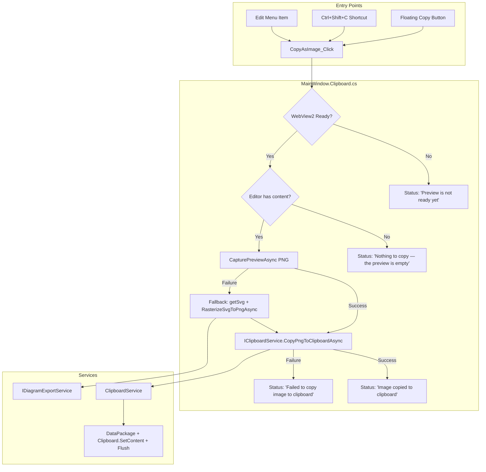

# Design Document: Copy Diagram to Clipboard

## Overview

This feature adds a "Copy as Image" action to the Mermaid Diagram Editor that captures the current WebView2 preview as a PNG image and places it on the Windows clipboard. The action is accessible from three entry points: an Edit menu item, a keyboard shortcut (Ctrl+Shift+C), and a floating button in the preview pane. After copying, a status bar confirmation message auto-dismisses after 3 seconds.

The implementation follows the existing partial-class architecture by introducing `MainWindow.Clipboard.cs` for the UI-facing orchestration and `IClipboardService` / `ClipboardService` for the testable clipboard logic. The capture pipeline reuses the existing `CapturePreviewAsync` path (primary) with an SVG-based fallback via `IDiagramExportService.RasterizeSvgToPngAsync`.

## Architecture

### How It Fits Into the Existing System



### Partial Class Placement

Following the existing convention where each concern gets its own partial class file:

| File | Responsibility |
|---|---|
| `MainWindow.Clipboard.cs` | `CopyAsImage_Click` handler, capture orchestration, status bar messages, auto-dismiss timer |
| `ClipboardService.cs` | `IClipboardService` implementation — DataPackage creation, `Clipboard.SetContent`, `Clipboard.Flush` |
| `IClipboardService.cs` | Interface for clipboard operations (testable seam) |

### DI Registration

`IClipboardService` / `ClipboardService` is registered as a singleton in `App.xaml.cs`, injected into `MainWindow` via the constructor, consistent with `IExportService`, `IDiagramExportService`, etc.

## Components and Interfaces

### IClipboardService

```csharp
namespace MermaidDiagramApp.Services;

/// <summary>
/// Abstracts Windows clipboard operations for PNG image data.
/// </summary>
public interface IClipboardService
{
    /// <summary>
    /// Places PNG image bytes on the Windows clipboard as a bitmap.
    /// Calls Clipboard.Flush so data persists after app exit.
    /// </summary>
    /// <param name="pngData">PNG image bytes to copy.</param>
    /// <returns>True if the clipboard was set successfully.</returns>
    Task<bool> CopyPngToClipboardAsync(byte[] pngData);
}
```

### ClipboardService

```csharp
namespace MermaidDiagramApp.Services;

using System;
using System.IO;
using System.Threading.Tasks;
using Windows.ApplicationModel.DataTransfer;
using Windows.Storage.Streams;
using MermaidDiagramApp.Services.Logging;

public class ClipboardService : IClipboardService
{
    private readonly ILogger _logger;

    public ClipboardService(ILogger logger)
    {
        _logger = logger ?? throw new ArgumentNullException(nameof(logger));
    }

    public async Task<bool> CopyPngToClipboardAsync(byte[] pngData)
    {
        if (pngData == null || pngData.Length == 0)
            return false;

        try
        {
            var dataPackage = new DataPackage();
            var stream = new InMemoryRandomAccessStream();
            await stream.WriteAsync(pngData.AsBuffer());
            stream.Seek(0);

            dataPackage.SetBitmap(RandomAccessStreamReference.CreateFromStream(stream));
            Clipboard.SetContent(dataPackage);
            Clipboard.Flush();
            return true;
        }
        catch (Exception ex)
        {
            _logger.LogError($"Failed to set clipboard content: {ex.Message}", ex);
            return false;
        }
    }
}
```

### MainWindow.Clipboard.cs (Orchestration)

```csharp
namespace MermaidDiagramApp;

public sealed partial class MainWindow
{
    private DispatcherTimer? _clipboardStatusTimer;

    private async void CopyAsImage_Click(object sender, RoutedEventArgs e)
    {
        await ExecuteCopyAsImageAsync();
    }

    private async Task ExecuteCopyAsImageAsync()
    {
        // Guard: WebView2 not ready
        if (PreviewBrowser?.CoreWebView2 == null)
        {
            ShowClipboardStatus("Preview is not ready yet");
            return;
        }

        // Guard: empty editor
        if (string.IsNullOrWhiteSpace(CodeEditor.Text))
        {
            ShowClipboardStatus("Nothing to copy — the preview is empty");
            return;
        }

        try
        {
            byte[] pngData = await CapturePngAsync();

            if (pngData.Length == 0)
            {
                ShowClipboardStatus("Failed to copy image to clipboard");
                return;
            }

            var success = await _clipboardService.CopyPngToClipboardAsync(pngData);
            ShowClipboardStatus(success
                ? "Image copied to clipboard"
                : "Failed to copy image to clipboard");
        }
        catch (Exception ex)
        {
            _logger.LogError($"Copy as image failed: {ex.Message}", ex);
            ShowClipboardStatus("Failed to copy image to clipboard");
        }
    }

    private async Task<byte[]> CapturePngAsync()
    {
        try
        {
            using var stream = new MemoryStream();
            await PreviewBrowser.CoreWebView2.CapturePreviewAsync(
                CoreWebView2CapturePreviewImageFormat.Png,
                stream.AsRandomAccessStream());
            return stream.ToArray();
        }
        catch (Exception ex)
        {
            _logger.LogWarning($"CapturePreviewAsync failed, falling back to SVG: {ex.Message}");
            return await CapturePngViaSvgFallbackAsync();
        }
    }

    private async Task<byte[]> CapturePngViaSvgFallbackAsync()
    {
        var svgJson = await PreviewBrowser.CoreWebView2.ExecuteScriptAsync("getSvg()");
        var svgString = System.Text.Json.JsonSerializer.Deserialize<string>(svgJson);
        if (string.IsNullOrEmpty(svgString))
            return Array.Empty<byte>();

        return await _diagramExportService.RasterizeSvgToPngAsync(svgString);
    }

    private void ShowClipboardStatus(string message)
    {
        _clipboardStatusTimer?.Stop();

        var previousText = RenderModeText.Text;
        RenderModeText.Text = message;

        _clipboardStatusTimer = new DispatcherTimer
        {
            Interval = TimeSpan.FromSeconds(3)
        };
        _clipboardStatusTimer.Tick += (s, e) =>
        {
            _clipboardStatusTimer.Stop();
            RenderModeText.Text = previousText;
        };
        _clipboardStatusTimer.Start();
    }
}
```

## XAML Changes

### Edit Menu — New "Copy as Image" Item

Insert between "Find..." and the separator before "Check & Fix Mermaid Syntax":

```xml
<MenuFlyoutItem Text="Copy as Image" Click="CopyAsImage_Click">
    <MenuFlyoutItem.KeyboardAccelerators>
        <KeyboardAccelerator Key="C" Modifiers="Control,Shift"/>
    </MenuFlyoutItem.KeyboardAccelerators>
</MenuFlyoutItem>
```

### Floating Copy Button in Preview Pane

Add alongside the existing `FloatingRefreshButton`, positioned below it:

```xml
<Button x:Name="FloatingCopyButton"
        Content="&#xE8C8;"
        FontFamily="{ThemeResource SymbolThemeFontFamily}"
        Width="40"
        Height="40"
        HorizontalAlignment="Left"
        VerticalAlignment="Top"
        Margin="16,128,16,16"
        Background="#CC000000"
        Foreground="White"
        FontSize="18"
        CornerRadius="20"
        BorderThickness="0"
        ToolTipService.ToolTip="Copy as Image (Ctrl+Shift+C)"
        Click="CopyAsImage_Click">
    <Button.Shadow>
        <ThemeShadow />
    </Button.Shadow>
</Button>
```

The glyph `&#xE8C8;` is the Segoe MDL2 "Copy" icon. The button is placed at `Margin="16,128,16,16"` to sit below the refresh button at `Margin="16,80,16,16"`.

## Data Models

No new data models are required. The feature operates on:

- `byte[]` — PNG image data from `CapturePreviewAsync` or `RasterizeSvgToPngAsync`
- `string` — SVG content from `getSvg()` JS function (fallback path)
- `DataPackage` — WinRT clipboard container (created and consumed within `ClipboardService`)
- `InMemoryRandomAccessStream` — WinRT stream wrapper for PNG bytes

All types are framework-provided. The `IClipboardService` interface is the only new type contract.


## Correctness Properties

*A property is a characteristic or behavior that should hold true across all valid executions of a system — essentially, a formal statement about what the system should do. Properties serve as the bridge between human-readable specifications and machine-verifiable correctness guarantees.*

### Property 1: Keyboard shortcut dispatch invokes registered action

*For any* registered keyboard shortcut (key + modifiers pair), invoking `HandleKeyDown` or `HandleWebViewKeyEvent` with that combination should execute the registered action exactly once and return true.

**Validates: Requirements 2.1, 2.2**

### Property 2: Successful primary capture skips SVG fallback

*For any* non-empty PNG byte array returned by the primary capture path, the SVG fallback rasterization path should not be invoked, and the returned byte array should be passed directly to the clipboard service.

**Validates: Requirements 4.2**

### Property 3: ClipboardService rejects empty input

*For any* null or empty byte array passed to `CopyPngToClipboardAsync`, the method should return false without attempting to set clipboard content. *For any* non-empty byte array, the method should attempt the clipboard operation and not throw.

**Validates: Requirements 5.1**

### Property 4: Empty or whitespace editor content prevents clipboard modification

*For any* string composed entirely of whitespace characters (including the empty string), executing the Copy_As_Image_Action should produce the status message "Nothing to copy — the preview is empty" and should not invoke the clipboard service.

**Validates: Requirements 7.1, 7.2**

### Property 5: Exceptions during copy produce failure status and are logged

*For any* exception thrown during PNG capture or clipboard operations, the orchestration should catch the exception, display the status message "Failed to copy image to clipboard", log the error with the exception message, and not propagate the exception.

**Validates: Requirements 9.1, 9.2, 9.3**

### Property 6: Successful copy produces success status message

*For any* successful clipboard operation (where `CopyPngToClipboardAsync` returns true), the status bar should display "Image copied to clipboard".

**Validates: Requirements 6.1**

## Error Handling

| Scenario | Behavior | Status Message |
|---|---|---|
| WebView2 `CoreWebView2` is null | Return early, no capture attempted | "Preview is not ready yet" |
| Editor text is empty/whitespace | Return early, no clipboard modification | "Nothing to copy — the preview is empty" |
| `CapturePreviewAsync` throws | Fall back to `getSvg()` + `RasterizeSvgToPngAsync` | *(none — fallback is transparent)* |
| SVG fallback returns empty bytes | Show failure message | "Failed to copy image to clipboard" |
| `CopyPngToClipboardAsync` throws | Catch, log error | "Failed to copy image to clipboard" |
| `Clipboard.SetContent` / `Flush` fails | `ClipboardService` catches, returns false | "Failed to copy image to clipboard" |

All exceptions are caught at the `ExecuteCopyAsImageAsync` level. The `_logger.LogError` call records the exception message and stack trace. The UI never enters an inconsistent state because the status bar message is always set in the `finally`-equivalent catch path.

## Testing Strategy

### Dual Testing Approach

This feature uses both unit tests and property-based tests:

- **Unit tests** (xUnit): Verify specific examples, edge cases, and integration wiring
- **Property-based tests** (FsCheck.Xunit): Verify universal properties across randomly generated inputs

### Property-Based Testing Configuration

- **Library**: FsCheck.Xunit 3.3 (already in the test project)
- **Minimum iterations**: 100 per property test
- **Tag format**: `Feature: copy-diagram-to-clipboard, Property {N}: {title}`
- Each correctness property is implemented by a single `[Property]`-attributed test method

### Test Files

| File | Contents |
|---|---|
| `MermaidDiagramApp.Tests/Services/ClipboardServicePropertyTests.cs` | Property tests for `ClipboardService` input validation (Property 3) |
| `MermaidDiagramApp.Tests/Services/ClipboardServiceTests.cs` | Unit tests for `ClipboardService` constructor, null logger, edge cases |
| `MermaidDiagramApp.Tests/Services/CopyAsImageOrchestrationPropertyTests.cs` | Property tests for orchestration logic: empty content guard (Property 4), error resilience (Property 5), success status (Property 6), primary capture skip fallback (Property 2) |
| `MermaidDiagramApp.Tests/Services/KeyboardShortcutManagerTests.cs` | Extend existing file with property test for shortcut dispatch (Property 1) |

### Unit Tests (Examples and Edge Cases)

- `ClipboardService` constructor throws `ArgumentNullException` for null logger
- `CopyPngToClipboardAsync` with null input returns false
- `CopyPngToClipboardAsync` with empty array returns false
- Copy action when WebView2 is null shows "Preview is not ready yet" (Req 8.1)
- Copy action fallback path is triggered when primary capture throws (Req 4.3)
- Status message auto-dismiss timer is set to 3 seconds (Req 6.2)
- Menu item click triggers `ExecuteCopyAsImageAsync` (Req 1.2)

### Property Tests

Each property test uses FsCheck generators to produce random inputs:

```csharp
// Feature: copy-diagram-to-clipboard, Property 1: Keyboard shortcut dispatch invokes registered action
[Property(MaxTest = 100)]
public Property RegisteredShortcut_IsDispatched_ByHandleKeyDown(VirtualKey key, VirtualKeyModifiers modifiers)
{
    // Register a shortcut, call HandleKeyDown, verify action was invoked
}

// Feature: copy-diagram-to-clipboard, Property 3: ClipboardService rejects empty input
[Property(MaxTest = 100)]
public Property EmptyOrNullInput_ReturnsFalse(byte[] pngData)
{
    // When pngData is null or empty, CopyPngToClipboardAsync returns false
}

// Feature: copy-diagram-to-clipboard, Property 4: Empty or whitespace editor content prevents clipboard modification
[Property(MaxTest = 100)]
public Property WhitespaceOnlyContent_ShowsEmptyMessage_AndSkipsClipboard(NonNull<string> whitespace)
{
    // Generate whitespace-only strings, verify status message and no clipboard call
}

// Feature: copy-diagram-to-clipboard, Property 5: Exceptions during copy produce failure status and are logged
[Property(MaxTest = 100)]
public Property AnyException_ProducesFailureStatus_AndLogs(NonNull<string> errorMessage)
{
    // Mock capture to throw with random message, verify status and log call
}

// Feature: copy-diagram-to-clipboard, Property 6: Successful copy produces success status message
[Property(MaxTest = 100)]
public Property SuccessfulCopy_ShowsSuccessMessage(NonEmptyArray<byte> pngData)
{
    // Mock successful capture and clipboard, verify "Image copied to clipboard"
}
```

### Mocking Strategy

- `IClipboardService` — mock for orchestration tests (verify calls, simulate failures)
- `IDiagramExportService` — mock for fallback path tests
- `ILogger` — mock to verify error logging (using Moq)
- WebView2 `CoreWebView2` — represented as a nullable field in test doubles; actual WebView2 calls are not unit-tested (integration concern)
