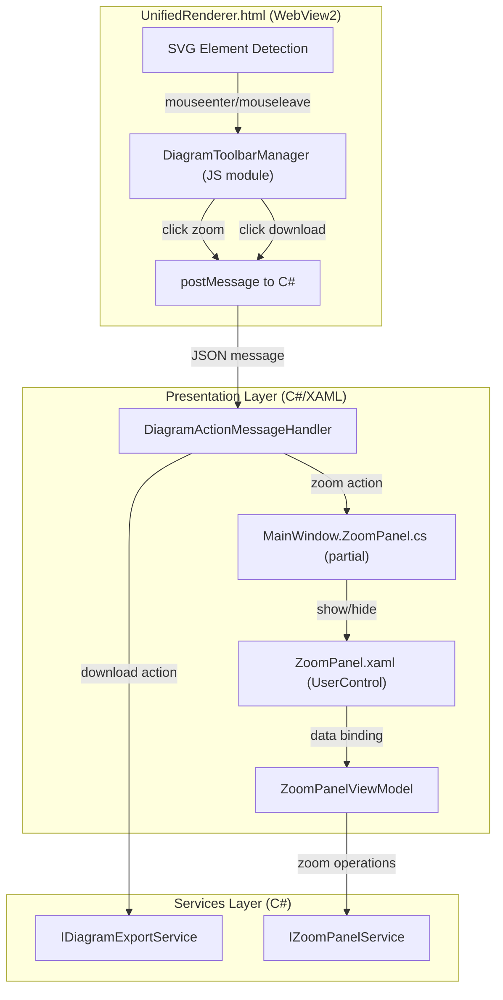

# Design Document

## Overview

This design adds hover-activated action icons on Mermaid diagrams and a side-by-side zoom panel to the existing layout. The implementation follows the project's established patterns: interface-based services registered in DI, partial class separation by concern, and WebView2 message-based communication between JS and C#.

## Architecture



## Design Principles

1. **Single Responsibility**: Each component has one job — JS handles hover UI, services handle data operations, ViewModel handles zoom state, partial class handles XAML wiring.
2. **Interface Segregation**: New service interfaces (`IDiagramExportService`, `IZoomPanelService`) keep contracts focused and testable.
3. **Dependency Inversion**: MainWindow depends on service interfaces, not implementations. New services are DI-registered following the existing pattern in `App.xaml.cs`.
4. **Open/Closed**: The existing `IExportService` is not modified. A new `IDiagramExportService` composes it for SVG-to-PNG rasterization, extending capability without changing existing code.
5. **Separation of Concerns**: JavaScript layer only handles DOM manipulation and message dispatch. All file I/O, dialogs, and layout management stay in C#.

## High-Level Design

### Component 1: DiagramToolbarManager (JavaScript — UnifiedRenderer.html)

A self-contained JS module responsible for attaching hover toolbars to rendered Mermaid SVG elements. It has no knowledge of C# or the zoom panel — it only sends messages.

Responsibilities:
- Wrap each rendered SVG in a `<div class="diagram-wrapper">` container
- Inject a `<div class="diagram-hover-toolbar">` with zoom and download buttons
- On button click, extract `svgElement.outerHTML` and dispatch via `postMessage`
- Clean up toolbars when diagrams are re-rendered (idempotent wrapping)

Integration points:
- Called from `renderMermaid()` after successful render (single diagram)
- Called from `renderMarkdown()` after each embedded Mermaid block renders (multiple diagrams)

Message protocol (JSON via `postMessage`):
```json
{ "type": "diagramAction", "action": "zoom", "svgContent": "<svg>...</svg>" }
{ "type": "diagramAction", "action": "downloadPng", "svgContent": "<svg>...</svg>" }
```

CSS uses `:hover` on `.diagram-wrapper` to toggle toolbar opacity — no JS timers needed. Light/dark theme variants use `body.light-theme` selector.

### Component 2: IDiagramExportService (C# — Services Layer)

A new service interface that handles SVG-to-PNG rasterization for individual diagrams. It composes the existing `IExportService` for PNG file writing.

```csharp
namespace MermaidDiagramApp.Services;

/// <summary>
/// Handles exporting individual diagram SVGs to PNG files.
/// </summary>
public interface IDiagramExportService
{
    /// <summary>
    /// Rasterizes SVG content to PNG bytes at the given scale.
    /// </summary>
    Task<byte[]> RasterizeSvgToPngAsync(string svgContent, float scale = 2.0f);
}
```

Implementation (`DiagramExportService`):
- Uses `Svg.Skia` / `SkiaSharp` to parse SVG and render to bitmap (same technique as `ExportPngFallback` in MainWindow.Export.cs)
- Adds a dark background before rasterization via `IExportService.AddBackgroundToSvg()`
- Delegates PNG file writing to `IExportService.SavePngAsync()`
- Registered as singleton in DI

This keeps the rasterization logic testable and reusable — the MainWindow.Export.cs handler just calls the service and shows the file picker.

### Component 3: IZoomPanelService (C# — Services Layer)

A service that manages zoom panel state independently of the UI. This makes the zoom logic testable without XAML dependencies.

```csharp
namespace MermaidDiagramApp.Services;

/// <summary>
/// Manages zoom panel state: zoom level, bounds clamping, and SVG content.
/// </summary>
public interface IZoomPanelService
{
    bool IsOpen { get; }
    double ZoomLevel { get; }
    string? CurrentSvgContent { get; }

    void Open(string svgContent);
    void Close();
    void ZoomIn();
    void ZoomOut();
    void SetZoomLevel(double level);
    void ApplyWheelDelta(double deltaY);

    event EventHandler<ZoomPanelStateChangedEventArgs>? StateChanged;
}
```

Implementation (`ZoomPanelService`):
- Zoom increment: 0.25 (25%)
- Zoom range: [0.25, 5.0] — clamped on every mutation
- `StateChanged` event fires on open/close/zoom changes so the ViewModel can react
- Registered as singleton in DI

`ZoomPanelStateChangedEventArgs`:
```csharp
public class ZoomPanelStateChangedEventArgs : EventArgs
{
    public bool IsOpen { get; init; }
    public double ZoomLevel { get; init; }
    public string? SvgContent { get; init; }
}
```

### Component 4: ZoomPanelViewModel (C# — ViewModels)

MVVM ViewModel for the zoom panel UI. Binds to the `ZoomPanel` UserControl.

```csharp
public class ZoomPanelViewModel : INotifyPropertyChanged
{
    // Bindable properties
    public bool IsOpen { get; }
    public string ZoomLevelDisplay { get; }  // e.g., "150%"
    public bool CanZoomIn { get; }
    public bool CanZoomOut { get; }

    // Commands (RelayCommand)
    public ICommand ZoomInCommand { get; }
    public ICommand ZoomOutCommand { get; }
    public ICommand CloseCommand { get; }
}
```

- Subscribes to `IZoomPanelService.StateChanged` to update bindable properties
- Commands delegate to `IZoomPanelService` methods
- `CloseCommand` also triggers layout restoration via a callback delegate (same pattern as `MainWindowViewModel.RequestExit`)

### Component 5: ZoomPanel UserControl (XAML — Views/ZoomPanel.xaml)

A self-contained UserControl that encapsulates the zoom panel UI. This keeps the MainWindow.xaml clean and the zoom panel independently testable.

Structure:
```xml
<UserControl x:Class="MermaidDiagramApp.Views.ZoomPanel">
    <Grid RowDefinitions="Auto, *">
        <!-- Toolbar row -->
        <Border Grid.Row="0" Background="{ThemeResource LayerFillColorDefaultBrush}"
                BorderBrush="{ThemeResource CardStrokeColorDefaultBrush}"
                BorderThickness="0,0,0,1" Padding="8">
            <StackPanel Orientation="Horizontal" Spacing="4">
                <Button Content="🔍+" Command="{x:Bind ViewModel.ZoomInCommand}"
                        ToolTipService.ToolTip="Zoom In"/>
                <Button Content="🔍−" Command="{x:Bind ViewModel.ZoomOutCommand}"
                        ToolTipService.ToolTip="Zoom Out"/>
                <TextBlock Text="{x:Bind ViewModel.ZoomLevelDisplay, Mode=OneWay}"
                           VerticalAlignment="Center" Margin="8,0"/>
                <Button Content="✕" Command="{x:Bind ViewModel.CloseCommand}"
                        ToolTipService.ToolTip="Close Zoom Panel (Esc)"
                        HorizontalAlignment="Right"/>
            </StackPanel>
        </Border>
        <!-- Diagram display -->
        <WebView2 x:Name="ZoomBrowser" Grid.Row="1"/>
    </Grid>
</UserControl>
```

The UserControl owns its WebView2 instance and exposes methods:
- `LoadDiagramAsync(string svgContent)` — loads SVG into the WebView2 via a minimal host HTML page
- `SetZoomLevel(double level)` — executes JS to apply CSS transform
- `SetTheme(string theme)` — applies light/dark theme to the host page

Mouse wheel events in the WebView2 are forwarded to C# via `postMessage`, then routed to `IZoomPanelService.ApplyWheelDelta()`.

### Component 6: MainWindow.ZoomPanel.cs (C# — Partial Class)

A new partial class that wires the zoom panel into MainWindow's layout. Follows the same pattern as `MainWindow.Builder.cs`, `MainWindow.Search.cs`, etc.

Responsibilities:
- Save/restore `EditorColumn.Width` and `PreviewColumn.Width` as `GridLength` values
- Show/hide the `ZoomPanelColumn`, `ZoomSplitterColumn`, and `ZoomPanelBorder`
- Subscribe to `IZoomPanelService.StateChanged` to drive UI updates
- Handle Escape key for closing (extends `MainWindow_PreviewKeyDown`)

State fields:
```csharp
private GridLength _savedEditorWidth;
private GridLength _savedPreviewWidth;
```

Methods:
- `InitializeZoomPanel()` — called from constructor, subscribes to service events
- `ShowZoomPanel(string svgContent)` — saves widths, makes columns visible, calls `ZoomPanelControl.LoadDiagramAsync()`
- `HideZoomPanel()` — collapses columns, restores saved widths
- `OnZoomPanelStateChanged(object? sender, ZoomPanelStateChangedEventArgs e)` — reacts to service state changes

### Component 7: WebMessage Router Extension (C# — MainWindow.WebView.cs)

Extend the existing `WebMessageReceived` handler to route `diagramAction` messages. This is a minimal addition — just a new `else if` branch in the existing message type switch.

```csharp
else if (messageType == "diagramAction")
{
    var action = root.GetProperty("action").GetString();
    var svgContent = root.GetProperty("svgContent").GetString();

    DispatcherQueue.TryEnqueue(() =>
    {
        if (action == "zoom")
        {
            _zoomPanelService.Open(svgContent);
        }
        else if (action == "downloadPng")
        {
            _ = ExportDiagramAsPngAsync(svgContent);
        }
    });
}
```

`ExportDiagramAsPngAsync` is a new method in `MainWindow.Export.cs` that:
1. Shows a `FileSavePicker`
2. Calls `IDiagramExportService.RasterizeSvgToPngAsync(svgContent)`
3. Calls `IExportService.SavePngAsync(filePath, pngBytes)`

## XAML Layout Changes

Add two new columns to `MainGrid.ColumnDefinitions` after the existing `PropertiesColumn`:

```xml
<!-- Existing columns 0-8 unchanged -->
<ColumnDefinition x:Name="ZoomSplitterColumn" Width="Auto"/>
<ColumnDefinition x:Name="ZoomPanelColumn" Width="0"/>
```

`ZoomPanelColumn` uses `Width="0"` when collapsed (not `Visibility="Collapsed"` on the column — WinUI doesn't support that). The partial class sets `Width="*"` when opening and `Width="0"` when closing.

```xml
<ctk:GridSplitter x:Name="ZoomSplitter"
                  Grid.Column="9"
                  Width="12"
                  Visibility="Collapsed"
                  ResizeBehavior="BasedOnAlignment"
                  ResizeDirection="Auto"
                  Background="Transparent"/>

<Border x:Name="ZoomPanelBorder" Grid.Column="10" Visibility="Collapsed">
    <views:ZoomPanel x:Name="ZoomPanelControl"/>
</Border>
```

## Asset: ZoomPanelHost.html

A minimal HTML page loaded by the zoom panel's WebView2. No Mermaid.js — it only displays pre-rendered SVG with CSS zoom transforms.

```html
<!DOCTYPE html>
<html>
<head>
<style>
    body {
        margin: 0;
        background: var(--bg, #222);
        display: flex;
        justify-content: center;
        align-items: flex-start;
        min-height: 100vh;
        overflow: auto;
    }
    body.light-theme { --bg: #fff; }
    #diagram {
        transform-origin: top center;
        transition: transform 0.15s ease;
        padding: 20px;
    }
</style>
</head>
<body>
    <div id="diagram"></div>
    <script>
        window.setDiagram = function(svgHtml) {
            document.getElementById('diagram').innerHTML = svgHtml;
        };
        window.setZoom = function(level) {
            document.getElementById('diagram').style.transform = 'scale(' + level + ')';
        };
        window.setTheme = function(theme) {
            document.body.className = theme === 'light' ? 'light-theme' : '';
        };

        // Forward mouse wheel to C# for zoom control
        document.addEventListener('wheel', (e) => {
            e.preventDefault();
            if (window.chrome?.webview) {
                window.chrome.webview.postMessage(JSON.stringify({
                    type: 'zoomWheel', deltaY: e.deltaY
                }));
            }
        }, { passive: false });

        // Forward Escape key to C#
        document.addEventListener('keydown', (e) => {
            if (e.key === 'Escape' && window.chrome?.webview) {
                e.preventDefault();
                window.chrome.webview.postMessage(JSON.stringify({
                    type: 'keypress', key: 'Escape'
                }));
            }
        });
    </script>
</body>
</html>
```

## DI Registration (App.xaml.cs)

```csharp
// Diagram zoom & export
services.AddSingleton<IZoomPanelService, ZoomPanelService>();
services.AddSingleton<IDiagramExportService, DiagramExportService>();
services.AddTransient<ViewModels.ZoomPanelViewModel>();
```

## File Changes

| File | Change Type | Description |
|---|---|---|
| `Services/IDiagramExportService.cs` | New | Interface for SVG-to-PNG rasterization |
| `Services/DiagramExportService.cs` | New | Implementation using Svg.Skia/SkiaSharp |
| `Services/IZoomPanelService.cs` | New | Interface for zoom panel state management |
| `Services/ZoomPanelService.cs` | New | Implementation with zoom level, open/close, events |
| `Models/ZoomPanelStateChangedEventArgs.cs` | New | Event args for zoom panel state changes |
| `ViewModels/ZoomPanelViewModel.cs` | New | MVVM ViewModel for zoom panel UI bindings |
| `Views/ZoomPanel.xaml` | New | UserControl with toolbar and WebView2 |
| `Views/ZoomPanel.xaml.cs` | New | Code-behind: WebView2 init, LoadDiagram, SetZoom |
| `Assets/ZoomPanelHost.html` | New | Minimal HTML host for zoom panel WebView2 |
| `MainWindow.xaml` | Modified | Add ZoomSplitter, ZoomPanelColumn, ZoomPanelBorder |
| `MainWindow.ZoomPanel.cs` | New | Partial class: layout save/restore, panel wiring |
| `MainWindow.WebView.cs` | Modified | Add `diagramAction` message handler |
| `MainWindow.Export.cs` | Modified | Add `ExportDiagramAsPngAsync()` method |
| `MainWindow.xaml.cs` | Modified | Add `IZoomPanelService` field, constructor param |
| `App.xaml.cs` | Modified | Register new services and ViewModel in DI |
| `Assets/UnifiedRenderer.html` | Modified | Add hover toolbar CSS, `wrapDiagramWithToolbar()`, call after renders |

## Correctness Properties

1. **Layout Restoration**: After `HideZoomPanel()`, `EditorColumn.Width` and `PreviewColumn.Width` must equal the `GridLength` values captured by `ShowZoomPanel()`.
2. **Single Instance**: `IZoomPanelService.IsOpen` is the single source of truth. Calling `Open()` while already open replaces the content without creating a second panel.
3. **Zoom Bounds**: `IZoomPanelService.ZoomLevel` is always in [0.25, 5.0] after any operation. `ZoomIn()` is a no-op at max; `ZoomOut()` is a no-op at min.
4. **SVG Integrity**: The SVG string passed from JS to C# via `postMessage` is used as-is for both zoom display and PNG export — no transformation.
5. **Toolbar Idempotency**: `wrapDiagramWithToolbar()` is safe to call multiple times on the same SVG — it checks for existing `.diagram-wrapper` parent before wrapping.
6. **Resource Cleanup**: `ZoomPanel.xaml.cs` disposes its WebView2 when the UserControl is unloaded. `HideZoomPanel()` navigates to `about:blank` to release SVG memory.
