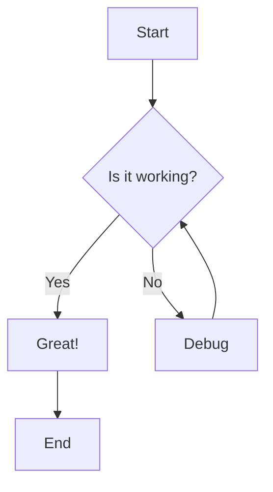
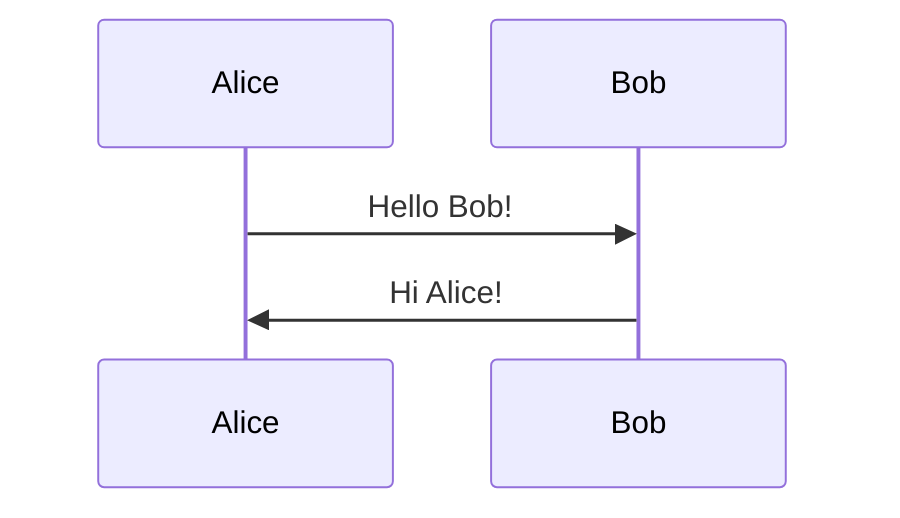

# Test Execution Guide
## Keyboard Shortcut Fix Feature - Task 13

This guide provides step-by-step instructions for executing the final validation testing for the keyboard shortcut fix feature.

---

## Pre-Test Setup

### 1. Build the Application

```powershell
# Navigate to project root
cd D:\Tester\MermaidDiagram

# Build for x64 platform
dotnet build MermaidDiagramApp/MermaidDiagramApp.csproj --configuration Debug /p:Platform=x64
```

**Expected Result:** Build succeeds with no errors

### 2. Run Automated Tests

```powershell
# Run all unit and property-based tests
dotnet test MermaidDiagramApp.Tests/MermaidDiagramApp.Tests.csproj --configuration Debug /p:Platform=x64
```

**Expected Result:** All 30 tests pass

### 3. Launch the Application

```powershell
# Run the application
.\MermaidDiagramApp\bin\x64\Debug\net8.0-windows10.0.19041.0\MermaidDiagramApp.exe
```

**Expected Result:** Application launches successfully

---

## Test Execution Checklist

### Phase 1: Basic Keyboard Shortcut Functionality

#### Test 1.1: F11 Behavior
- [ ] Launch application
- [ ] Load sample diagram
- [ ] Press F11
- [ ] Document whether F11 is intercepted by Windows or works
- [ ] If intercepted, verify tip appears about Ctrl+F11

#### Test 1.2: Ctrl+F11 from Editor
- [ ] Click in code editor
- [ ] Press Ctrl+F11
- [ ] Verify full-screen mode activates (editor hidden)
- [ ] Verify zoom controls appear
- [ ] Press Ctrl+F11 again
- [ ] Verify full-screen mode deactivates (editor returns)

#### Test 1.3: Ctrl+F11 from WebView2
- [ ] Click in preview panel
- [ ] Press Ctrl+F11
- [ ] Verify full-screen mode activates
- [ ] Press Ctrl+F11 again
- [ ] Verify full-screen mode deactivates

---

### Phase 2: Escape Key Functionality

#### Test 2.1: Escape from Full-Screen
- [ ] Enter full-screen mode (Ctrl+F11)
- [ ] Press Escape
- [ ] Verify full-screen exits
- [ ] Verify editor is visible

#### Test 2.2: Escape from Presentation Mode
- [ ] Enter presentation mode (F5)
- [ ] Press Escape
- [ ] Verify presentation mode exits
- [ ] Verify normal view restored

---

### Phase 3: F7 Syntax Checker

#### Test 3.1: F7 from Editor
- [ ] Click in code editor
- [ ] Press F7
- [ ] Verify syntax checker dialog opens

#### Test 3.2: F7 from WebView2
- [ ] Click in preview panel
- [ ] Press F7
- [ ] Verify syntax checker dialog opens

#### Test 3.3: F7 from Menu
- [ ] Click on menu bar
- [ ] Press F7
- [ ] Verify syntax checker dialog opens

---

### Phase 4: Other Shortcuts

#### Test 4.1: Ctrl+F5 Refresh
- [ ] Make a change to diagram
- [ ] Press Ctrl+F5 from editor
- [ ] Verify preview refreshes
- [ ] Click in preview
- [ ] Press Ctrl+F5 from WebView2
- [ ] Verify preview refreshes

#### Test 4.2: F5 Presentation Mode
- [ ] Press F5
- [ ] Verify presentation mode activates
- [ ] Press F5 or Escape
- [ ] Verify presentation mode exits

---

### Phase 5: User Experience

#### Test 5.1: First-Run Tip
**Setup:** Clear application settings
```powershell
# Close application first
# Delete LocalState folder
Remove-Item -Recurse -Force "$env:LOCALAPPDATA\Packages\*MermaidDiagramApp*\LocalState"
```

- [ ] Launch application
- [ ] Wait for WebView2 to initialize
- [ ] Verify tip appears about Ctrl+F11
- [ ] Verify tip is informational (not blocking)

#### Test 5.2: Don't Show Again
- [ ] Ensure tip is visible
- [ ] Click "Don't show again" button
- [ ] Verify tip closes
- [ ] Restart application
- [ ] Verify tip does not reappear

#### Test 5.3: Menu Display
- [ ] Open View menu
- [ ] Locate "Full Screen Preview" item
- [ ] Verify text shows "(F11 or Ctrl+F11)"
- [ ] Verify formatting is clear

---

### Phase 6: Cross-Context Consistency

#### Test 6.1: Shortcut Consistency Matrix

Test each shortcut from each focus context:

| Shortcut | Editor Focus | WebView2 Focus | Menu Focus | Result |
|----------|--------------|----------------|------------|--------|
| Ctrl+F11 | [ ]          | [ ]            | [ ]        | ___    |
| Escape   | [ ]          | [ ]            | [ ]        | ___    |
| F7       | [ ]          | [ ]            | [ ]        | ___    |
| Ctrl+F5  | [ ]          | [ ]            | [ ]        | ___    |
| F5       | [ ]          | [ ]            | [ ]        | ___    |

**Expected:** All shortcuts work from all contexts

---

### Phase 7: Platform Testing

#### Test 7.1: Windows 10 (if available)
- [ ] Test on Windows 10 system
- [ ] Document Windows version and build
- [ ] Run all Phase 1-6 tests
- [ ] Document any platform-specific issues

#### Test 7.2: Windows 11 (if available)
- [ ] Test on Windows 11 system
- [ ] Document Windows version and build
- [ ] Run all Phase 1-6 tests
- [ ] Document any platform-specific issues

---

## Test Data

### Sample Mermaid Diagram


### Sample Markdown with Mermaid
```markdown
# Test Document

This is a test document with an embedded Mermaid diagram.



More content here.
```

---

## Logging and Debugging

### Enable Debug Logging
1. Open browser developer tools in WebView2: Ctrl+Shift+D
2. Check console for keyboard event messages
3. Look for messages like:
   - "Rendering content in mermaid mode"
   - Keyboard event forwarding messages

### Check Application Logs
```powershell
# Open log folder
explorer "$env:LOCALAPPDATA\Packages\*MermaidDiagramApp*\LocalState\Logs"
```

---

## Known Issues and Workarounds

### Issue: F11 Intercepted by Windows
**Symptom:** F11 triggers volume mute instead of full-screen  
**Workaround:** Use Ctrl+F11 instead  
**Expected:** Application shows tip about this

### Issue: WebView2 Not Initialized
**Symptom:** Keyboard shortcuts don't work in preview  
**Workaround:** Wait for preview to fully load  
**Expected:** "Ready to render content" message appears

---

## Success Criteria

For this task to be considered complete, the following must be true:

1. **Build Success**
   - [x] Application builds without errors
   - [x] All 30 automated tests pass

2. **Core Functionality**
   - [ ] Ctrl+F11 toggles full-screen from any focus
   - [ ] Escape exits full-screen/presentation mode
   - [ ] F7 opens syntax checker from any focus
   - [ ] All shortcuts work consistently

3. **User Experience**
   - [ ] First-run tip displays correctly
   - [ ] "Don't show again" preference persists
   - [ ] Menu shows both F11 and Ctrl+F11
   - [ ] No confusing or broken behavior

4. **Platform Compatibility**
   - [ ] Works on Windows 10 (if tested)
   - [ ] Works on Windows 11 (if tested)
   - [ ] No platform-specific crashes

5. **Documentation**
   - [x] Manual test validation document created
   - [x] Test execution guide created
   - [ ] All test results documented

---

## Reporting Results

### After Testing
1. Fill out `MANUAL_TEST_VALIDATION.md` with results
2. Document any issues found
3. Take screenshots of any problems
4. Note system configuration details

### Issue Template
```
**Issue:** [Brief description]
**Test Case:** [Which test case]
**Steps to Reproduce:**
1. [Step 1]
2. [Step 2]
3. [Step 3]

**Expected:** [What should happen]
**Actual:** [What actually happened]
**System:** [Windows version, build number]
**Severity:** [Critical/High/Medium/Low]
```

---

## Next Steps

After completing all tests:

1. Review `MANUAL_TEST_VALIDATION.md`
2. Calculate pass/fail statistics
3. Document any critical issues
4. Provide overall assessment
5. Make recommendations for:
   - Release readiness
   - Additional fixes needed
   - Future enhancements

---

## Contact

If you encounter any issues during testing or need clarification:
- Review the design document: `.kiro/specs/keyboard-shortcut-fix/design.md`
- Review the requirements: `.kiro/specs/keyboard-shortcut-fix/requirements.md`
- Check automated test results for clues
