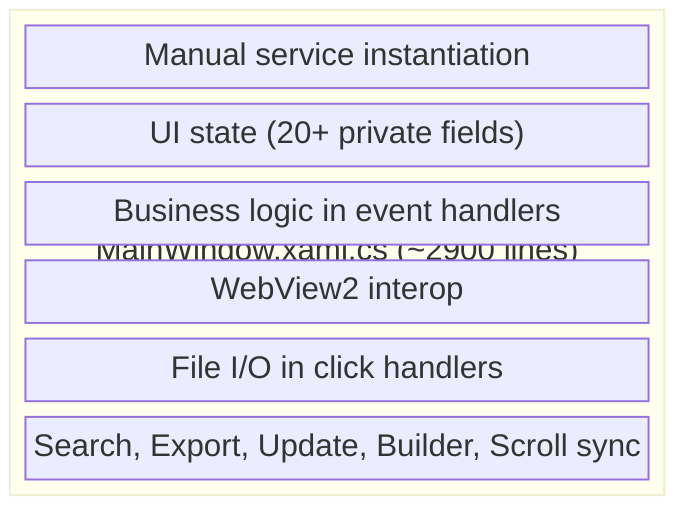
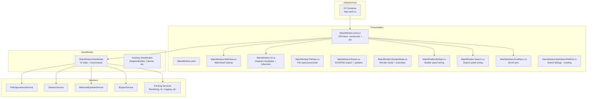

# Design Document: MainWindow Comprehensive Refactoring

## Overview

This design transforms the MermaidDiagramApp from a God Object architecture (where MainWindow.xaml.cs handles everything) into a well-structured MVVM application with dependency injection, clear service boundaries, and organized code-behind files.

The refactoring follows an incremental, safe approach:

1. **Phase 1 — DI Container**: Introduce Microsoft.Extensions.DependencyInjection in App.xaml.cs, register all existing services, and resolve them into MainWindow via constructor injection. No logic changes.
2. **Phase 2 — Service Extraction**: Extract business logic from MainWindow event handlers into new services (FileOperationsService, SearchService, MermaidUpdateService, ExportService) behind interfaces.
3. **Phase 3 — ViewModel Extraction**: Create MainWindowViewModel holding UI state and ICommand-based commands, wired to the view via data binding.
4. **Phase 4 — Partial Class Splitting**: Organize remaining code-behind into focused partial class files by concern.

Each phase produces a compilable, testable application with all existing tests passing.

## Architecture

### Current Architecture



### Target Architecture



## Components and Interfaces

### 1. DI Container Setup (App.xaml.cs)

The App class will configure a `ServiceCollection` and build a `ServiceProvider`. MainWindow receives its dependencies through a parameterized constructor.

```csharp
// App.xaml.cs
public partial class App : Application
{
    public static IServiceProvider Services { get; private set; } = null!;

    public App()
    {
        InitializeComponent();
        InitializeLogging();
        Services = ConfigureServices();
    }

    private static IServiceProvider ConfigureServices()
    {
        var services = new ServiceCollection();

        // Logging
        services.AddSingleton<ILogger>(LoggingService.Instance.GetLogger<App>());

        // Rendering
        services.AddSingleton<IContentTypeDetector, ContentTypeDetector>();
        services.AddSingleton<ContentRendererFactory>();
        services.AddSingleton<RenderingOrchestrator>();

        // File & State
        services.AddSingleton<DiagramFileService>();
        services.AddSingleton<RecentFilesService>();
        services.AddSingleton<MarkdownStyleSettingsService>();
        services.AddSingleton<ShortcutPreferencesService>();
        services.AddSingleton<WindowStateManager>();

        // Syntax
        services.AddTransient<MermaidSyntaxAnalyzer>();
        services.AddTransient<MermaidSyntaxFixer>();
        services.AddTransient<MermaidTextOptimizer>();
        services.AddSingleton<MermaidLinter>();

        // AI
        services.AddSingleton<AiConfigStorageService>();
        services.AddSingleton<AiServiceFactory>();

        // New services
        services.AddSingleton<IFileOperationsService, FileOperationsService>();
        services.AddSingleton<ISearchService, SearchService>();
        services.AddSingleton<IMermaidUpdateService, MermaidUpdateService>();
        services.AddSingleton<IExportService, ExportService>();

        // ViewModel
        services.AddTransient<MainWindowViewModel>();

        return services.BuildServiceProvider();
    }

    protected override void OnLaunched(LaunchActivatedEventArgs args)
    {
        _window = new MainWindow(Services.GetRequiredService<MainWindowViewModel>());
        _window.Activate();
    }
}
```

**NuGet Package**: `Microsoft.Extensions.DependencyInjection` (latest stable for .NET 8).

### 2. MainWindowViewModel

Holds all UI state and exposes ICommand properties. Receives services via constructor injection.

```csharp
public class MainWindowViewModel : INotifyPropertyChanged
{
    private readonly IFileOperationsService _fileOps;
    private readonly ISearchService _search;
    private readonly IMermaidUpdateService _updateService;
    private readonly IExportService _exportService;
    private readonly RenderingOrchestrator _renderingOrchestrator;
    private readonly IContentTypeDetector _contentTypeDetector;
    private readonly MarkdownStyleSettingsService _styleSettingsService;
    private readonly ILogger _logger;

    // UI State
    public string CurrentFilePath { get; set; }
    public ContentType CurrentContentType { get; set; }
    public bool IsFullScreen { get; set; }
    public bool IsPresentationMode { get; set; }
    public bool IsPanModeEnabled { get; set; }
    public bool IsBuilderVisible { get; set; }
    public string CurrentSearchText { get; set; }
    public string LastPreviewedCode { get; set; }
    public bool IsWebViewReady { get; set; }

    // Commands
    public ICommand NewClassDiagramCommand { get; }
    public ICommand NewSequenceDiagramCommand { get; }
    public ICommand OpenFileCommand { get; }
    public ICommand SaveFileCommand { get; }
    public ICommand CloseFileCommand { get; }
    public ICommand ExportSvgCommand { get; }
    public ICommand ExportPngCommand { get; }
    public ICommand ToggleFullScreenCommand { get; }
    public ICommand TogglePresentationModeCommand { get; }
    public ICommand ToggleBuilderCommand { get; }
    public ICommand FindCommand { get; }
    public ICommand CheckSyntaxCommand { get; }
    public ICommand ExitCommand { get; }
    // ... additional diagram type commands
}
```

**Key design decisions**:
- The ViewModel does NOT hold a reference to WebView2 or any XAML controls. WebView2 interop stays in the code-behind partial classes.
- Commands that need UI interaction (file pickers, dialogs) use callback delegates or events that the code-behind subscribes to.
- The ViewModel exposes an `Action<string>?` callback pattern for operations requiring UI (e.g., `RequestFilePicker`, `RequestDialog`).

### 3. IFileOperationsService

Encapsulates file open/save/close logic, recent files, and file type detection.

```csharp
public interface IFileOperationsService
{
    string CurrentFilePath { get; }
    Task<string?> ReadFileAsync(string filePath);
    Task SaveFileAsync(string filePath, string content);
    Task<DiagramBuilderFile?> LoadDiagramAsync(string filePath);
    Task<bool> SaveDiagramAsync(string filePath, DiagramCanvasViewModel viewModel);
    string OptimizeMermaidContent(string content);
    bool NeedsMermaidOptimization(string content);
    void AddRecentFile(string filePath);
    IReadOnlyList<RecentFileEntry> GetRecentFiles();
    void RemoveRecentFile(string filePath);
    void ClearRecentFiles();
    string GetWindowTitle(string? filePath);
}
```

### 4. ISearchService

Encapsulates search state and navigation logic (decoupled from TextControlBox).

```csharp
public interface ISearchService
{
    string CurrentSearchText { get; }
    void SetSearchText(string text);
    SearchResult FindNext(string text, string editorContent);
    SearchResult FindPrevious(string text, string editorContent);
    void Reset();
}
```

### 5. IMermaidUpdateService

Encapsulates Mermaid.js version checking, downloading, and installation.

```csharp
public interface IMermaidUpdateService
{
    Task<MermaidVersionInfo> CheckForUpdatesAsync();
    Task<bool> DownloadAndInstallUpdateAsync(string version);
    string GetCurrentVersion();
}

public record MermaidVersionInfo(
    string CurrentVersion,
    string LatestVersion,
    bool UpdateAvailable);
```

### 6. IExportService

Encapsulates SVG/PNG export logic (the image data extraction and file writing, not the UI dialogs).

```csharp
public interface IExportService
{
    string AddBackgroundToSvg(string svgContent);
    Task<byte[]> ScaleImageAsync(byte[] pngData, float scale);
    Task SaveSvgAsync(string filePath, string svgContent);
    Task SavePngAsync(string filePath, byte[] pngData);
}
```

### 7. Partial Class Organization

After ViewModel and service extraction, the remaining code-behind is organized:

| File | Responsibility | Approx Lines |
|---|---|---|
| `MainWindow.xaml.cs` | Constructor, field declarations, DI wiring, initialization orchestration | ~250 |
| `MainWindow.WebView.cs` | WebView2 init, message handling, ExecuteRenderingScript, UpdatePreview | ~460 |
| `MainWindow.UI.cs` | New diagram templates, fullscreen/presentation mode, keyboard wiring | ~440 |
| `MainWindow.FileOps.cs` | File open/save/close, recent files, dialog utilities | ~490 |
| `MainWindow.Export.cs` | SVG/PNG export, Mermaid.js update management, about/log handlers | ~430 |
| `MainWindow.RenderMode.cs` | Render mode overrides, zoom/pan controls, content type indicators | ~230 |
| `MainWindow.Builder.cs` | Builder panel visibility, canvas wiring, toolbox/properties panel setup | ~120 |
| `MainWindow.Search.cs` | Search panel visibility, TextBox events, CodeEditor search integration | ~140 |
| `MainWindow.ScrollSync.cs` | Synchronized scrolling init, CodeEditor click handler, SyncPreviewToLine | ~200 |
| `MainWindow.MarkdownToWord.cs` | Existing — Word export dialogs and progress (already extracted) | ~415 |


## Data Models

### New Data Models

```csharp
/// <summary>
/// Result of a search operation within the code editor.
/// </summary>
public record SearchResult(
    bool Found,
    int MatchIndex,
    int MatchLength,
    string StatusMessage);

/// <summary>
/// Information about Mermaid.js version status.
/// </summary>
public record MermaidVersionInfo(
    string CurrentVersion,
    string LatestVersion,
    bool UpdateAvailable);
```

### Existing Models (Unchanged)

All existing models in `Models/` remain unchanged:
- `ContentType`, `RenderingContext`, `RenderingResult`
- `MarkdownStyleSettings`, `SyntaxIssue`
- `DiagramBuilderFile`, `CanvasNode`, `CanvasConnector`
- `KeyboardEventMessage`

No data model migrations are required. The refactoring is purely structural.


## Correctness Properties

*A property is a characteristic or behavior that should hold true across all valid executions of a system — essentially, a formal statement about what the system should do. Properties serve as the bridge between human-readable specifications and machine-verifiable correctness guarantees.*

This refactoring is primarily structural (code organization, not new features), so the testable properties focus on the DI wiring, ViewModel contract, and constructor injection correctness.

### Property 1: DI container resolves all registered services

*For any* service type registered in the DI container, resolving that type from the built `IServiceProvider` should return a non-null instance without throwing an exception.

**Validates: Requirements 1.1, 1.2, 3.5**

### Property 2: ViewModel exposes non-null commands

*For any* expected command name in the MainWindowViewModel (NewClassDiagram, OpenFile, SaveFile, CloseFile, ExportSvg, ExportPng, ToggleFullScreen, TogglePresentationMode, ToggleBuilder, Find, CheckSyntax, Exit), the corresponding ICommand property should be non-null after construction.

**Validates: Requirements 2.2**

### Property 3: ViewModel fires PropertyChanged for all bindable properties

*For any* bindable property on MainWindowViewModel (CurrentFilePath, CurrentContentType, IsFullScreen, IsPresentationMode, IsPanModeEnabled, IsBuilderVisible, CurrentSearchText, IsWebViewReady), setting the property to a different value should fire the PropertyChanged event with the correct property name.

**Validates: Requirements 2.3**

### Property 4: All injectable types accept mocked dependencies

*For any* newly created injectable type (MainWindowViewModel, FileOperationsService, SearchService, MermaidUpdateService, ExportService), constructing the type with mocked interface dependencies should succeed and produce a non-null instance.

**Validates: Requirements 6.1, 6.2**

## Error Handling

The refactoring preserves all existing error handling behavior. No new error paths are introduced.

**DI Container Errors**:
- If a required service is missing from the container, `GetRequiredService<T>()` throws `InvalidOperationException` at startup — this is the desired fail-fast behavior (Requirement 1.5).
- All service registrations are validated at app startup by the container build step.

**Existing Error Handling Preserved**:
- All try-catch blocks in event handlers are preserved in their respective partial class files or ViewModel commands.
- Error logging via `ILogger` continues unchanged.
- ContentDialog error presentations remain in the code-behind (UI layer).
- WebView2 initialization error handling stays in `MainWindow.WebView.cs`.

**New Service Error Handling**:
- New services (FileOperationsService, MermaidUpdateService, etc.) propagate exceptions to callers. The ViewModel or code-behind catches and presents errors to the user via dialogs, maintaining the existing UX.

## Testing Strategy

### Dual Testing Approach

**Unit Tests** (specific examples and edge cases):
- Verify DI container resolves specific critical services (e.g., MainWindowViewModel, RenderingOrchestrator)
- Verify MainWindowViewModel construction with null dependencies throws ArgumentNullException
- Verify MermaidUpdateService handles HTTP failures gracefully
- Verify FileOperationsService returns correct window titles for various file paths
- Verify ExportService.AddBackgroundToSvg handles malformed SVG input
- Verify SearchService.Reset clears state correctly

**Property-Based Tests** (universal properties across all inputs, using FsCheck.Xunit):
- Property 1: DI container service resolution (parameterized over all registered types)
- Property 2: ViewModel command non-nullity (parameterized over all command names)
- Property 3: ViewModel PropertyChanged notification (parameterized over all bindable properties with generated values)
- Property 4: Constructor injection with mocks (parameterized over all injectable types)

**Property-Based Testing Configuration**:
- Library: FsCheck.Xunit 3.3 (already in test project)
- Minimum iterations: 100 per property test
- Each test tagged with: **Feature: mainwindow-refactoring, Property {number}: {property_text}**
- Each correctness property implemented as a single property-based test

### Existing Test Preservation

All existing tests in `MermaidDiagramApp.Tests/` must continue to pass after refactoring:
- `Services/Export/*Tests.cs`
- `Services/KeyboardShortcutManagerTests.cs`
- `Services/MermaidTextOptimizerTests.cs`
- `Services/ShortcutPreferencesServiceTests.cs`
- `Services/TipDisplayLogicTests.cs`
- `ViewModels/MarkdownToWordViewModelTests.cs`
- `ViewModels/MarkdownToWordViewModelPropertyTests.cs`
- `ViewModels/MainWindowPropertyTests.cs`
- `Models/KeyboardEventMessageTests.cs`

Build verification: `dotnet build MermaidDiagramApp/MermaidDiagramApp.sln` must succeed.
Test verification: `dotnet test MermaidDiagramApp.Tests/MermaidDiagramApp.Tests.csproj` must pass all tests.
