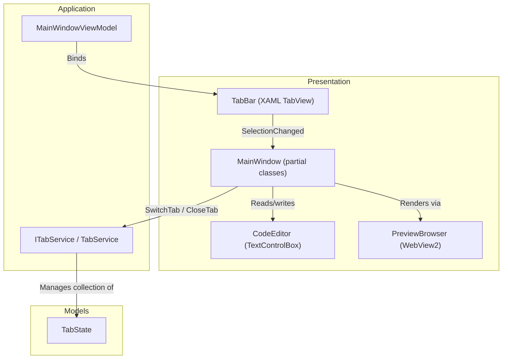
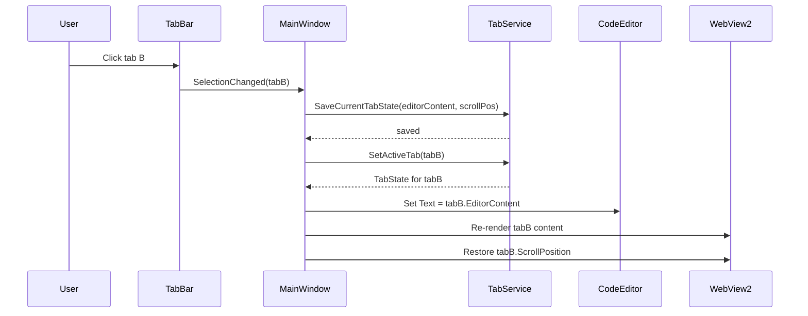

# Design Document: Multi-Tab Preview

## Overview

This design adds multi-tab support to the Preview pane of the Mermaid Diagram Editor. Currently the application tracks a single open file via `_currentFilePath` in `MainWindow.xaml.cs`. The multi-tab design introduces a `TabState` model to hold per-file state (content, file path, content type, dirty flag, scroll position) and an `ITabService` to manage the collection of open tabs. A `TabBar` control is added above the Preview pane in XAML. The single `WebView2` instance is shared across all tabs — only the active tab's content is rendered at any time. Tab switching saves the outgoing tab's editor content and scroll position, then restores the incoming tab's state. The default pane width ratio is changed from 50/50 to 30/70 (editor/preview).

## Architecture



### Tab Switching Flow



## Components and Interfaces

### 1. TabState (Model)

A plain data class holding all per-tab state. Stored in memory by `TabService`.

```csharp
namespace MermaidDiagramApp.Models;

public class TabState
{
    public Guid Id { get; } = Guid.NewGuid();
    public string FilePath { get; set; } = string.Empty;
    public string FileName => string.IsNullOrEmpty(FilePath)
        ? "Untitled"
        : Path.GetFileName(FilePath);
    public string EditorContent { get; set; } = string.Empty;
    public ContentType ContentType { get; set; } = ContentType.Unknown;
    public bool IsDirty { get; set; }
    public double ScrollTop { get; set; }
    public double ScrollLeft { get; set; }
}
```

### 2. ITabService (Service Interface)

Manages the ordered collection of open tabs and the active tab pointer. Registered as a singleton in the DI container.

```csharp
namespace MermaidDiagramApp.Services;

public interface ITabService
{
    IReadOnlyList<TabState> Tabs { get; }
    TabState? ActiveTab { get; }

    TabState AddTab(string filePath, string content, ContentType contentType);
    void RemoveTab(Guid tabId);
    void SetActiveTab(Guid tabId);
    TabState? FindTabByFilePath(string filePath);
    void UpdateTabContent(Guid tabId, string content);
    void MarkDirty(Guid tabId, bool isDirty);
    void UpdateScrollPosition(Guid tabId, double scrollTop, double scrollLeft);

    event EventHandler<TabChangedEventArgs>? ActiveTabChanged;
    event EventHandler<TabChangedEventArgs>? TabClosed;
    event EventHandler<TabChangedEventArgs>? TabAdded;
}

public class TabChangedEventArgs : EventArgs
{
    public TabState? Tab { get; init; }
    public TabState? PreviousTab { get; init; }
}
```

### 3. TabService (Implementation)

```csharp
namespace MermaidDiagramApp.Services;

public class TabService : ITabService
{
    private readonly List<TabState> _tabs = new();
    private Guid? _activeTabId;

    public IReadOnlyList<TabState> Tabs => _tabs.AsReadOnly();
    public TabState? ActiveTab => _tabs.FirstOrDefault(t => t.Id == _activeTabId);

    // ... implementation of interface methods
    // AddTab appends to _tabs, fires TabAdded
    // RemoveTab removes from _tabs, fires TabClosed, selects adjacent tab if active was removed
    // SetActiveTab fires ActiveTabChanged with previous and new tab
}
```

### 4. XAML Layout Changes

The main grid column definitions change the default editor/preview ratio from `*`/`*` to `3*`/`7*`:

```xml
<!-- Before -->
<ColumnDefinition x:Name="EditorColumn" Width="*"/>
<ColumnDefinition x:Name="PreviewColumn" Width="*"/>

<!-- After -->
<ColumnDefinition x:Name="EditorColumn" Width="3*"/>
<ColumnDefinition x:Name="PreviewColumn" Width="7*"/>
```

A `TabView` control is added inside the Preview column (Grid.Column="6"), wrapping the existing `WebView2`:

```xml
<Grid Grid.Column="6">
    <Grid.RowDefinitions>
        <RowDefinition Height="Auto"/>  <!-- TabBar -->
        <RowDefinition Height="*"/>     <!-- Preview content -->
    </Grid.RowDefinitions>

    <TabView x:Name="PreviewTabView"
             Grid.Row="0"
             IsAddTabButtonVisible="False"
             TabCloseRequested="PreviewTabView_TabCloseRequested"
             SelectionChanged="PreviewTabView_SelectionChanged"
             CanDragTabs="False"
             CanReorderTabs="False">
        <!-- TabViewItems are added/removed from code-behind -->
    </TabView>

    <Grid Grid.Row="1">
        <WebView2 x:Name="PreviewBrowser"/>
        <!-- Loading overlay, refresh button, zoom controls remain here -->
    </Grid>
</Grid>
```

Each `TabViewItem` displays the file name, a dirty indicator, and a close button (built into `TabView`):

```csharp
var tabItem = new TabViewItem
{
    Header = tab.IsDirty ? $"● {tab.FileName}" : tab.FileName,
    Tag = tab.Id,
    IsClosable = true
};
```

### 5. MainWindow.Tabs.cs (New Partial Class)

A new partial class file `MainWindow.Tabs.cs` encapsulates all tab-related UI logic:

- `PreviewTabView_SelectionChanged` — saves outgoing tab state, loads incoming tab state into CodeEditor and WebView2
- `PreviewTabView_TabCloseRequested` — checks dirty state, shows save dialog if needed, calls `ITabService.RemoveTab`
- `SyncTabBarFromService` — rebuilds `TabViewItem` collection from `ITabService.Tabs`
- `UpdateTabDirtyIndicator(Guid tabId)` — updates the header text of a specific tab item
- `SaveCurrentTabScrollPosition` — executes JS to read `window.scrollX`/`window.scrollY` and stores in `TabState`
- `RestoreTabScrollPosition` — executes JS `window.scrollTo(x, y)` after render completes

### 6. Integration Points

#### Open File Flow (MainWindow.FileOps.cs)
After reading file content, instead of setting `_currentFilePath` and `CodeEditor.Text` directly:
1. Check if file is already open via `ITabService.FindTabByFilePath(path)`. If so, switch to that tab.
2. Otherwise, call `ITabService.AddTab(path, content, detectedContentType)`.
3. The `TabAdded` event triggers `SyncTabBarFromService` and selects the new tab.

#### Save Flow
`Save_Click` saves the active tab's content. On success, calls `ITabService.MarkDirty(activeTab.Id, false)`.

#### Close Flow
`Close_Click` now closes the active tab (not the entire document). The tab close handler in `MainWindow.Tabs.cs` checks `IsDirty` and shows the save/discard/cancel dialog only when dirty.

#### Timer_Tick / Content Change
When `CodeEditor.Text` changes, call `ITabService.UpdateTabContent(activeTab.Id, newContent)` and `ITabService.MarkDirty(activeTab.Id, true)`.

#### Zoom Panel
When `ActiveTabChanged` fires while the zoom panel is open, re-render the new tab's content and update the zoom panel via `_zoomPanelService.Open(newSvgContent)`.

#### DI Registration (App.xaml.cs)
```csharp
services.AddSingleton<ITabService, TabService>();
```

`MainWindow` constructor receives `ITabService` and wires event handlers.

## Data Models

### TabState

| Property | Type | Description |
|----------|------|-------------|
| `Id` | `Guid` | Unique identifier for the tab instance |
| `FilePath` | `string` | Full path to the file, empty for untitled |
| `FileName` | `string` | Derived from `FilePath`, "Untitled" if empty |
| `EditorContent` | `string` | Current text content in the code editor |
| `ContentType` | `ContentType` | Detected content type (Mermaid, Markdown, etc.) |
| `IsDirty` | `bool` | True when editor content differs from last save |
| `ScrollTop` | `double` | Vertical scroll offset of the WebView2 preview |
| `ScrollLeft` | `double` | Horizontal scroll offset of the WebView2 preview |

### TabChangedEventArgs

| Property | Type | Description |
|----------|------|-------------|
| `Tab` | `TabState?` | The tab that was added, removed, or activated |
| `PreviousTab` | `TabState?` | The previously active tab (for `ActiveTabChanged`) |

### Relationship to Existing Models

- `TabState.ContentType` reuses the existing `ContentType` enum
- `TabState.FilePath` replaces the role of `_currentFilePath` in `MainWindow.xaml.cs`
- `TabState.EditorContent` replaces the implicit "CodeEditor.Text is the source of truth" pattern
- `TabState.IsDirty` replaces the ad-hoc unsaved-changes check (`!string.IsNullOrEmpty(CodeEditor.Text)`) in `Close_Click` and `OpenRecentFile`


## Correctness Properties

*A property is a characteristic or behavior that should hold true across all valid executions of a system — essentially, a formal statement about what the system should do. Properties serve as the bridge between human-readable specifications and machine-verifiable correctness guarantees.*

### Property 1: AddTab creates a correctly named tab and grows the collection

*For any* valid file path and content string, calling `AddTab` should increase the tab count by exactly one, and the new tab's `FileName` should equal `Path.GetFileName(filePath)` (or "Untitled" when the path is empty).

**Validates: Requirements 2.1**

### Property 2: Tab content round-trip across switches

*For any* set of tabs with distinct editor content, switching away from a tab and then switching back should preserve the tab's `EditorContent` exactly as it was before the switch.

**Validates: Requirements 2.2, 2.3, 2.8**

### Property 3: Dirty flag toggle

*For any* tab, calling `MarkDirty(tabId, true)` should set `IsDirty` to true, and subsequently calling `MarkDirty(tabId, false)` should set `IsDirty` to false. The dirty state should always reflect the most recent `MarkDirty` call.

**Validates: Requirements 2.4, 2.6**

### Property 4: Close behavior depends on dirty state

*For any* tab, if `IsDirty` is true then the close flow must require user confirmation before removal; if `IsDirty` is false then the tab can be removed immediately without confirmation.

**Validates: Requirements 3.1, 3.2**

### Property 5: New tabs initialize with zero scroll position

*For any* file path and content, a newly created tab via `AddTab` should have `ScrollTop == 0` and `ScrollLeft == 0`.

**Validates: Requirements 5.1, 5.2**

### Property 6: Scroll position round-trip across switches

*For any* tab with a saved scroll position `(scrollTop, scrollLeft)`, switching away and then switching back should restore the exact same `ScrollTop` and `ScrollLeft` values.

**Validates: Requirements 5.3**

### Property 7: Tab removal removes exactly the target tab

*For any* collection of tabs and any tab ID within that collection, calling `RemoveTab(tabId)` should decrease the tab count by exactly one, and the removed tab should no longer appear in the `Tabs` collection.

**Validates: Requirements 7.3**

## Error Handling

| Scenario | Handling |
|----------|----------|
| File read failure during tab open | Show error dialog, do not create a tab. Log the error. |
| Save failure during tab close (Save option) | Show error dialog, keep the tab open (treat as Cancel). |
| WebView2 not ready during tab switch | Queue the render; when `OnWebViewReady` fires, render the active tab's content. |
| Duplicate file open | `FindTabByFilePath` returns the existing tab; switch to it instead of creating a duplicate. |
| Last tab closed | Clear CodeEditor and WebView2, show empty state. `ActiveTab` becomes null. |
| Tab switch during ongoing render | Cancel/ignore the in-flight render. The new tab's render takes priority. Use `_lastPreviewedCode` guard. |
| Scroll position restore fails (JS error) | Log warning, default to (0, 0). Non-blocking. |
| Zoom panel open during tab switch | Re-render zoom panel with new tab's SVG content. If new tab has no diagram, close the zoom panel. |

## Testing Strategy

### Property-Based Tests (FsCheck.Xunit)

Each correctness property maps to a single property-based test in `MermaidDiagramApp.Tests/Services/TabServicePropertyTests.cs`. Tests use FsCheck 3.x with xUnit integration. Minimum 100 iterations per property.

| Test | Property | Tag |
|------|----------|-----|
| `AddTab_CreatesCorrectlyNamedTab_AndGrowsCollection` | Property 1 | Feature: multi-tab-preview, Property 1: AddTab creates correctly named tab |
| `TabContent_PreservedAcrossSwitch` | Property 2 | Feature: multi-tab-preview, Property 2: Tab content round-trip |
| `DirtyFlag_ReflectsMostRecentMarkDirtyCall` | Property 3 | Feature: multi-tab-preview, Property 3: Dirty flag toggle |
| `CloseRequiresConfirmation_OnlyWhenDirty` | Property 4 | Feature: multi-tab-preview, Property 4: Close behavior depends on dirty state |
| `NewTab_HasZeroScrollPosition` | Property 5 | Feature: multi-tab-preview, Property 5: New tabs zero scroll |
| `ScrollPosition_PreservedAcrossSwitch` | Property 6 | Feature: multi-tab-preview, Property 6: Scroll position round-trip |
| `RemoveTab_RemovesExactlyTargetTab` | Property 7 | Feature: multi-tab-preview, Property 7: Tab removal |

### Unit Tests (xUnit)

Example-based tests for specific scenarios and edge cases:

- Close last tab → empty state (Requirement 3.6)
- Dirty tab shows visual indicator in header (Requirement 2.5)
- Save dialog returns Save → file saved, tab closed (Requirement 3.3)
- Save dialog returns Discard → tab closed without save (Requirement 3.4)
- Save dialog returns Cancel → tab stays open (Requirement 3.5)
- Open file already in a tab → switches to existing tab (dedup)
- Default column widths are 3*/7* (Requirement 1.1)

### Integration Tests

- Tab switch triggers zoom panel update when zoom panel is open (Requirement 6.1)
- Tab close button wiring invokes the correct close flow (Requirement 4.2)

### Test Library

- **FsCheck.Xunit 3.3** for property-based tests (already in test project)
- **xUnit 2.9** for unit and integration tests
- **Moq 4.20** for mocking `IFileOperationsService`, `IZoomPanelService`, etc.
