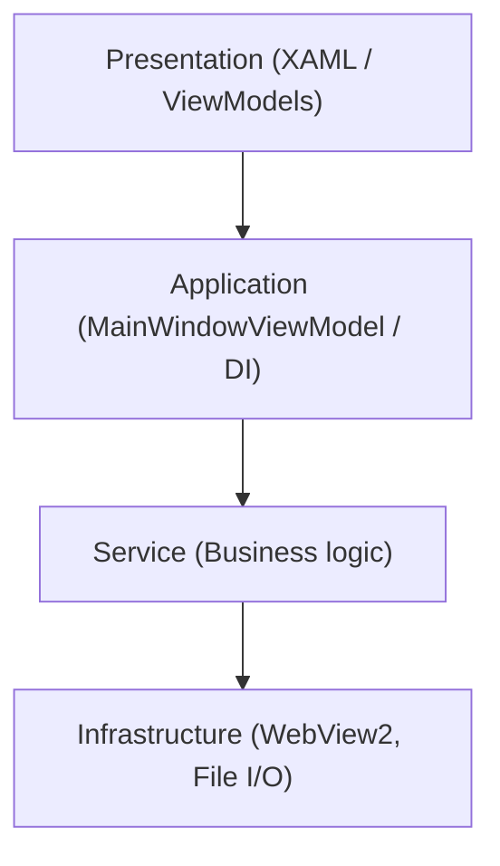

# Project Structure

## Solution Organization

```
MermaidDiagramApp/              # Main application project
MermaidDiagramApp.Tests/        # Test project
docs/                           # Documentation
.kiro/                          # Kiro configuration and specs
```

## Main Application Structure

### Core Application Files

- **App.xaml / App.xaml.cs** - Application entry point, DI container configuration, logging initialization
- **MainWindow.xaml** - Primary UI layout (MenuBar, CodeEditor, WebView2, GridSplitter)
- **MainWindow.xaml.cs** - Core partial class: constructor, field declarations, DI wiring, initialization orchestration (~250 lines)
- **MainWindow.WebView.cs** - Partial class: WebView2 init, message handling, rendering, zoom (~460 lines)
- **MainWindow.UI.cs** - Partial class: new diagram templates, fullscreen/presentation mode, keyboard wiring (~440 lines)
- **MainWindow.FileOps.cs** - Partial class: file open/save/close, recent files, dialog utilities (~490 lines)
- **MainWindow.Export.cs** - Partial class: SVG/PNG export, Mermaid.js update management (~430 lines)
- **MainWindow.RenderMode.cs** - Partial class: render mode overrides, zoom/pan controls, content type indicators (~230 lines)
- **MainWindow.Builder.cs** - Partial class: visual builder panel visibility and canvas wiring (~120 lines)
- **MainWindow.Search.cs** - Partial class: search panel UI wiring and CodeEditor search integration (~140 lines)
- **MainWindow.ScrollSync.cs** - Partial class: synchronized scrolling and scroll-to-line (~200 lines)
- **MainWindow.MarkdownToWord.cs** - Partial class: Markdown-to-Word export dialogs and progress (~415 lines)
- **Package.appxmanifest** - MSIX packaging configuration

### Services Layer (`Services/`)

Organized by functional domain:

#### Rendering (`Services/Rendering/`)
- **RenderingOrchestrator.cs** - Coordinates rendering pipeline (Strategy pattern)
- **ContentTypeDetector.cs** - Detects Mermaid vs Markdown content
- **ContentRendererFactory.cs** - Creates renderer instances (Factory pattern)
- **MermaidRenderer.cs** - Mermaid diagram rendering
- **MarkdownRenderer.cs** - Markdown document rendering
- **IContentRenderer.cs** - Renderer interface

#### Export (`Services/Export/`)
- **MarkdownToWordExportService.cs** - Main export orchestrator
- **MarkdigMarkdownParser.cs** - Parses Markdown to structured data
- **OpenXmlWordDocumentGenerator.cs** - Generates Word documents
- **WebView2MermaidImageRenderer.cs** - Renders Mermaid diagrams to images
- **ImagePathResolver.cs** - Resolves relative/absolute image paths
- Supporting models: ExportResult, ExportProgress, ImageReference, etc.

#### AI (`Services/AI/`)
- **AiServiceFactory.cs** - Creates AI service instances
- **OpenAiService.cs** - OpenAI integration
- **OllamaAiService.cs** - Ollama integration
- **DiagramTypeClassifier.cs** - Classifies diagram types
- **AiConfigStorageService.cs** - Persists AI configuration

#### Logging (`Services/Logging/`)
- **LoggingService.cs** - Singleton logging service
- **Logger.cs** - Logger implementation
- **RollingFileLogSink.cs** - File-based log sink with rotation
- **LogEntry.cs**, **LogLevel.cs** - Supporting types

#### Extracted Services (DI-registered, interface-based)
- **IFileOperationsService.cs / FileOperationsService.cs** - File open/save, recent files, text optimization (wraps DiagramFileService, RecentFilesService, MermaidTextOptimizer)
- **ISearchService.cs / SearchService.cs** - Search state management (find next/previous, reset)
- **IMermaidUpdateService.cs / MermaidUpdateService.cs** - Mermaid.js version checking and update
- **IExportService.cs / ExportService.cs** - SVG background insertion, PNG scaling, file export

#### Other Services
- **MermaidSyntaxAnalyzer.cs** - Analyzes Mermaid syntax
- **MermaidSyntaxFixer.cs** - Auto-fixes common syntax errors
- **MermaidTextOptimizer.cs** - Optimizes text in diagrams
- **KeyboardShortcutManager.cs** - Manages keyboard shortcuts
- **RecentFilesService.cs** - Tracks recently opened files
- **DiagramFileService.cs** - File I/O operations
- **MarkdownStyleSettingsService.cs** - Persists Markdown style preferences

### ViewModels (`ViewModels/`)

MVVM pattern implementation:
- **MainWindowViewModel.cs** - Main window UI state (9 bindable properties) + 19 ICommand properties, delegates to services via DI
- **DiagramBuilderViewModel.cs** - Visual diagram builder logic
- **DiagramCanvasViewModel.cs** - Canvas interaction logic
- **AiDiagramGeneratorViewModel.cs** - AI generation UI logic
- **MarkdownToWordViewModel.cs** - Export UI logic
- **PropertiesPanelViewModel.cs** - Properties panel logic
- **ShapeToolboxViewModel.cs** - Shape toolbox logic
- **SyntaxIssuesViewModel.cs** - Syntax error display

### Views (`Views/`)

XAML user controls:
- **DiagramCanvas.xaml** - Visual diagram builder canvas
- **ShapeToolbox.xaml** - Shape palette for builder
- **PropertiesPanel.xaml** - Element properties editor
- **AiDiagramGeneratorPanel.xaml** - AI generation interface
- **FloatingAiPrompt.xaml** - Floating AI prompt dialog
- **AiSettingsDialog.xaml** - AI configuration dialog
- **MarkdownStyleSettingsDialog.xaml** - Markdown style editor

### Models (`Models/`)

Data structures organized by domain:

#### Canvas (`Models/Canvas/`)
- **DiagramBuilderFile.cs** - Diagram file format
- **CanvasNode.cs** - Visual node representation
- **CanvasConnector.cs** - Connection between nodes
- **ShapeTemplate.cs** - Shape definitions
- **DiagramType.cs** - Diagram type enumeration

#### Core Models
- **ContentType.cs** - Content type enumeration
- **RenderingContext.cs** - Rendering metadata
- **RenderingResult.cs** - Rendering output
- **MarkdownStyleSettings.cs** - Style configuration
- **SearchResult.cs** - Search operation result (Found, MatchIndex, MatchLength, StatusMessage)
- **MermaidVersionInfo.cs** - Mermaid version info (CurrentVersion, LatestVersion, UpdateAvailable)
- **SyntaxIssue.cs** - Syntax error representation
- **KeyboardEventMessage.cs** - Keyboard event data

### Assets (`Assets/`)

Static resources:
- **UnifiedRenderer.html** - WebView2 rendering engine (Mermaid + Markdown)
- **MermaidHost.html** - Legacy Mermaid-only renderer
- **mermaid.min.js** - Mermaid.js library
- **mermaid-version.txt** - Version tracking
- **css/** - Font Awesome CSS
- **webfonts/** - Font Awesome fonts
- **Images/** - Application icons and assets

### Commands (`Commands/`)

- **RelayCommand.cs** - ICommand implementation for MVVM

### Converters (`Converters/`)

XAML value converters:
- **BoolToVisibilityConverter.cs**
- **InverseBooleanConverter.cs**
- **EnumToStringConverter.cs**
- **ZoomLevelConverter.cs**
- etc.

## Test Project Structure (`MermaidDiagramApp.Tests/`)

Mirrors main project structure:

```
Services/
  DiContainerPropertyTests.cs   # DI container resolution tests
  FileOperationsServiceTests.cs  # FileOperationsService unit tests
  SearchServiceTests.cs          # SearchService unit tests
  MermaidUpdateServiceTests.cs   # MermaidUpdateService unit tests
  ExportServiceTests.cs          # ExportService unit tests
  Export/                        # Export functionality tests
    MarkdownToWordExportServiceTests.cs
    ImagePathResolverTests.cs
    *PropertyTests.cs            # Property-based tests
    EndToEndIntegrationTests.cs
  KeyboardShortcutManagerTests.cs
  MermaidTextOptimizerTests.cs
ViewModels/
  MainWindowViewModelPropertyTests.cs  # ViewModel commands, PropertyChanged, DI tests
  MarkdownToWordViewModelTests.cs
  *PropertyTests.cs
Models/
  KeyboardEventMessageTests.cs
```

### Test Naming Conventions

- **Unit tests**: `[ClassName]Tests.cs`
- **Property-based tests**: `[ClassName]PropertyTests.cs`
- **Integration tests**: `[Feature]IntegrationTests.cs`

## Documentation (`docs/`)

- **SOFTWARE_DESIGN.md** - Architecture and design patterns
- **USER_GUIDE.md** - End-user documentation
- **features/** - Feature-specific documentation
- **design/** - Design documents
- **finding/** - Investigation notes

## Configuration Files

- **.kiro/specs/** - Feature specifications
- **.kiro/steering/** - AI assistant guidance (this file)
- **.kiro/hooks/** - Automation hooks
- **.gitignore** - Git exclusions
- **Package.appxmanifest** - MSIX manifest

## Key Architectural Patterns

### Layered Architecture


### Dependency Injection
- DI container configured in `App.xaml.cs` using `Microsoft.Extensions.DependencyInjection`
- Services registered as singletons or transients based on statefulness
- MainWindow and MainWindowViewModel resolved from the container
- Static classes (WindowStateManager, AiConfigStorageService, AiServiceFactory, FontManager) used directly (not DI-registered)

### SOLID Principles
- Services use interface-based design (IContentRenderer, ILogger, IFileOperationsService, ISearchService, etc.)
- Factory pattern for object creation
- Strategy pattern for rendering
- Single responsibility per service class and per partial class file

### File Naming
- Interfaces: `I[Name].cs`
- Implementations: `[Name].cs`
- ViewModels: `[Feature]ViewModel.cs`
- Views: `[Feature].xaml` + `[Feature].xaml.cs`
- Tests: `[ClassName]Tests.cs`
