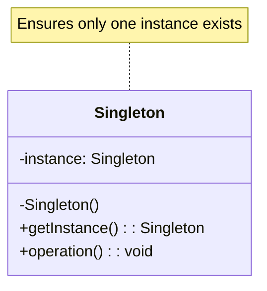
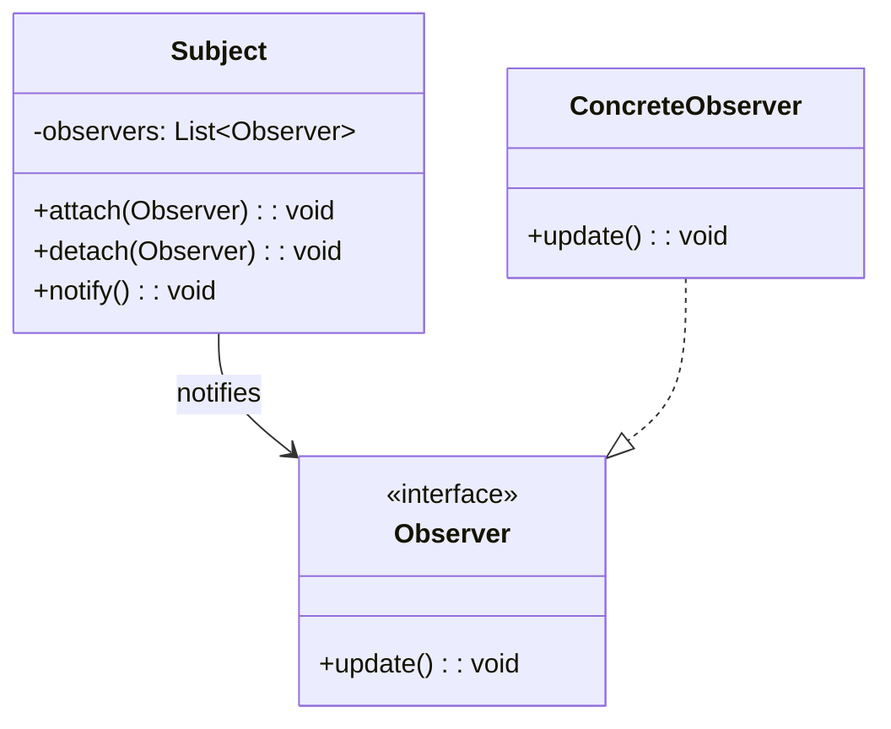

# WinUI3 Mermaid Diagram Editor - Product Backlog

## Epic: Design Pattern Diagram Generation

### Overview
Deliver a reusable pattern catalog and diagram generator so users can scaffold UML diagrams from canonical design patterns with minimal manual effort.

### Architecture & Design Principles
* __Single Responsibility (S)__ — Separate concerns across presentation (`PatternSelectionDialog`), orchestration (`DesignPatternController`), and template data (`IPatternTemplate` implementations).
* __Open/Closed (O)__ — Allow new patterns to be added by creating additional template classes or JSON documents without modifying existing logic.
* __Liskov Substitution (L)__ — Ensure every template implements a common interface so the generator treats all patterns uniformly.
* __Interface Segregation (I)__ — Provide focused interfaces (`IPatternMetadata`, `IPatternRenderer`, `ICustomizationSchema`) consumed only by components that need them.
* __Dependency Inversion (D)__ — Resolve template providers and documentation services through abstractions to keep `MainWindow` and UI code decoupled from data sources.

### User Stories

#### Story 1: Discover Patterns in the UI
**As a** diagram author  
**I want** an organized pattern catalog inside the editor  
**So that** I can quickly find the pattern I need without leaving the app

**Acceptance Criteria:**
- [ ] A `Design Patterns` top-level menu (or submenu) appears next to existing templates in `MainMenuBar` of `MainWindow.xaml`.
- [ ] Selecting the menu opens a `PatternSelectionDialog` with tabs or filters for Creational, Structural, and Behavioral categories.
- [ ] Each catalog card shows pattern name, one-sentence summary, and difficulty tag.
- [ ] Selecting a card highlights it and enables the `Use Pattern` action.
- [ ] The catalog loads from the pattern registry service; removing a pattern from the registry hides it without UI changes.

**Estimated Effort:** 8 story points

#### Story 2: Generate Creational Pattern Diagrams
**As a** developer  
**I want** the app to scaffold Mermaid diagrams for standard creational patterns  
**So that** I can communicate object-creation strategies quickly

**Acceptance Criteria:**
- [ ] Patterns supported: Singleton, Factory Method, Abstract Factory, Builder, Prototype.
- [ ] Selecting `Use Pattern` injects the generated Mermaid code into the editor and triggers `UpdatePreview()`.
- [ ] Template output adheres to Mermaid class diagram syntax with correct relationships and stereotypes.
- [ ] The generator exposes a `Customize…` button when optional role names are available.
- [ ] Unit tests confirm each pattern renders expected Mermaid markup via an `IPatternRenderer` contract.

**Estimated Effort:** 13 story points

#### Story 3: Generate Structural Pattern Diagrams
**As a** developer  
**I want** ready-made diagrams for structural patterns  
**So that** I can show object composition and delegation clearly

**Acceptance Criteria:**
- [ ] Patterns supported: Adapter, Decorator, Facade, Composite, Bridge, Proxy.
- [ ] Diagram output matches UML expectations (composition, aggregation, inheritance) using Mermaid syntax.
- [ ] Each template provides sensible default participant names and relationships that can be customized.
- [ ] Pattern templates reside in individual classes or JSON files so additional patterns can be added without modifying core logic.
- [ ] Integration tests validate the generator returns non-empty code for every registered structural pattern.

**Estimated Effort:** 13 story points

#### Story 4: Generate Behavioral Pattern Diagrams
**As a** developer  
**I want** behavior-focused diagrams for collaboration patterns  
**So that** I can illustrate control flow and interactions

**Acceptance Criteria:**
- [ ] Patterns supported: Observer, Strategy, Command, State, Template Method, Chain of Responsibility.
- [ ] Each pattern chooses the most expressive Mermaid format (class, sequence, or state) defined in the template metadata.
- [ ] Templates include interaction notes (e.g., method calls, state transitions) rendered using Mermaid annotations.
- [ ] Each pattern exposes a step-by-step description in the customization dialog’s “How it works” panel.
- [ ] Automated tests assert that every behavioral template compiles through the Mermaid renderer without errors.

**Estimated Effort:** 21 story points

#### Story 5: Customize Pattern Parameters
**As a** developer  
**I want** to tailor class and participant names before inserting a pattern  
**So that** the generated diagram matches my domain vocabulary

**Acceptance Criteria:**
- [ ] Selecting `Customize…` opens a WinUI dialog bound to the template’s `ICustomizationSchema` (e.g., role names, method labels).
- [ ] The dialog shows validation feedback (required fields, naming clashes) before the `Insert` button is enabled.
- [ ] Changes update a live preview section powered by the WebView2 instance using throttled renders.
- [ ] User selections persist for the current session so reopening the dialog preserves prior inputs.
- [ ] Canceling the dialog leaves the editor unchanged.

**Estimated Effort:** 13 story points

#### Story 6: Contextual Documentation & Guidance
**As a** developer  
**I want** quick access to pattern documentation inside the dialog  
**So that** I understand when to use each pattern and its trade-offs

**Acceptance Criteria:**
- [ ] Each pattern exposes a documentation pane with sections: “When to use”, “Participants”, “Sample code (language toggle)”, and “Pitfalls”.
- [ ] External resource links open in the default browser via `Launcher.LaunchUriAsync`.
- [ ] A comparison matrix is available from the dialog, highlighting similar patterns (e.g., Strategy vs State) with key differences.
- [ ] Documentation content is supplied by a provider implementing `IPatternDocumentationService`, keeping UI decoupled from content.
- [ ] Accessibility review verifies the dialog is keyboard navigable and compliant with contrast guidelines.

**Estimated Effort:** 8 story points

### Technical Considerations

#### Implementation Approach
- Introduce `DesignPatternModule` containing interfaces (`IPatternTemplate`, `IPatternRenderer`, `IPatternCustomizationSchema`).
- Implement a registry (`PatternCatalogService`) that loads template metadata from embedded JSON or assembly scanning.
- Build a WinUI `PatternSelectionDialog` leveraging MVVM (view model orchestrates selections, documentation, customization flow).
- Reuse `MainWindow.UpdatePreview()` by injecting generated code into `CodeEditor.Text` and resetting `_lastPreviewedCode`.
- Provide extension points for future template packs (e.g., enterprise patterns) without modifying existing services.

#### Mermaid Template Examples

**Singleton Pattern:**

**Observer Pattern:**

### Definition of Done
- [ ] All story-level acceptance criteria satisfied
- [ ] Unit tests for template generation and customization logic
- [ ] Integration tests covering pattern selection and live preview
- [ ] Documentation updated (`USER_GUIDE.md`, inline help)
- [ ] Code review completed with architectural sign-off
- [ ] Performance verified (pattern render < 100 ms on reference hardware)

### Priority: Medium
### Target Sprint: Future (Post-MVP)
### Dependencies: Core editor functionality, UML template system, WebView2 preview pipeline

---

## Notes
- This feature builds upon the existing UML-focused template system
- Should integrate seamlessly with current file operations and preview
- Consider extensibility for custom user-defined patterns
- May require WebView2 integration for enhanced preview capabilities

---

## Epic: Stick Figure Pose Builder

### Overview
Introduce a customizable stick-figure creation workflow that lets users compose human poses inside the Mermaid editor. The feature should expose granular controls for limbs, posture, head orientation, rotation, and provide a dedicated menu entry to launch the experience.

### User Stories

#### Story 1: Stick Figure Menu Entry
**As a** diagram author  
**I want** a "Stick Figure" item in the Templates menu  
**So that** I can quickly open the pose builder workspace

**Acceptance Criteria:**
- [ ] Add "Stick Figure" option to the Templates (or dedicated) menu without implementation yet
- [ ] Launches placeholder dialog or page once implemented
- [ ] Integrates with future stick figure pose builder

**Estimated Effort:** 3 story points

#### Story 2: Limb Control Panel
**As a** designer  
**I want** to adjust stick figure arm and leg angles  
**So that** I can depict different gestures and stances

**Acceptance Criteria:**
- [ ] Sliders or numeric inputs for shoulder, elbow, hip, and knee angles
- [ ] Visual feedback in Mermaid preview
- [ ] Preset poses (e.g., neutral, walking, running)

**Estimated Effort:** 8 story points

#### Story 3: Posture & Balance Controls
**As a** user  
**I want** to set the torso lean and overall posture  
**So that** I can represent different movement dynamics

**Acceptance Criteria:**
- [ ] Controls for torso tilt (forward/backward, left/right)
- [ ] Adjustable center-of-mass / base stance width
- [ ] Real-time validation to avoid impossible poses

**Estimated Effort:** 8 story points

#### Story 4: Head Orientation
**As a** user  
**I want** to specify the head direction (front/back/left/right)  
**So that** the figure conveys attention and motion direction

**Acceptance Criteria:**
- [ ] Dropdown or toggle for head orientation presets
- [ ] Optional fine-grained yaw, pitch, roll controls
- [ ] Head orientation reflected in generated Mermaid markup

**Estimated Effort:** 5 story points

#### Story 5: Figure Rotation & Placement
**As a** diagram author  
**I want** to rotate and position the entire figure  
**So that** I can align it within complex diagrams

**Acceptance Criteria:**
- [ ] Global rotation control (0°–360°)
- [ ] Position offsets (X/Y) relative to diagram origin
- [ ] Snapping options for alignment with other diagram elements

**Estimated Effort:** 5 story points

### Technical Considerations
- Extend existing Mermaid template generation to support stick figure primitives (e.g., `graph TD` or custom `flowchart` shapes).
- Evaluate whether a custom Mermaid plugin or SVG overlay is required for fine-grained limb articulation.
- Persist pose configurations alongside diagrams for later editing.
- Ensure future UI dialog matches WinUI3 design guidelines and responds to theme changes.

### Priority: Low-Medium (Backlog)
### Target Sprint: Future
### Dependencies: Stable template infrastructure, enhanced preview pipeline

---

## Epic: Manual Mermaid Syntax Fixer with Validation

### Overview
Deliver a manual syntax fixer that first shows all detected syntax errors and allows users to review and confirm before applying fixes, providing full visibility and control over what changes will be made to their diagrams.

### Architecture & Design Principles
* __Single Responsibility (S)__ — Separate concerns: syntax detection (`ISyntaxAnalyzer`), issue presentation (`SyntaxIssuesPanel`), and fix application (`ISyntaxFixer`).
* __Open/Closed (O)__ — Allow new detection rules to be added without modifying core analyzer logic.
* __Interface Segregation (I)__ — Provide focused interfaces for detection, preview, and fix operations.
* __Dependency Inversion (D)__ — Resolve analyzers and fixers through abstractions to keep UI decoupled from detection logic.

### User Stories

#### Story 1: Trigger Syntax Analysis via Menu
**As a** diagram creator  
**I want** a menu item to analyze syntax issues in the current file  
**So that** I can see what problems exist before deciding to fix them

**Acceptance Criteria:**
- [ ] Menu item available in editor context menu (right-click)
- [ ] Menu item available in top menu bar (e.g., Edit > Check Mermaid Syntax)
- [ ] Menu item only appears when editing `.mmd` files
- [ ] Keyboard shortcut is available and configurable
- [ ] Menu item is clearly labeled (e.g., "Check & Fix Mermaid Syntax")

**Estimated Effort:** 5 story points

#### Story 2: Display Detected Syntax Issues
**As a** diagram creator  
**I want** to see a clear list of all detected syntax issues  
**So that** I understand what's wrong before fixing

**Acceptance Criteria:**
- [ ] Issues displayed in a dedicated panel/dialog
- [ ] Each issue shows: line number, column, issue type, and description
- [ ] Issues are grouped by type (Unicode chars, line breaks, etc.)
- [ ] Shows count of each issue type
- [ ] Displays "No issues found" if file is clean
- [ ] Issues are sortable by line number or type
- [ ] Click on issue navigates to that line in editor

**Estimated Effort:** 8 story points

#### Story 3: Preview Proposed Fixes
**As a** diagram creator  
**I want** to see exactly what changes will be made for each issue  
**So that** I can verify the fixes are correct before applying

**Acceptance Criteria:**
- [ ] Side-by-side diff view shows before/after for each issue
- [ ] Original text and replacement text clearly highlighted
- [ ] Can navigate between issues using next/previous buttons
- [ ] Shows context (surrounding lines) for each fix
- [ ] Visual indicators for additions/deletions/changes
- [ ] Preview updates in real-time as user selects issues

**Estimated Effort:** 13 story points

#### Story 4: Selective Fix Application
**As a** diagram creator  
**I want** to choose which issues to fix  
**So that** I have granular control over changes

**Acceptance Criteria:**
- [ ] Checkbox next to each issue to select/deselect
- [ ] "Select All" / "Deselect All" options available
- [ ] Can select all issues of a specific type
- [ ] Selected count displayed (e.g., "5 of 12 selected")
- [ ] Only selected issues are fixed when applying
- [ ] Unselected issues remain unchanged

**Estimated Effort:** 8 story points

#### Story 5: Confirm Before Applying Fixes
**As a** diagram creator  
**I want** a final confirmation step before fixes are applied  
**So that** I can prevent accidental changes

**Acceptance Criteria:**
- [ ] "Apply Fixes" button clearly visible
- [ ] Confirmation dialog shows summary of changes to be made
- [ ] Summary includes: number of fixes, affected lines, issue types
- [ ] "Cancel" option discards all changes
- [ ] Cannot apply if no issues are selected
- [ ] Confirmation can be disabled in settings (with warning)

**Estimated Effort:** 5 story points

#### Story 6: Unicode Character Detection & Replacement
**As a** diagram creator  
**I want** the analyzer to detect problematic Unicode characters  
**So that** I can see and fix Unicode-related parse errors

**Acceptance Criteria:**
- [ ] Detects en-dashes (–), em-dashes (—), and suggests hyphen (-)
- [ ] Detects Unicode arrows (→, ←, ↔) and suggests text/removal
- [ ] Detects smart quotes (" " ' ') and suggests straight quotes
- [ ] Shows exact Unicode character code in issue details
- [ ] Highlights problematic character in editor when selected
- [ ] Provides explanation why character causes issues

**Estimated Effort:** 8 story points

#### Story 7: Line Break Syntax Detection
**As a** diagram creator  
**I want** the analyzer to detect incompatible line break syntax  
**So that** I can fix multi-line label issues

**Acceptance Criteria:**
- [ ] Detects `\n` escape sequences in node labels
- [ ] Suggests replacement with ` ` tags
- [ ] Only flags `\n` within node labels `[...]`
- [ ] Does not flag `\n` in comments or other contexts
- [ ] Shows preview of how label will appear after fix
- [ ] Handles multiple `\n` sequences in same label

**Estimated Effort:** 5 story points

#### Story 8: Issue Severity Levels
**As a** diagram creator  
**I want** issues categorized by severity  
**So that** I can prioritize critical fixes

**Acceptance Criteria:**
- [ ] Issues marked as: Error, Warning, or Info
- [ ] Errors prevent diagram rendering (must fix)
- [ ] Warnings may cause issues (recommended to fix)
- [ ] Info items are suggestions (optional)
- [ ] Visual indicators (icons/colors) for each severity
- [ ] Can filter view by severity level
- [ ] Error count displayed prominently

**Estimated Effort:** 5 story points

#### Story 9: Batch Analysis for Multiple Files
**As a** diagram creator  
**I want** to analyze multiple `.mmd` files at once  
**So that** I can identify issues across my project

**Acceptance Criteria:**
- [ ] Right-click multiple files in explorer to analyze
- [ ] Command to analyze all `.mmd` files in workspace
- [ ] Results grouped by file
- [ ] Shows total issue count per file
- [ ] Can expand/collapse each file's issues
- [ ] Can fix all issues in selected files after review
- [ ] Progress indicator during batch analysis

**Estimated Effort:** 13 story points

#### Story 10: Post-Fix Summary & Undo
**As a** diagram creator  
**I want** a summary after fixes are applied and ability to undo  
**So that** I can verify results and revert if needed

**Acceptance Criteria:**
- [ ] Success message shows number of fixes applied
- [ ] Lists which issue types were fixed
- [ ] Shows which lines were modified
- [ ] Standard undo (Ctrl+Z) reverts all fixes as one operation
- [ ] "Undo" button available in summary notification
- [ ] Can re-run analysis to verify all issues resolved
- [ ] Summary can be copied to clipboard

**Estimated Effort:** 5 story points

#### Story 11: Configurable Detection Rules
**As a** power user  
**I want** to configure which syntax issues to detect  
**So that** I can customize the analyzer for my needs

**Acceptance Criteria:**
- [ ] Settings panel lists all detection rules
- [ ] Each rule can be enabled/disabled
- [ ] Can set severity level per rule (Error/Warning/Info)
- [ ] Custom rules can be added via regex patterns
- [ ] Settings persist across sessions
- [ ] Can export/import rule configurations
- [ ] Changes apply to next analysis run

**Estimated Effort:** 13 story points

#### Story 12: Manual-Only Operation
**As a** diagram creator  
**I want** the analyzer to only run when I explicitly trigger it  
**So that** I'm never interrupted by automatic checks

**Acceptance Criteria:**
- [ ] No automatic analysis on file open
- [ ] No automatic analysis on file save
- [ ] No automatic analysis while typing
- [ ] Only runs via menu item or command
- [ ] Clear indication when analysis is running
- [ ] Can cancel analysis if taking too long

**Estimated Effort:** 3 story points

### User Flow
1. User opens `.mmd` file with syntax errors
2. User clicks "Check & Fix Mermaid Syntax" menu item
3. Analyzer scans file and displays issues panel
4. User reviews each issue with preview
5. User selects which issues to fix (or select all)
6. User clicks "Apply Fixes" button
7. Confirmation dialog shows summary
8. User confirms, fixes are applied
9. Success summary displayed with undo option

### Technical Considerations

#### Implementation Approach
- Introduce `SyntaxAnalysisModule` containing interfaces (`ISyntaxAnalyzer`, `ISyntaxFixer`, `ISyntaxRule`).
- Implement a rule-based analyzer that scans for Unicode issues, line break problems, and other syntax errors.
- Build a WinUI `SyntaxIssuesPanel` with diff preview leveraging MVVM pattern.
- Provide atomic undo/redo support for all fixes applied in a single operation.
- Support extensible rule system for future syntax checks.

#### Detection Rules
- **Unicode Dash Detection**: Regex pattern to find en-dash (U+2013), em-dash (U+2014)
- **Unicode Arrow Detection**: Pattern for →, ←, ↔, ⇒, etc.
- **Smart Quote Detection**: Pattern for curly quotes " " ' '
- **Line Break Detection**: Pattern for `\n` within `[...]` node labels
- **Parentheses in Labels**: Detection of problematic parentheses usage

### Definition of Done
- [ ] All story-level acceptance criteria satisfied
- [ ] Unit tests for syntax detection and fix logic
- [ ] Integration tests covering analysis workflow and fix application
- [ ] Documentation updated (`USER_GUIDE.md`, inline help)
- [ ] Code review completed with architectural sign-off
- [ ] Performance verified (analysis < 1 second for 5,000 line files)
- [ ] Zero data loss or corruption in fix operations

### Priority: High
### Target Sprint: Next Sprint
### Dependencies: Core editor functionality, file operations, undo/redo system

### Success Metrics
- 95% of syntax errors detected accurately
- Zero false positives in detection
- User applies fixes 80%+ of the time after review
- Average time from detection to fix <30 seconds
- User satisfaction rating >4.5/5
