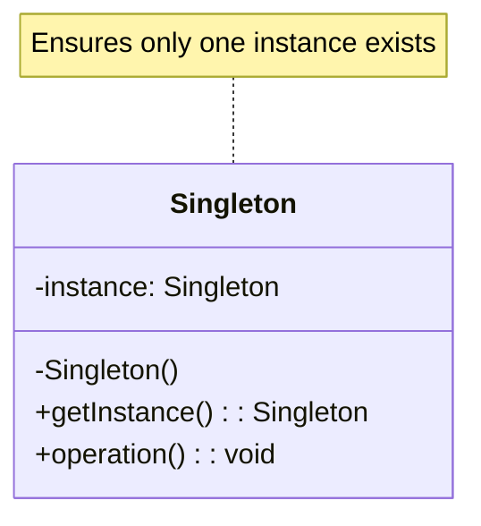
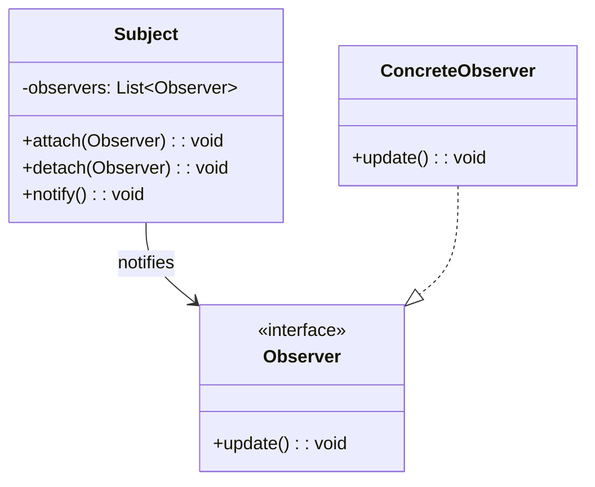

# WinUI3 Mermaid Diagram Editor - Product Backlog

## Epic: Design Pattern Diagram Generation

### Overview
Add functionality to automatically generate Mermaid diagrams for common software design patterns, allowing users to quickly create standardized pattern visualizations.

### User Stories

#### Story 1: Design Pattern Selection UI
**As a** developer  
**I want** to select from a list of common design patterns  
**So that** I can quickly generate standardized pattern diagrams  

**Acceptance Criteria:**
- [ ] Add "Design Patterns" menu to main menu bar
- [ ] Create pattern selection dialog with categories
- [ ] Display pattern descriptions and use cases
- [ ] Show preview thumbnail for each pattern

**Estimated Effort:** 8 story points

#### Story 2: Creational Pattern Templates
**As a** developer  
**I want** to generate diagrams for creational design patterns  
**So that** I can visualize object creation mechanisms  

**Patterns to Support:**
- [ ] Singleton Pattern
- [ ] Factory Method Pattern  
- [ ] Abstract Factory Pattern
- [ ] Builder Pattern
- [ ] Prototype Pattern

**Acceptance Criteria:**
- [ ] Pre-built Mermaid class diagram templates
- [ ] Customizable class and method names
- [ ] Proper UML relationships and stereotypes
- [ ] Generated code appears in editor for modification

**Estimated Effort:** 13 story points

#### Story 3: Structural Pattern Templates
**As a** developer  
**I want** to generate diagrams for structural design patterns  
**So that** I can visualize object composition and relationships  

**Patterns to Support:**
- [ ] Adapter Pattern
- [ ] Decorator Pattern
- [ ] Facade Pattern
- [ ] Composite Pattern
- [ ] Bridge Pattern
- [ ] Proxy Pattern

**Acceptance Criteria:**
- [ ] Class diagram templates showing structure
- [ ] Interface and inheritance relationships
- [ ] Composition and aggregation links
- [ ] Configurable component names

**Estimated Effort:** 13 story points

#### Story 4: Behavioral Pattern Templates
**As a** developer  
**I want** to generate diagrams for behavioral design patterns  
**So that** I can visualize object interactions and responsibilities  

**Patterns to Support:**
- [ ] Observer Pattern
- [ ] Strategy Pattern
- [ ] Command Pattern
- [ ] State Pattern
- [ ] Template Method Pattern
- [ ] Chain of Responsibility Pattern

**Acceptance Criteria:**
- [ ] Class and sequence diagram options
- [ ] Method call flows and interactions
- [ ] State transitions where applicable
- [ ] Parameterizable participant names

**Estimated Effort:** 21 story points

#### Story 5: Pattern Customization Dialog
**As a** developer  
**I want** to customize pattern parameters before generation  
**So that** I can create domain-specific implementations  

**Acceptance Criteria:**
- [ ] Parameter input form for each pattern
- [ ] Real-time preview of generated diagram
- [ ] Validation of input parameters
- [ ] Save custom pattern configurations
- [ ] Import/export pattern templates

**Estimated Effort:** 13 story points

#### Story 6: Pattern Documentation Integration
**As a** developer  
**I want** to access pattern documentation and examples  
**So that** I can understand when and how to use each pattern  

**Acceptance Criteria:**
- [ ] Built-in help system for each pattern
- [ ] Code examples in multiple languages
- [ ] Best practices and anti-patterns
- [ ] Links to external resources
- [ ] Pattern comparison matrix

**Estimated Effort:** 8 story points

### Technical Considerations

#### Implementation Approach
- Extend existing template system in MainWindow.xaml.cs
- Create PatternTemplate class hierarchy
- Add PatternSelectionDialog WinUI3 window
- Integrate with existing Mermaid code generation

#### Mermaid Template Examples

**Singleton Pattern:**

**Observer Pattern:**

### Definition of Done
- [ ] All acceptance criteria met
- [ ] Unit tests for pattern generation logic
- [ ] Integration tests for UI components
- [ ] Documentation updated
- [ ] Code review completed
- [ ] Performance testing (pattern generation < 100ms)

### Priority: Medium
### Target Sprint: Future (Post-MVP)
### Dependencies: Core editor functionality, UML template system

---

## Notes
- This feature builds upon the existing UML-focused template system
- Should integrate seamlessly with current file operations and preview
- Consider extensibility for custom user-defined patterns
- May require WebView2 integration for enhanced preview capabilities

---

## Epic: Stick Figure Pose Builder

### Overview
Introduce a customizable stick-figure creation workflow that lets users compose human poses inside the Mermaid editor. The feature should expose granular controls for limbs, posture, head orientation, rotation, and provide a dedicated menu entry to launch the experience.

### User Stories

#### Story 1: Stick Figure Menu Entry
**As a** diagram author  
**I want** a "Stick Figure" item in the Templates menu  
**So that** I can quickly open the pose builder workspace

**Acceptance Criteria:**
- [ ] Add "Stick Figure" option to the Templates (or dedicated) menu without implementation yet
- [ ] Launches placeholder dialog or page once implemented
- [ ] Integrates with future stick figure pose builder

**Estimated Effort:** 3 story points

#### Story 2: Limb Control Panel
**As a** designer  
**I want** to adjust stick figure arm and leg angles  
**So that** I can depict different gestures and stances

**Acceptance Criteria:**
- [ ] Sliders or numeric inputs for shoulder, elbow, hip, and knee angles
- [ ] Visual feedback in Mermaid preview
- [ ] Preset poses (e.g., neutral, walking, running)

**Estimated Effort:** 8 story points

#### Story 3: Posture & Balance Controls
**As a** user  
**I want** to set the torso lean and overall posture  
**So that** I can represent different movement dynamics

**Acceptance Criteria:**
- [ ] Controls for torso tilt (forward/backward, left/right)
- [ ] Adjustable center-of-mass / base stance width
- [ ] Real-time validation to avoid impossible poses

**Estimated Effort:** 8 story points

#### Story 4: Head Orientation
**As a** user  
**I want** to specify the head direction (front/back/left/right)  
**So that** the figure conveys attention and motion direction

**Acceptance Criteria:**
- [ ] Dropdown or toggle for head orientation presets
- [ ] Optional fine-grained yaw, pitch, roll controls
- [ ] Head orientation reflected in generated Mermaid markup

**Estimated Effort:** 5 story points

#### Story 5: Figure Rotation & Placement
**As a** diagram author  
**I want** to rotate and position the entire figure  
**So that** I can align it within complex diagrams

**Acceptance Criteria:**
- [ ] Global rotation control (0°–360°)
- [ ] Position offsets (X/Y) relative to diagram origin
- [ ] Snapping options for alignment with other diagram elements

**Estimated Effort:** 5 story points

### Technical Considerations
- Extend existing Mermaid template generation to support stick figure primitives (e.g., `graph TD` or custom `flowchart` shapes).
- Evaluate whether a custom Mermaid plugin or SVG overlay is required for fine-grained limb articulation.
- Persist pose configurations alongside diagrams for later editing.
- Ensure future UI dialog matches WinUI3 design guidelines and responds to theme changes.

### Priority: Low-Medium (Backlog)
### Target Sprint: Future
### Dependencies: Stable template infrastructure, enhanced preview pipeline
