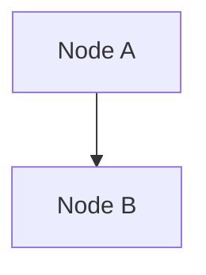

# Markdown + Mermaid Scroll Synchronization

## What Was Fixed

Updated the scroll synchronization to work with **Markdown files that contain Mermaid diagrams**.

## How It Works Now

### 1. Detects Mermaid Code Blocks

The parser now looks for Mermaid code blocks in Markdown:

```markdown
# My Document

Some text here...



More text...
```

### 2. Extracts and Parses Each Block

- Finds all ````mermaid` code blocks
- Extracts the Mermaid code from each block
- Parses nodes and tracks their line numbers
- Maintains correct line numbers relative to the original file

### 3. Click to Scroll

When you click on a line in the Markdown file:
- If the line is inside a Mermaid block, it scrolls to that node
- If the line is outside Mermaid blocks, nothing happens (no elements to scroll to)

## Test It

1. **Run the application**
2. **Open your Markdown file** (the one with Mermaid diagrams)
3. **Click on lines inside the Mermaid code blocks**
4. **The preview should scroll** to show the corresponding diagram element

## What to Look For in Logs

```
[INFO] Parsed X elements for scroll sync  ← Should be > 0 now
[INFO] Line markers injected into SVG
[INFO] CodeEditor clicked!
[INFO] Elements count: X  ← Should show the number of nodes found
[INFO] Clicked on line X, syncing...
[DEBUG] Syncing to element 'A' at line X
[DEBUG] Scroll result: "success"  ← Should say "success" not "no svg"
```

## Example

If your Markdown file has:

```markdown
Line 1: # Title
Line 2: 
Line 3: ```mermaid
Line 4: flowchart TB
Line 5:     A[Start]
Line 6:     B[End]
Line 7:     A --> B
Line 8: ```
```

When you click on **line 5**, the preview will scroll to show the "Start" node.

## Build Status

✅ **Compiled successfully**
✅ **Ready to test**

Now test it with your Markdown file and check the logs to see if it finds the elements!
