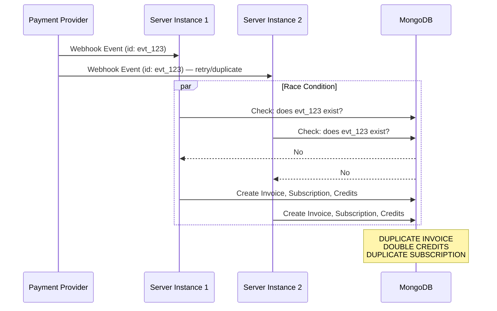
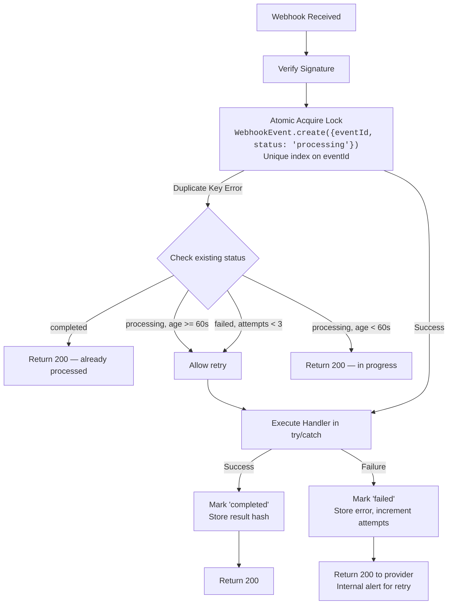
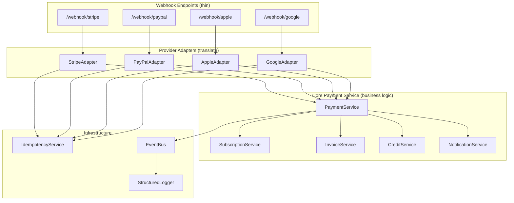
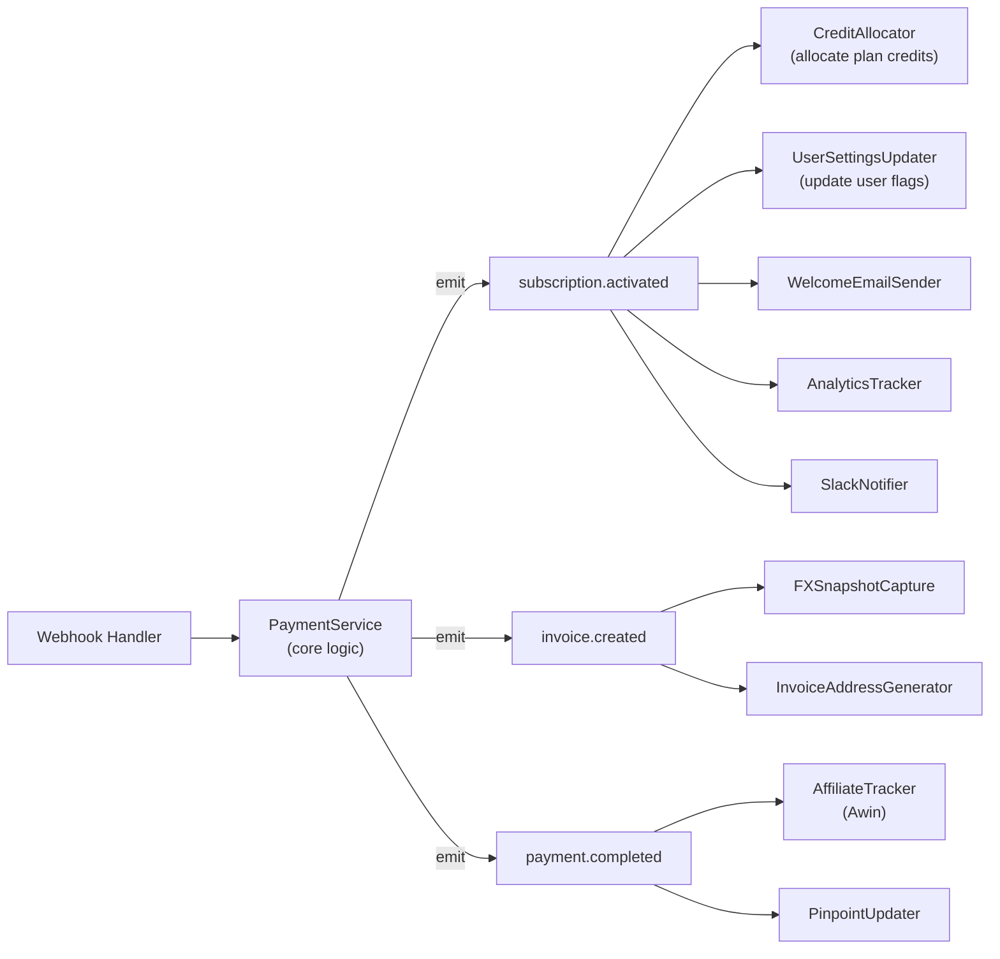
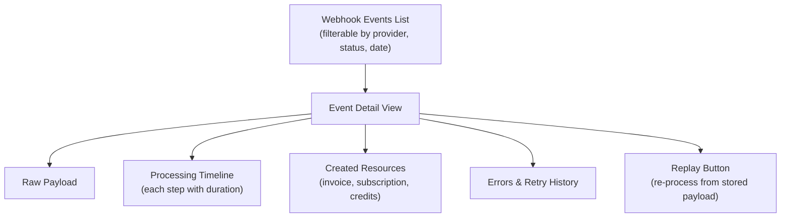
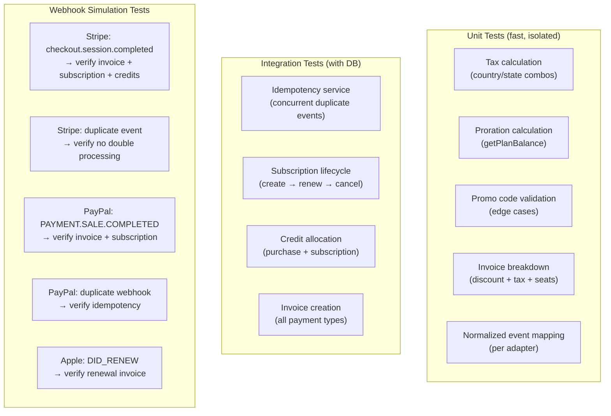
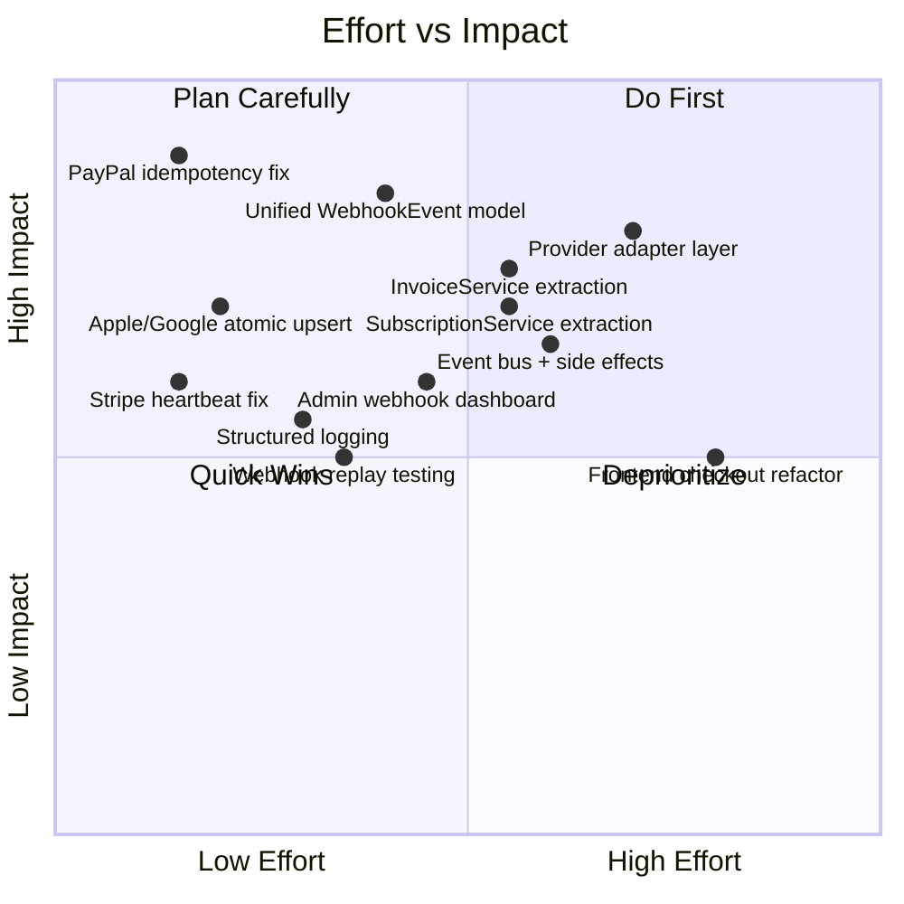

# Payment Module — Refactoring Proposal

> A comprehensive plan to make the payment module more maintainable, modular, and resilient — with a specific focus on webhook idempotency and duplicate callback handling.

---

## Table of Contents

1. [Current Pain Points](#1-current-pain-points)
2. [Webhook Idempotency & Duplicate Callbacks](#2-webhook-idempotency--duplicate-callbacks)
3. [Unified Provider Abstraction Layer](#3-unified-provider-abstraction-layer)
4. [Event-Driven Architecture](#4-event-driven-architecture)
5. [Observability & Troubleshooting](#5-observability--troubleshooting)
6. [Code Organization & Modularization](#6-code-organization--modularization)
7. [Testing Strategy](#7-testing-strategy)
8. [Migration Plan](#8-migration-plan)

---

## 1. Current Pain Points

### 1.1 Inconsistent Idempotency Across Providers

The biggest operational risk in the current system. Each provider handles duplicate callbacks differently — or not at all:

| Provider | Current Idempotency | Risk Level |
|----------|-------------------|------------|
| Stripe | `StripeProcessedEvent` model + in-memory `Set` + resource-level check (`stripeSessionId`) | Low — but has a race window between the `create` and the `findOne` fallback |
| PayPal | **None.** `PaypalWebhookModel` logs events but never checks for duplicates before processing. `webhookEvent()` fires immediately. | **Critical** — duplicate `PAYMENT.SALE.COMPLETED` creates duplicate invoices and double-credits |
| Apple | `InvoiceModel.findOne({ providerTransId })` check before processing | Medium — check is at the invoice level, not the event level. A slow first request can still race with a retry. |
| Google | `InvoiceModel.findOne({ providerTransId: orderId })` check | Medium — same race condition as Apple |
| Adyen (Cron) | No deduplication — relies on cron scheduling to not overlap | Low — single-instance cron, but risky if cron runs overlap |

### 1.2 Monolithic Controller Files

- `stripe_webhook.ts` is a single file handling 10+ event types with inline business logic (invoice creation, subscription management, credit allocation, email sending, analytics). Hard to test, hard to reason about.
- `pixlr_checkout.ts` mixes Adyen payment orchestration, tax calculation, promo validation, invoice creation, subscription creation, and email sending in one flow.
- `paypal.ts` is ~1800+ lines combining plan creation, subscription management, order capture, webhook handling, and fee tracking.

### 1.3 Duplicated Business Logic

The same operations are reimplemented per provider:
- Invoice creation logic exists in `stripe_webhook.ts`, `pixlr_checkout.ts`, `paypal.ts`, `pixlr_apple_purchase.ts`, `pixlr_google_purchase.ts`, and `autorenewal.js`
- Credit allocation is called from 6+ different places
- Subscription activation/deactivation logic is scattered across all controllers
- Tax calculation has 3 different code paths (Stripe Tax, internal `calculateTaxForCheckout`, PayPal baked-in)

### 1.4 Weak Observability

- Console.log-based logging with inconsistent prefixes (`[Stripe Webhook]`, `[PayPal Webhook]`, `[Stripe Tax]`)
- No structured correlation between a webhook event and all the side effects it triggers
- No way to replay a failed webhook without re-triggering from the provider
- Debug logs left in production code (`console.log('[Checkout] upgradeDetails:', JSON.stringify(...)`)

### 1.5 Frontend Checkout Complexity

- `checkout.ts` is a ~1500+ line class handling all checkout types, all payment methods, all UI states, and all provider-specific logic in a single constructor + method chain
- Tightly coupled to Adyen Web Component lifecycle
- PayPal popup flow mixed with Stripe redirect flow mixed with Adyen 3DS flow

---

## 2. Webhook Idempotency & Duplicate Callbacks

This is the most urgent issue. Payment providers routinely send duplicate callbacks — Stripe retries on non-2xx responses, PayPal retries on timeouts, Apple sends overlapping notification types for the same event. The system must guarantee exactly-once processing.

### 2.1 The Problem in Detail



Current Stripe implementation partially solves this with `StripeProcessedEvent.create()` using a unique index on `eventId` — the second insert throws a duplicate key error. But:

1. There's a 30-second `PROCESSING_TIMEOUT_MS` window where a stuck event gets retried, potentially causing double processing if the first attempt was slow but eventually succeeds.
2. The in-memory `processedEvents` Set is per-instance and doesn't survive restarts.
3. PayPal has **zero** protection — `webhookEvent()` fires immediately after logging.
4. Apple and Google check at the invoice level (`providerTransId`), but the check and the insert are not atomic — a race window exists.

### 2.2 Proposed Solution: Unified Webhook Idempotency Layer

Create a single, provider-agnostic idempotency service that all webhook handlers use.



```typescript
// backend/services/webhook_idempotency.ts

interface WebhookEventRecord {
  eventId: string;           // Provider event ID (evt_xxx, WH-xxx, etc.)
  provider: 'stripe' | 'paypal' | 'apple' | 'google';
  eventType: string;         // e.g., 'checkout.session.completed'
  resourceId?: string;       // e.g., subscription ID, order ID
  status: 'processing' | 'completed' | 'failed';
  attempts: number;
  resultHash?: string;       // SHA256 of created resource IDs — for verification
  error?: string;
  processedAt: Date;
  completedAt?: Date;
  payload?: object;          // Raw event payload for replay
  correlationId: string;     // UUID for tracing all side effects
}

class WebhookIdempotencyService {
  /**
   * Attempt to acquire processing lock for a webhook event.
   * Returns { acquired: true, correlationId } if this instance should process it.
   * Returns { acquired: false, reason } if another instance is handling it or it's done.
   */
  async acquireLock(
    provider: string,
    eventId: string,
    eventType: string,
    payload: object
  ): Promise<{ acquired: boolean; correlationId?: string; reason?: string }>;

  /**
   * Mark event as successfully processed.
   * Stores a hash of created resource IDs for audit.
   */
  async markCompleted(
    eventId: string,
    resultHash: string
  ): Promise<void>;

  /**
   * Mark event as failed. Allows retry up to maxAttempts.
   */
  async markFailed(
    eventId: string,
    error: string
  ): Promise<void>;

  /**
   * Replay a failed event by re-invoking its handler.
   * Used by admin tooling for manual recovery.
   */
  async replay(eventId: string): Promise<void>;
}
```

### 2.3 Resource-Level Guards (Defense in Depth)

The event-level lock is the primary defense. But as a second layer, every write operation should use atomic upserts or unique constraints:

```typescript
// Instead of: check-then-insert (race-prone)
const exists = await InvoiceModel.findOne({ providerTransId });
if (exists) return;
const invoice = new InvoiceModel({ providerTransId, ... });
await invoice.save();

// Use: atomic findOneAndUpdate with upsert + setOnInsert
const { upsertedId } = await InvoiceModel.updateOne(
  { providerTransId },                    // filter
  { $setOnInsert: { ...invoiceData } },   // only set if inserting
  { upsert: true }                        // create if not exists
);

if (!upsertedId) {
  // Document already existed — this is a duplicate
  logger.info('Invoice already exists for providerTransId, skipping', { providerTransId });
  return;
}
```

### 2.4 PayPal-Specific Fix (Immediate Priority)

PayPal is the most exposed. The fix is straightforward:

```typescript
// backend/helpers/paypal.ts — webhookHandler()

export const webhookHandler = async (req, res) => {
  const { id, event_type, resource } = req.body;
  if (!id || !event_type || !resource) return res.sendStatus(400);

  // IMMEDIATE FIX: Check for duplicate before processing
  const existing = await PaypalWebhookModel.findOne({ id });
  if (existing) {
    console.log(`[PayPal Webhook] Event ${id} already received, skipping`);
    return res.sendStatus(200);
  }

  await new PaypalWebhookModel({ id, create_time, event_type, summary, resource }).save();

  // Return 200 immediately, process async
  res.sendStatus(200);

  try {
    await webhookEvent(event_type, resource, req);
  } catch (error) {
    console.error(`[PayPal Webhook] Processing failed for ${id}:`, error);
    // Update webhook record with error for debugging
    await PaypalWebhookModel.updateOne({ id }, { $set: { error: error.message } });
  }
};
```

### 2.5 Stripe Race Condition Fix

The current Stripe implementation has a subtle issue: the `PROCESSING_TIMEOUT_MS` (30s) allows a retry to start processing while the original is still running (just slow). Fix:

```typescript
// Use a longer timeout and add a heartbeat mechanism
const PROCESSING_TIMEOUT_MS = 120_000; // 2 minutes

// During long processing, periodically update the timestamp
async function withHeartbeat(eventId: string, fn: () => Promise<void>) {
  const interval = setInterval(async () => {
    await StripeProcessedEventModel.updateOne(
      { eventId, status: 'processing' },
      { $set: { processedAt: new Date() } }
    );
  }, 15_000); // heartbeat every 15s

  try {
    await fn();
  } finally {
    clearInterval(interval);
  }
}
```

---

## 3. Unified Provider Abstraction Layer

### 3.1 Problem

Every provider has its own way of doing the same things: create a subscription, process a renewal, handle a cancellation, issue a refund. The business logic (create invoice, allocate credits, send email) is copy-pasted into each provider's handler with slight variations.

### 3.2 Proposed Architecture



### 3.3 Provider Adapter Interface

Each adapter translates provider-specific events into a normalized internal event:

```typescript
// backend/services/payment/types.ts

interface NormalizedPaymentEvent {
  type: 'subscription.created'
      | 'subscription.renewed'
      | 'subscription.cancelled'
      | 'subscription.expired'
      | 'payment.completed'
      | 'payment.failed'
      | 'refund.completed';

  provider: 'stripe' | 'paypal' | 'apple' | 'google' | 'adyen';
  providerEventId: string;
  providerResourceId: string;

  userId?: string;
  email?: string;

  planCode?: string;
  amount: number;
  currency: string;
  tax?: { percentage: number; amount: number; type: string };

  billingAddress?: BillingAddress;
  cardDetails?: CardDetails;

  dateStart?: Date;
  dateEnd?: Date;
  freeTrial?: boolean;
  promoCode?: string;

  rawPayload: object;  // Original provider payload for debugging
}

interface PaymentProviderAdapter {
  readonly provider: string;

  /** Verify the webhook signature/authenticity */
  verifyWebhook(req: Request): Promise<{ valid: boolean; eventId: string }>;

  /** Translate provider event into normalized event */
  normalize(rawEvent: any): Promise<NormalizedPaymentEvent>;

  /** Provider-specific: cancel a subscription */
  cancelSubscription(providerSubscriptionId: string): Promise<void>;

  /** Provider-specific: issue a refund */
  issueRefund(providerTransactionId: string, amount?: number): Promise<string>;
}
```

### 3.4 Core Services

```typescript
// backend/services/payment/subscription_service.ts

class SubscriptionService {
  async activate(event: NormalizedPaymentEvent): Promise<Subscription> {
    // 1. Find or create user
    // 2. Resolve subscription plan
    // 3. Cancel any existing active subscriptions
    // 4. Create subscription record
    // 5. Emit 'subscription.activated' domain event
    // Single implementation, used by ALL providers
  }

  async renew(event: NormalizedPaymentEvent): Promise<Subscription> { ... }
  async cancel(event: NormalizedPaymentEvent): Promise<void> { ... }
  async upgrade(event: NormalizedPaymentEvent): Promise<Subscription> { ... }
}

// backend/services/payment/invoice_service.ts

class InvoiceService {
  async createFromPayment(event: NormalizedPaymentEvent, subscription: Subscription): Promise<Invoice> {
    // 1. Generate transId
    // 2. Resolve tax details
    // 3. Get FX snapshot
    // 4. Create invoice with all fields
    // 5. Emit 'invoice.created' domain event
    // Single implementation, used by ALL providers
  }
}

// backend/services/payment/credit_service.ts

class CreditService {
  async allocateForSubscription(userId: ObjectId, plan: SubscriptionPlan): Promise<void> { ... }
  async allocateForPurchase(userId: ObjectId, creditPlan: CreditPlan): Promise<void> { ... }
}
```

### 3.5 Benefits

- Business logic written once, tested once, bugs fixed once
- Adding a new provider = writing one adapter file
- Each service is independently testable with mocked dependencies
- Provider-specific quirks are isolated in adapters, not leaked into business logic

---

## 4. Event-Driven Architecture

### 4.1 Problem

Currently, webhook handlers directly call every side effect inline: create invoice → allocate credits → update user → send email → track analytics → notify Slack. If any step fails, the entire handler fails and the webhook gets retried — potentially re-executing already-completed steps.

### 4.2 Proposed: Internal Domain Events

Decouple side effects from the core payment flow using an internal event bus:



```typescript
// backend/services/event_bus.ts

type DomainEvent =
  | { type: 'subscription.activated'; payload: { userId: string; subscriptionId: string; planCode: string; provider: string } }
  | { type: 'subscription.renewed'; payload: { userId: string; subscriptionId: string; invoiceId: string } }
  | { type: 'subscription.cancelled'; payload: { userId: string; subscriptionId: string; reason: string } }
  | { type: 'invoice.created'; payload: { invoiceId: string; userId: string; amount: number; currency: string } }
  | { type: 'credits.purchased'; payload: { userId: string; credits: number; invoiceId: string } }
  | { type: 'payment.failed'; payload: { userId: string; provider: string; error: string } };

class EventBus {
  private handlers = new Map<string, Array<(payload: any) => Promise<void>>>();

  on(eventType: string, handler: (payload: any) => Promise<void>) {
    // Register handler
  }

  async emit(event: DomainEvent) {
    // Execute all handlers for this event type
    // Each handler runs independently — one failure doesn't block others
    // Failed handlers are logged and can be retried
  }
}
```

### 4.3 Benefits

- Webhook handler only does the critical path (create subscription + invoice). If email sending fails, the subscription is still created.
- Side effects are independently retryable.
- Easy to add new side effects (e.g., "send Slack notification on high-value purchase") without touching core payment code.
- Each handler is a small, focused, testable unit.

---

## 5. Observability & Troubleshooting

### 5.1 Structured Logging with Correlation IDs

Every webhook event gets a `correlationId` (UUID) that propagates through all operations:

```typescript
// Every log line includes the correlation ID
logger.info('Invoice created', {
  correlationId: 'abc-123',
  provider: 'stripe',
  eventId: 'evt_xxx',
  invoiceId: 'INV-00123',
  userId: '...',
  amount: 49.99,
  currency: 'USD',
  duration_ms: 234
});
```

This lets you trace a single webhook event through: signature verification → idempotency check → subscription creation → invoice creation → credit allocation → email sending — all with one query.

### 5.2 Webhook Event Dashboard (Admin)

Add an admin page that shows:



Key features:
- Filter by: provider, event type, status (completed/failed/processing), date range
- See all resources created by a single webhook event
- One-click replay for failed events (uses stored raw payload)
- Alert on events stuck in "processing" for > 2 minutes

### 5.3 Health Metrics

Track and alert on:
- Webhook processing latency (p50, p95, p99) per provider
- Duplicate event rate per provider
- Failed event rate per provider
- Time between provider event creation and our processing
- Credit allocation drift (credits allocated vs. credits expected based on invoices)

---

## 6. Code Organization & Modularization

### 6.1 Proposed Directory Structure

```
backend/
├── services/
│   └── payment/
│       ├── index.ts                    # Barrel exports
│       ├── types.ts                    # Shared types & interfaces
│       ├── payment_service.ts          # Orchestrator
│       ├── subscription_service.ts     # Subscription CRUD
│       ├── invoice_service.ts          # Invoice creation & management
│       ├── credit_service.ts           # Credit allocation & balance
│       ├── tax_service.ts             # Unified tax calculation
│       ├── promo_service.ts           # Promo code validation & application
│       ├── upgrade_service.ts         # Plan upgrade logic & proration
│       ├── event_bus.ts               # Internal domain events
│       ├── webhook_idempotency.ts     # Idempotency service
│       │
│       ├── adapters/
│       │   ├── stripe_adapter.ts
│       │   ├── paypal_adapter.ts
│       │   ├── apple_adapter.ts
│       │   ├── google_adapter.ts
│       │   └── adyen_adapter.ts
│       │
│       └── handlers/                   # Domain event handlers (side effects)
│           ├── credit_allocator.ts
│           ├── welcome_email.ts
│           ├── analytics_tracker.ts
│           ├── affiliate_tracker.ts
│           ├── pinpoint_updater.ts
│           └── slack_notifier.ts
│
├── controllers/
│   └── webhooks/
│       ├── stripe_webhook.ts          # Thin: verify → idempotency → adapter → service
│       ├── paypal_webhook.ts
│       ├── apple_webhook.ts
│       └── google_webhook.ts
```

### 6.2 Frontend Checkout Refactor

Break the monolithic `Checkout` class into composable modules:

```
apps/common/checkout/
├── checkout.ts              # Orchestrator (slim)
├── providers/
│   ├── stripe_checkout.ts   # Stripe redirect flow
│   ├── paypal_checkout.ts   # PayPal popup flow
│   └── adyen_checkout.ts    # Adyen 3DS flow
├── components/
│   ├── plan_selector.ts
│   ├── billing_form.ts
│   ├── payment_picker.ts
│   ├── promo_input.ts
│   ├── order_summary.ts
│   └── credit_picker.ts
├── services/
│   ├── tax_calculator.ts    # Client-side tax display
│   ├── price_calculator.ts  # Price computation
│   └── geo_resolver.ts      # Country/state resolution
```

### 6.3 Shared Constants

Centralize magic values that are currently scattered:

```typescript
// backend/services/payment/constants.ts

export const FREE_TRIAL_DAYS = 7;
export const FREE_TRIAL_CREDITS = 250;

export const CREDITS_PER_PLAN = {
  'plus-monthly': 80,
  'plus-yearly': 960,
  'premium-monthly': 1000,
  'premium-yearly': 12000,
  'team-monthly': 1000,
  'team-yearly': 12000,
} as const;

export const SEAT_PRICE = {
  monthly: 5.99,
  yearly: 59.99,
} as const;

export const UPGRADEABLE_PLANS = { ... } as const;
```

---

## 7. Testing Strategy

### 7.1 Current State

No test coverage visible for payment flows. The `backend/controllers/__tests__/` folder exists but payment-specific tests are absent or minimal.

### 7.2 Proposed Test Layers



### 7.3 Webhook Replay Testing

Store real (sanitized) webhook payloads as fixtures:

```
backend/__tests__/
├── fixtures/
│   └── webhooks/
│       ├── stripe/
│       │   ├── checkout_session_completed.json
│       │   ├── invoice_paid_renewal.json
│       │   ├── subscription_deleted.json
│       │   └── invoice_payment_failed.json
│       ├── paypal/
│       │   ├── billing_subscription_activated.json
│       │   ├── payment_sale_completed.json
│       │   └── billing_subscription_cancelled.json
│       ├── apple/
│       │   ├── did_renew.json
│       │   └── refund.json
│       └── google/
│           ├── subscription_purchased.json
│           └── subscription_renewed.json
```

Each test replays a stored payload through the full handler chain and asserts on the database state.

---

## 8. Migration Plan

### Phase 1: Immediate Fixes (1–2 weeks)

Priority: Stop the bleeding on duplicate callbacks.

1. **PayPal idempotency guard** — Add duplicate check in `webhookHandler()` before calling `webhookEvent()`. Use `PaypalWebhookModel.findOne({ id })` as the gate. This is a ~10-line change.

2. **Apple/Google atomic upsert** — Replace the check-then-insert pattern with `updateOne({ providerTransId }, { $setOnInsert: {...} }, { upsert: true })` to eliminate the race window.

3. **Stripe heartbeat** — Add the heartbeat mechanism to prevent the 30s timeout from allowing premature retries on slow-but-succeeding events.

4. **Add unique index on `PaypalWebhookModel.id`** — Prevents duplicate webhook records at the database level.

### Phase 2: Idempotency Service (2–3 weeks)

1. Create `WebhookEvent` model (unified across all providers)
2. Implement `WebhookIdempotencyService` with `acquireLock` / `markCompleted` / `markFailed`
3. Migrate Stripe webhook handler to use the new service (replace `StripeProcessedEvent`)
4. Migrate PayPal webhook handler
5. Migrate Apple and Google handlers
6. Add admin page for webhook event monitoring

### Phase 3: Service Extraction (4–6 weeks)

1. Extract `InvoiceService` — consolidate all invoice creation logic into one service
2. Extract `SubscriptionService` — consolidate subscription CRUD
3. Extract `CreditService` — consolidate credit allocation
4. Extract `TaxService` — unify tax calculation across providers
5. Wire existing controllers to use the new services (keep controllers as thin routing layers)

### Phase 4: Provider Adapters (4–6 weeks)

1. Define `PaymentProviderAdapter` interface and `NormalizedPaymentEvent` type
2. Implement `StripeAdapter` — translate Stripe events to normalized events
3. Implement `PayPalAdapter`
4. Implement `AppleAdapter` and `GoogleAdapter`
5. Refactor webhook controllers to: verify → adapt → service

### Phase 5: Event Bus & Side Effects (2–3 weeks)

1. Implement `EventBus` with async handler execution
2. Extract side effects into handlers: email, analytics, affiliate, Pinpoint, Slack
3. Wire domain events from core services to handlers
4. Add retry mechanism for failed handlers

### Phase 6: Frontend Refactor (4–6 weeks)

1. Break `Checkout` class into provider-specific modules
2. Extract UI components into standalone files
3. Extract price/tax calculation into pure functions
4. Add TypeScript strict mode to checkout modules

---

## Summary: Priority Matrix



The PayPal idempotency fix, Apple/Google atomic upserts, and the unified `WebhookEvent` model are the highest-ROI changes. They directly prevent duplicate invoices and double credit allocations — the most damaging bugs in a payment system.

---

*Proposal authored from codebase analysis. April 2026.*
