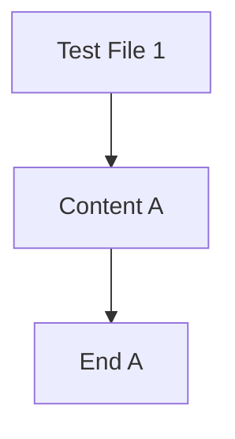

# Test File 1

This is the **first test file** with some content.

## Features
- Feature A
- Feature B
- Feature C

```mermaid
graph TD
    A[Test File 1] --> B[Content A]
    B --> C[End A]
```

This is the content from **Test File 1**.