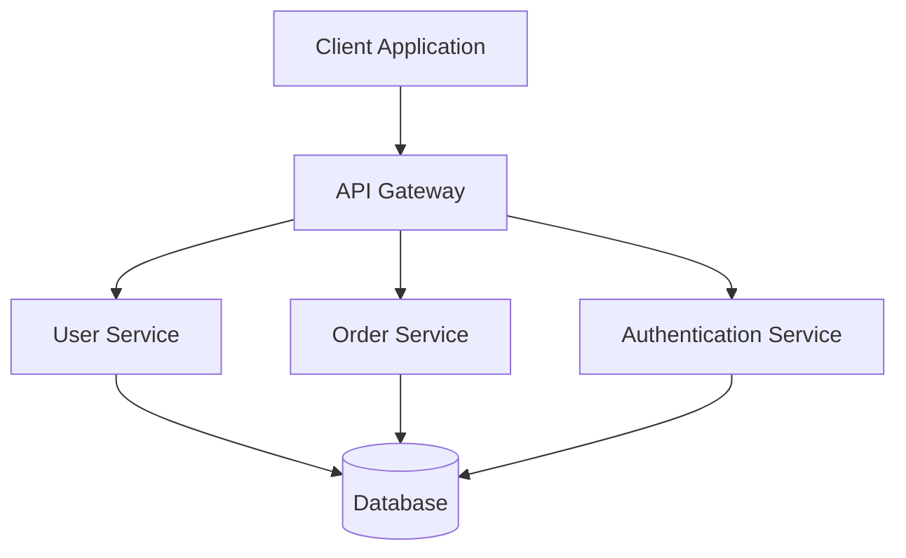
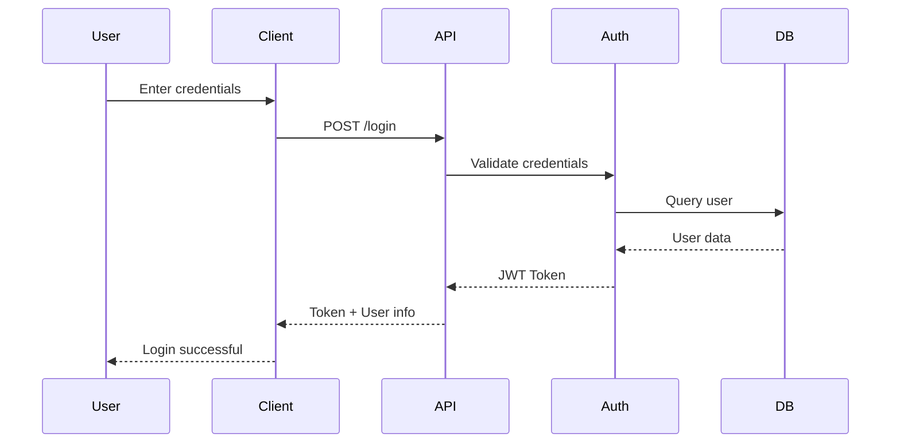
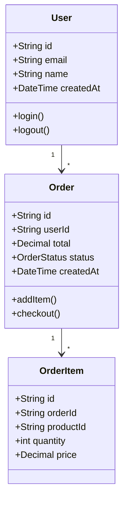
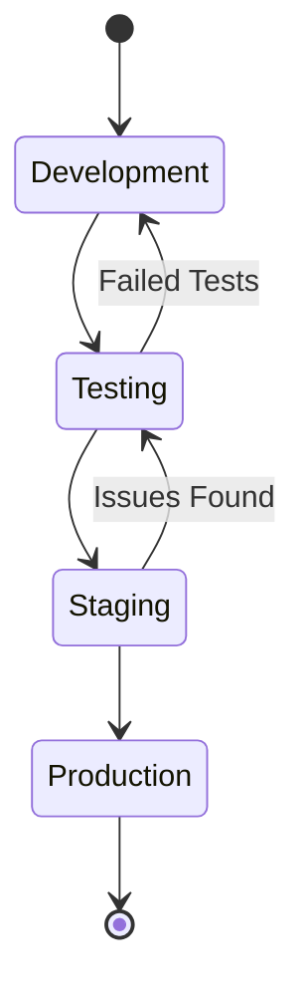

# System Architecture Documentation

This document demonstrates **Markdown with embedded Mermaid diagrams** - a powerful combination for technical documentation.

## Overview

Our system follows a microservices architecture with clear separation of concerns.

## System Components

The diagram above shows the high-level architecture of our system.

## User Authentication Flow

Here's how users authenticate in our system:

## Data Model

Our core entities are represented in this class diagram:

## Deployment States

## Key Features

- **Hybrid Rendering**: Seamlessly combines Markdown text with Mermaid diagrams
- **Multiple Diagram Types**: Supports flowcharts, sequence diagrams, class diagrams, and more
- **Live Preview**: Real-time rendering as you type
- **Export Options**: Save as PNG, SVG, or PDF

## Conclusion

This document demonstrates that Markdown and Mermaid diagrams work together perfectly, enabling rich technical documentation with visual elements.
