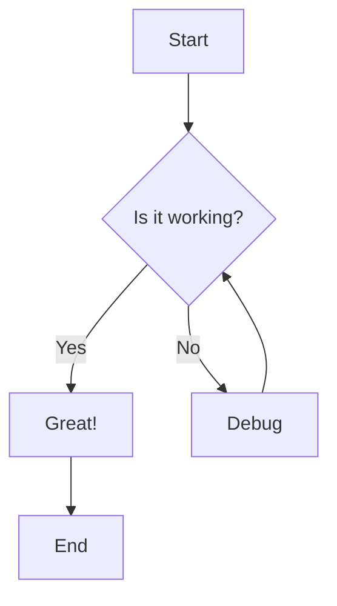

# Test Word Export with Mermaid

This is a test document to verify that Mermaid diagrams are properly embedded in Word documents.

## Sample Flowchart

Below is a simple flowchart diagram:

## Conclusion

The diagram above should be rendered and embedded in the Word document with all labels visible.
