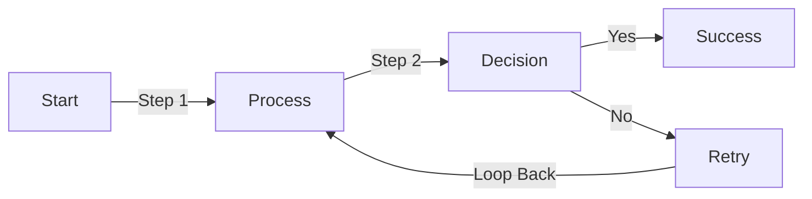
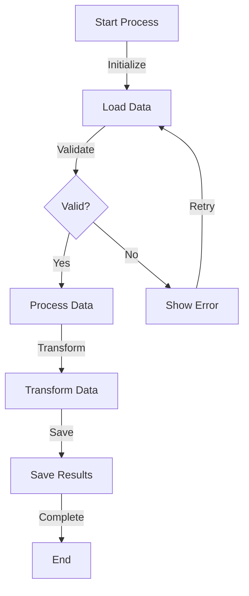
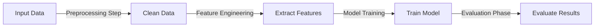

# Z-Order Fix Test

This document tests the z-order fix for connector line labels.

## Test 1: Simple Flowchart with Labels

**Expected Result**: All labels ("Step 1", "Step 2", "Yes", "No", "Loop Back") should be clearly visible and NOT obscured by the connector lines.

## Test 2: Complex Flowchart with Many Labels

**Expected Result**: All labels should be readable with text appearing above the connector lines.

## Test 3: Horizontal Flow with Long Labels

**Expected Result**: Long labels should have solid backgrounds and appear on top of lines.

## How to Test

1. Open this file in the Mermaid Diagram App
2. Export to Word (Ctrl+E)
3. Open the generated .docx file
4. Verify that:
   - All text labels on connector lines are clearly visible
   - Text appears ABOVE the lines (not behind them)
   - Background rectangles around labels are visible
   - No white boxes appear

## What to Look For

### ✅ GOOD (After Fix)
- Text labels are crisp and readable
- Labels have solid background rectangles
- Lines do not obscure text
- All diagrams render correctly

### ❌ BAD (Before Fix)
- Text labels are hard to read
- Lines appear on top of text
- Text seems "behind" the connector lines
- White boxes instead of diagrams
