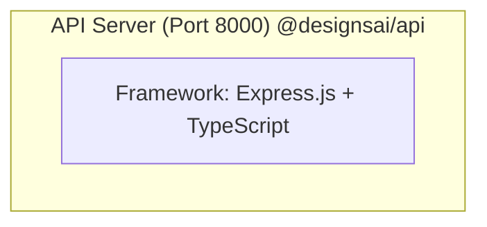
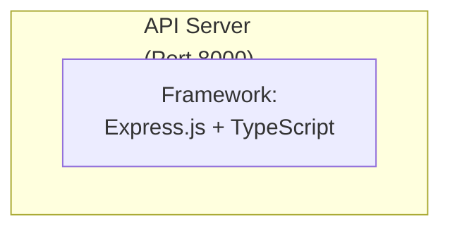

# Automatic Text Optimization for Mermaid Diagrams

## Overview

The Mermaid Diagram Editor now includes an **automatic text optimization** feature that detects and fixes text overflow issues when loading `.mmd` files. This feature helps prevent long node labels and subgraph titles from being cut off or covered by other elements.

## How It Works

When you open a `.mmd` (Mermaid diagram) file, the application automatically:

1. **Scans the diagram** for long text labels that might cause overflow
2. **Detects problematic patterns** such as:
   - Subgraph titles longer than 30 characters
   - Node labels longer than 40 characters
   - Text without existing line breaks
3. **Automatically adds line breaks** (` `) at natural break points (spaces, punctuation)
4. **Preserves the diagram structure** and formatting

## Example

### Before Optimization

### After Optimization

## Configuration

The optimizer uses the following thresholds (defined in `MermaidTextOptimizer.cs`):

- **MaxLabelLength**: 40 characters - Node labels longer than this will be optimized
- **MaxSubgraphTitleLength**: 20 characters - Subgraph titles longer than this will be optimized (reduced for better display)
- **PreferredLineLength**: 20 characters - Target length for each line after splitting (reduced for better wrapping)

### Special Handling

The optimizer includes intelligent pattern recognition:

- **Port Numbers**: Automatically breaks before port information like "(Port 8000)" to keep it on a separate line
- **Package Names**: Handles patterns like "@designsai/api" intelligently
- **Word Boundaries**: Always breaks at spaces to maintain readability

## Supported Node Types

The optimizer handles various Mermaid node styles:

- Square brackets: `node["label"]`
- Parentheses: `node("label")`
- Double curly braces: `node{{"label"}}`
- Asymmetric shapes: `node>"label"]`
- Subgraph titles: `subgraph id["title"]`

## When Optimization Occurs

- **Automatic**: When opening `.mmd` files through File > Open
- **Transparent**: The optimization happens silently in the background
- **Logged**: Optimization actions are logged for debugging purposes

## Disabling Optimization

Currently, the optimization is always enabled for `.mmd` files. If you need to disable it:

1. The original file is never modified - only the in-memory content is optimized
2. You can manually remove ` ` tags from the code editor if needed
3. Saving the file will save the current editor content (with or without optimizations)

## Technical Details

### Implementation

The feature is implemented in:
- **Service**: `MermaidDiagramApp/Services/MermaidTextOptimizer.cs`
- **Integration**: `MermaidDiagramApp/MainWindow.xaml.cs` (Open_Click method)
- **Tests**: `MermaidDiagramApp.Tests/Services/MermaidTextOptimizerTests.cs`

### Algorithm

1. **Pattern Matching**: Uses regular expressions to find node labels and subgraph titles
2. **Length Check**: Compares text length against thresholds
3. **Smart Breaking**: Splits text at word boundaries to maintain readability
4. **Line Break Insertion**: Adds ` ` tags at optimal positions
5. **Structure Preservation**: Maintains original diagram syntax and indentation

### Performance

- **Fast**: Regex-based pattern matching is efficient
- **Non-blocking**: Optimization happens during file load, no UI freeze
- **Minimal overhead**: Only processes text that needs optimization

## Benefits

1. **Better Readability**: Long labels are automatically formatted for better display
2. **Prevents Overflow**: Eliminates text being cut off or covered
3. **Automatic**: No manual intervention required
4. **Safe**: Original files are never modified
5. **Transparent**: Works seamlessly in the background

## Limitations

1. **Only for .mmd files**: Markdown files (`.md`) are not automatically optimized
2. **Fixed thresholds**: Character limits are hardcoded (can be made configurable in future)
3. **English-optimized**: Word-based splitting works best for space-separated languages
4. **No undo**: Once optimized, you need to reload the file to get the original text

## Future Enhancements

Potential improvements for future versions:

- [ ] User-configurable thresholds in settings
- [ ] Optional prompt before applying optimizations
- [ ] Support for other file types (`.md`, `.markdown`)
- [ ] Visual indicator showing which labels were optimized
- [ ] Undo/redo support for optimizations
- [ ] Language-aware text breaking (CJK languages, etc.)
- [ ] Preview before/after comparison

## Troubleshooting

### Issue: Optimization not working

**Solution**: Check that:
- File extension is `.mmd`
- Labels are longer than the threshold (40 characters for nodes, 30 for subgraphs)
- Labels don't already contain ` ` tags

### Issue: Text still overflows after optimization

**Solution**: 
- The thresholds might need adjustment for your specific case
- Manually add more ` ` tags in the code editor
- Consider shortening the text content

### Issue: Optimization breaks diagram syntax

**Solution**:
- Report the issue with the specific diagram code
- Reload the file to get the original content
- Manually format the text as needed

## Related Documentation

- [Mermaid Syntax Guide](./USER_GUIDE.md)
- [Syntax Fixer Guide](./SYNTAX_FIXER_GUIDE.md)
- [Software Design](./SOFTWARE_DESIGN.md)

---

**Version**: 1.0  
**Last Updated**: January 2026  
**Author**: Mermaid Diagram App Team
