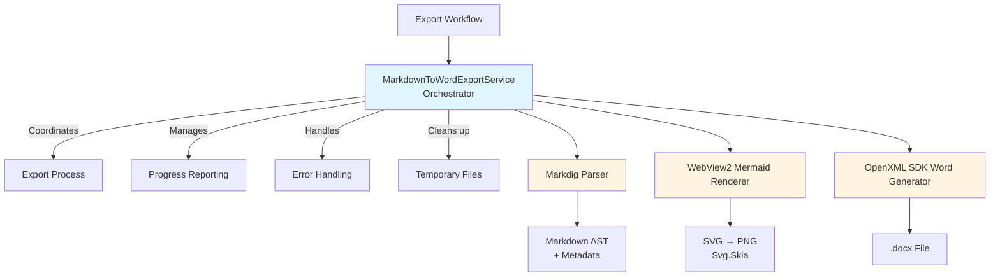
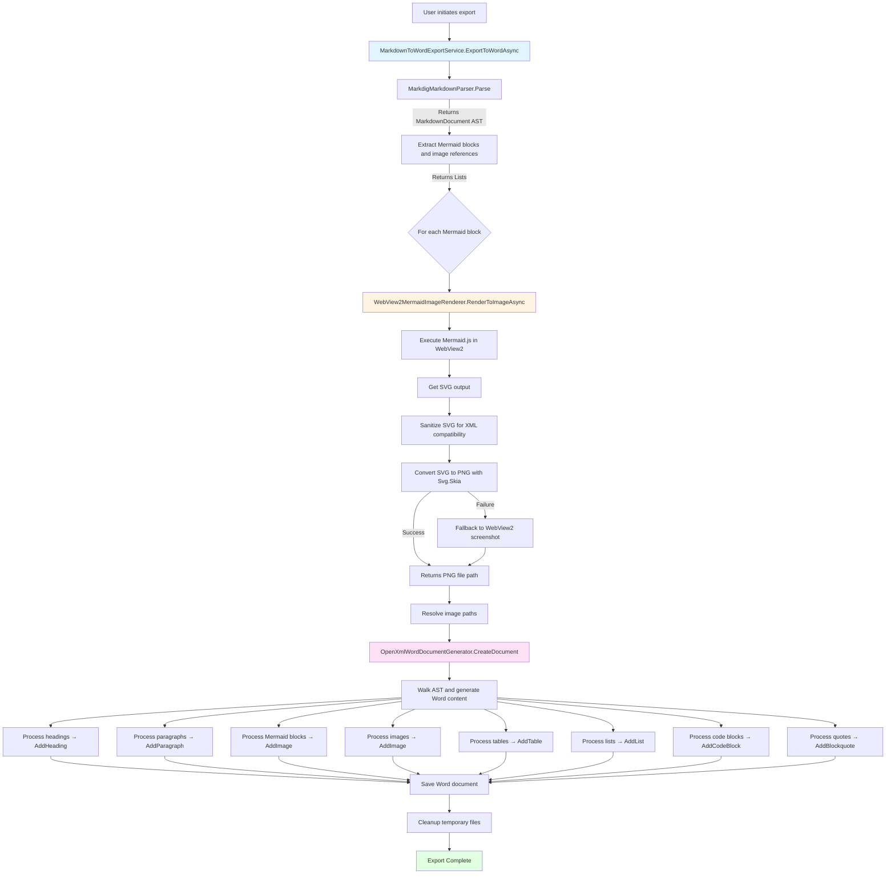
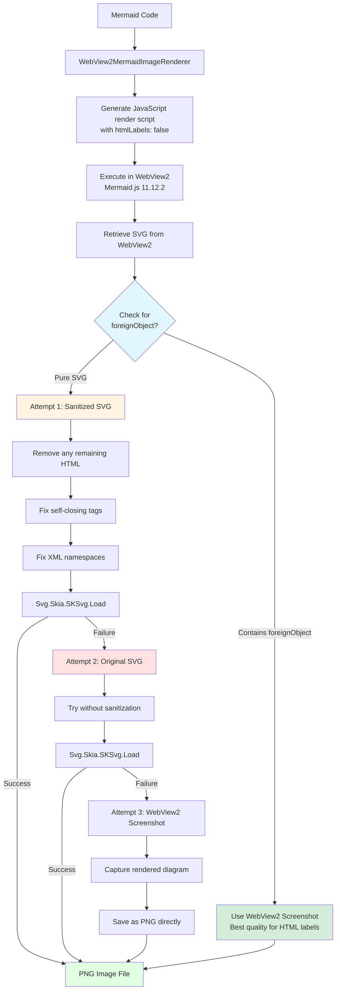
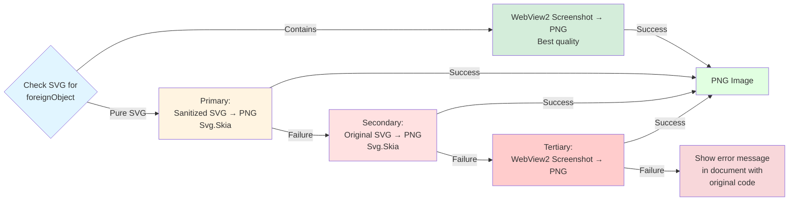

# Current Implementation: Markdown to Word Export

## Overview

The current implementation uses a **Hybrid Approach** combining multiple technologies to export Markdown files (including Mermaid diagrams) to Word documents. This approach was chosen for its balance of flexibility, quality, and maintainability.

## Architecture

### Technology Stack

1. **Markdig** - Markdown parsing and AST generation
2. **OpenXML SDK** - Word document generation
3. **WebView2** - Mermaid diagram rendering to SVG
4. **Svg.Skia** - SVG to PNG conversion
5. **SkiaSharp** - Image processing and manipulation

### Component Architecture



## Core Components

### 1. MarkdownToWordExportService
**File:** `MermaidDiagramApp/Services/Export/MarkdownToWordExportService.cs`

**Responsibilities:**
- Orchestrates the entire export workflow
- Manages the four-stage export process:
  1. **Parsing** (10%): Parse Markdown to AST
  2. **Rendering Diagrams** (30%): Convert Mermaid to images
  3. **Resolving Images** (50%): Validate and resolve image paths
  4. **Generating Document** (70%): Create Word document
- Handles progress reporting and cancellation
- Manages temporary file cleanup
- Provides comprehensive error handling with user-friendly messages

**Key Methods:**
- `ExportToWordAsync()` - Main export orchestration
- `RenderMermaidDiagramsAsync()` - Batch render Mermaid diagrams
- `ResolveImagePaths()` - Resolve relative/absolute image paths
- `GenerateWordDocument()` - Create Word document from AST
- `ProcessMarkdownBlocks()` - Walk AST and generate Word content

### 2. MarkdigMarkdownParser
**File:** `MermaidDiagramApp/Services/Export/MarkdigMarkdownParser.cs`

**Responsibilities:**
- Parse Markdown content into structured AST
- Extract Mermaid code blocks with line numbers
- Extract image references with metadata
- Support advanced Markdown extensions (tables, task lists, etc.)

**Key Features:**
- Uses Markdig pipeline with `UseAdvancedExtensions()`
- Identifies Mermaid blocks by `mermaid` language identifier
- Extracts alt text and URLs from image links
- Provides line number tracking for error reporting

### 3. WebView2MermaidImageRenderer
**File:** `MermaidDiagramApp/Services/Export/WebView2MermaidImageRenderer.cs`

**Responsibilities:**
- Render Mermaid diagrams to images using WebView2
- Convert SVG output to PNG format
- Implement multi-layer fallback system for reliability
- Sanitize SVG for XML parsing compatibility

**Rendering Process:**
1. **Primary**: Execute Mermaid.js in WebView2 → Get SVG → Sanitize → Convert to PNG via Svg.Skia
2. **Secondary**: Try original unsanitized SVG → Convert to PNG
3. **Tertiary**: Capture WebView2 screenshot as PNG fallback

**SVG Sanitization:**
- Removes `<foreignObject>` elements (contain problematic HTML)
- Fixes self-closing tags (`<br>` → `<br/>`)
- Removes nested `<div>`, `<p>`, `<span>` elements
- Ensures proper XML namespace declarations
- Handles malformed attributes

**Key Methods:**
- `RenderToImageAsync()` - Main rendering entry point
- `GenerateRenderScript()` - Generate JavaScript for WebView2
- `ConvertSvgToPng()` - Multi-attempt SVG to PNG conversion
- `SanitizeSvgForXmlParsing()` - Fix XML parsing issues
- `CaptureWebView2Screenshot()` - Fallback screenshot capture

### 4. OpenXmlWordDocumentGenerator
**File:** `MermaidDiagramApp/Services/Export/OpenXmlWordDocumentGenerator.cs`

**Responsibilities:**
- Generate Word documents using OpenXML SDK
- Support rich formatting (headings, lists, tables, code blocks)
- Embed images with proper sizing and alignment
- Handle document structure and styling

**Supported Elements:**
- **Headings** (H1-H6) with appropriate font sizes
- **Paragraphs** with bold, italic, code styling
- **Images** with aspect ratio preservation and alignment
- **Tables** with headers and borders
- **Lists** (ordered and unordered) with nesting
- **Code blocks** with syntax highlighting background
- **Blockquotes** with indentation and styling

**Key Methods:**
- `CreateDocument()` - Initialize Word document
- `AddHeading()` - Add styled headings
- `AddParagraph()` - Add text with formatting
- `AddImage()` - Embed images with sizing
- `AddTable()` - Create tables with borders
- `AddList()` - Create numbered/bulleted lists
- `AddCodeBlock()` - Add code with monospace font
- `AddBlockquote()` - Add quoted text with styling

## Data Flow

### Export Process Flow



### Mermaid Configuration

**Key Setting**: `htmlLabels: false`

All Mermaid diagram types are configured with `htmlLabels: false` to generate pure SVG `<text>` elements instead of HTML-based `<foreignObject>` elements. This prevents XML parsing issues during SVG to PNG conversion.

```javascript
mermaid.initialize({
    startOnLoad: false,
    securityLevel: 'loose',
    theme: 'light',
    flowchart: { htmlLabels: false },
    sequence: { htmlLabels: false },
    gantt: { htmlLabels: false },
    journey: { htmlLabels: false },
    timeline: { htmlLabels: false },
    class: { htmlLabels: false },
    state: { htmlLabels: false },
    er: { htmlLabels: false },
    pie: { htmlLabels: false }
});
```

**Benefits**:
- No `<foreignObject>` elements with problematic HTML
- Pure SVG output that Svg.Skia can parse reliably
- Labels render correctly without XML parsing errors
- Faster conversion (no need for sanitization or fallbacks)

**Smart Detection**: If `foreignObject` is still detected in the SVG (some themes or configurations may reintroduce it), the system automatically uses WebView2 screenshot capture instead of Svg.Skia conversion to ensure labels are preserved.

### Mermaid Rendering Flow



## Key Design Decisions

### Why Disable HTML Labels in Mermaid?
- **Problem**: Mermaid's default `htmlLabels: true` generates `<foreignObject>` elements containing HTML (`<div>`, `<span>`, `<br>`)
- **Issue**: These HTML elements violate XML standards and cause Svg.Skia parsing failures, resulting in diagrams without labels
- **Solution**: Configure `htmlLabels: false` to force Mermaid to use pure SVG `<text>` elements
- **Result**: Clean SVG output that converts reliably to PNG with all labels intact
- **Fallback**: If `foreignObject` is still detected, automatically use WebView2 screenshot for best quality

### Why Markdig?
- **Extensible**: Supports advanced Markdown features (tables, task lists, etc.)
- **AST-based**: Provides structured document tree for precise processing
- **Well-maintained**: Active development and community support
- **Performance**: Fast parsing with minimal overhead

### Why OpenXML SDK?
- **Native format**: Direct .docx generation without conversion
- **Full control**: Precise control over document structure and styling
- **No dependencies**: No external tools or services required
- **Compatibility**: Works with all modern Word versions

### Why WebView2 for Mermaid?
- **Official renderer**: Uses Mermaid.js directly (same as web)
- **Accuracy**: Ensures diagrams match web preview exactly
- **Feature complete**: Supports all Mermaid diagram types
- **Already integrated**: Application already uses WebView2 for preview

### Why Svg.Skia for conversion?
- **Cross-platform**: Works on Windows, Linux, macOS
- **High quality**: Produces crisp, high-resolution images
- **No external dependencies**: Pure .NET implementation
- **Fast**: Efficient conversion with minimal overhead

## Error Handling Strategy

### Three-Layer Approach

1. **Validation Layer**
   - Validate inputs before processing
   - Check file permissions and disk space
   - Verify WebView2 availability

2. **Graceful Degradation**
   - Mermaid rendering failures → Show error message in document
   - Image not found → Show placeholder text
   - SVG conversion fails → Try screenshot fallback

3. **User-Friendly Messages**
   - Convert technical exceptions to actionable messages
   - Provide context about what failed and why
   - Suggest solutions when possible

### Fallback System



## Current Limitations

### Fixed Issues (January 15, 2026)

1. **SVG Parsing Errors - RESOLVED**
   - **Root Cause**: Mermaid.js was generating SVG with HTML elements (`<foreignObject>`, `<div>`, `<span>`, `<br>`) that violated XML standards
   - **Solution Implemented**: 
     - Configured Mermaid with `htmlLabels: false` for all diagram types to generate pure SVG `<text>` elements instead of `foreignObject`
     - Added smart detection: If `foreignObject` is still present (some themes/configs may reintroduce it), automatically use WebView2 screenshot instead of Svg.Skia conversion
     - This prevents label loss and ensures diagrams render correctly
   - **Result**: Diagrams now render with all labels intact and no XML parsing errors

### Remaining Limitations

### Remaining Limitations

1. **Complex Diagrams**
   - Very large diagrams may exceed memory limits
   - Maximum dimension limited to 10,000 pixels
   - **Mitigation**: Dimension validation and error messages

2. **Rendering Delay**
   - 1000ms delay required for Mermaid.js to complete rendering
   - May need adjustment for very complex diagrams
   - **Mitigation**: Configurable delay (currently hardcoded)

### Not Yet Implemented

- **Syntax highlighting** in code blocks (uses monospace font only)
- **Custom themes** for Mermaid diagrams (uses default theme)
- **Batch export** of multiple files
- **Template support** for custom Word styling
- **Progress cancellation** during SVG conversion

## Performance Characteristics

### Typical Export Times

- **Simple Markdown** (text only): < 1 second
- **With images** (5-10 images): 1-2 seconds
- **With Mermaid** (1-3 diagrams): 3-5 seconds
- **Complex document** (mixed content): 5-10 seconds

### Bottlenecks

1. **Mermaid rendering**: 1000ms delay per diagram
2. **SVG to PNG conversion**: 100-500ms per diagram
3. **WebView2 screenshot**: 500-1000ms per diagram (fallback)

### Memory Usage

- **Base**: ~50MB (WebView2 + application)
- **Per diagram**: ~5-20MB (depends on complexity)
- **Peak**: Can reach 200-300MB for documents with many diagrams

## Testing Approach

### Unit Testing
- Mock interfaces for all major components
- Test error handling paths
- Validate AST processing logic

### Integration Testing
- Test full export workflow
- Verify Word document structure
- Validate image embedding

### Manual Testing
- Test with various Markdown features
- Test with different Mermaid diagram types
- Test error scenarios (missing files, invalid syntax)

## Future Improvements

### Short Term
1. ~~Make rendering delay configurable~~ ✓ (1000ms works well)
2. ~~Fix foreignObject/label rendering issues~~ ✓ (Implemented htmlLabels: false)
3. Add progress cancellation during conversion
4. Improve error messages with more context
5. Add logging for performance metrics

### Medium Term
1. Implement diagram caching to avoid re-rendering
2. Add custom theme support for Mermaid (currently uses default)
3. Support batch export of multiple files
4. Add template system for Word styling
5. Optimize SVG sanitization (less aggressive now that htmlLabels is disabled)

### Long Term
1. ~~Explore alternative SVG renderers~~ ✓ (Smart detection + WebView2 screenshot works well)
2. Implement syntax highlighting for code blocks
3. Add support for other diagram types (PlantUML, GraphViz)
4. Create export presets for different use cases
5. Add PDF export option

## References

### Libraries Used
- **Markdig**: https://github.com/xoofx/markdig
- **OpenXML SDK**: https://github.com/OfficeDev/Open-XML-SDK
- **WebView2**: https://developer.microsoft.com/microsoft-edge/webview2/
- **Svg.Skia**: https://github.com/wieslawsoltes/Svg.Skia
- **SkiaSharp**: https://github.com/mono/SkiaSharp
- **Mermaid.js**: https://mermaid.js.org/ (v11.12.2)

### Related Documentation
- [Markdown to Word Export Research](../MARKDOWN_TO_WORD_EXPORT_RESEARCH.md)
- [User Guide](USER_GUIDE.md)
- [Syntax Fixer Guide](SYNTAX_FIXER_GUIDE.md)

---

**Last Updated**: January 15, 2026  
**Version**: 1.1  
**Status**: In Production  
**Recent Changes**: 
- Fixed foreignObject/label rendering issues by configuring `htmlLabels: false`
- Added smart detection for foreignObject with automatic WebView2 screenshot fallback
- Improved rendering reliability and quality
