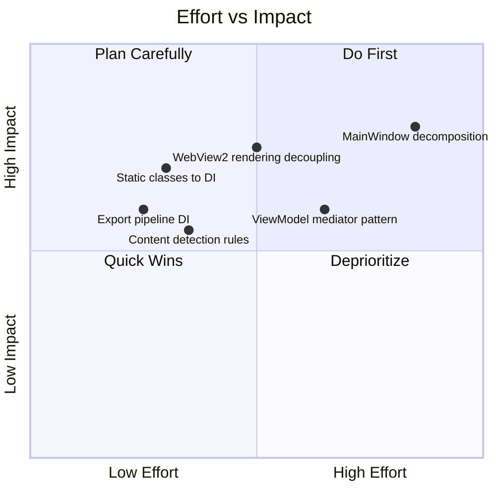
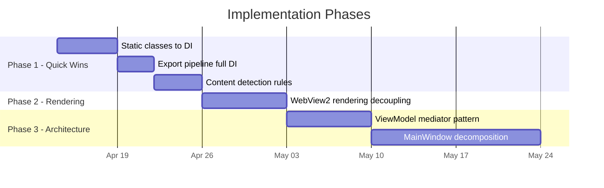
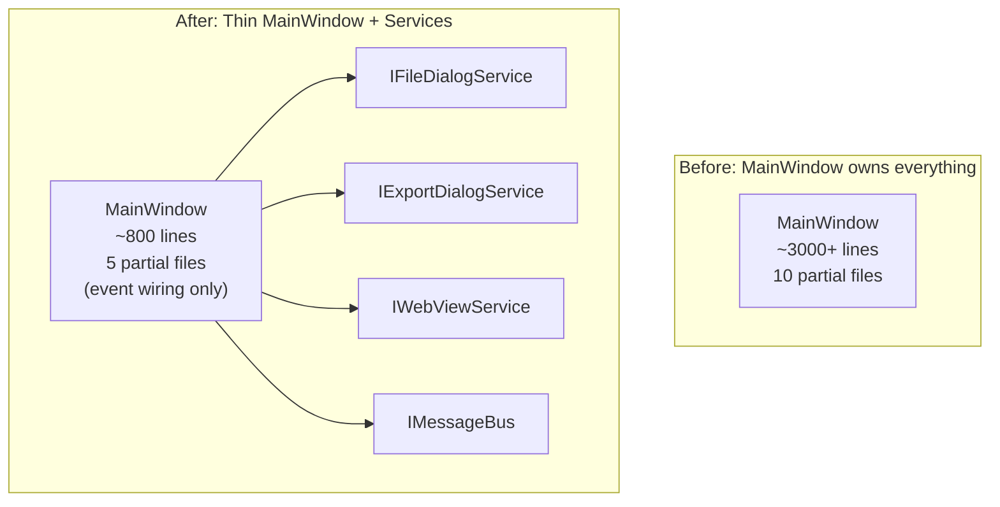

# Modularity Improvement Plan

Implementation plan for the six improvement areas identified in the System Design Document (Section 11.2).

## Priority Matrix



## Recommended Execution Order



---

## 1. Static Classes to DI

**Problem**: `WindowStateManager`, `AiConfigStorageService`, `AiServiceFactory`, and `FontManager` are static classes that bypass the DI container. They cannot be mocked in tests or swapped for alternative implementations.

**Impact**: High — directly affects testability and replaceability of 4 components.
**Effort**: Low — straightforward interface extraction and DI registration.

### Plan

#### 1.1 WindowStateManager

```
Current:  static class WindowStateManager { static void Save(...); static void Restore(...); }
Target:   interface IWindowStateManager → class WindowStateManager : IWindowStateManager
```

- Extract `IWindowStateManager` interface with `SaveAsync()` and `RestoreAsync()` methods
- Convert static class to instance class implementing the interface
- Register as singleton in `App.xaml.cs`
- Inject into `MainWindow` constructor
- Update all call sites from `WindowStateManager.Save(...)` to `_windowStateManager.Save(...)`

#### 1.2 AiServiceFactory

```
Current:  static class AiServiceFactory { static IAiService CreateAiService(config); }
Target:   interface IAiServiceFactory → class AiServiceFactory : IAiServiceFactory
```

- Extract `IAiServiceFactory` interface
- Convert to instance class, register as singleton
- Inject into `AiDiagramGeneratorViewModel`
- This enables testing with mock factories that return stub AI services

#### 1.3 AiConfigStorageService

```
Current:  static class AiConfigStorageService { static AiConfiguration Load(); static void Save(...); }
Target:   interface IAiConfigStorage → class AiConfigStorageService : IAiConfigStorage
```

- Extract `IAiConfigStorage` interface with `Load()` and `Save()` methods
- Convert to instance class, register as singleton
- Inject where AI config is accessed

#### 1.4 FontManager

```
Current:  static class FontManager { static List<string> GetSystemFonts(); }
Target:   interface IFontManager → class FontManager : IFontManager
```

- Extract `IFontManager` interface
- Convert to instance class, register as singleton
- Inject into `MarkdownStyleSettingsDialog` or wherever fonts are listed

### Tests to Add

- Unit tests for each converted service using mock dependencies
- DI container resolution test: verify all 4 new interfaces resolve correctly

---

## 2. Export Pipeline Full DI

**Problem**: `MarkdownToWordExportService` receives its dependencies via constructor injection, but the service itself is not registered in the DI container — it's created manually in `MainWindow.MarkdownToWord.cs`. This makes it harder to test the integration and swap implementations.

**Impact**: Medium — improves testability of the export pipeline.
**Effort**: Low — wire existing classes into DI.

### Plan

#### 2.1 Register Export Services in DI

Add to `App.xaml.cs`:

```csharp
// Export pipeline
services.AddTransient<IMarkdownParser, MarkdigMarkdownParser>();
services.AddTransient<IWordDocumentGenerator, OpenXmlWordDocumentGenerator>();
services.AddTransient<MarkdownToWordExportService>();
```

#### 2.2 Inject into MarkdownToWordViewModel

- Add `MarkdownToWordExportService` as a constructor parameter to `MarkdownToWordViewModel`
- Remove manual instantiation from `MainWindow.MarkdownToWord.cs`
- The `IMermaidImageRenderer` (WebView2-based) still needs special handling since it requires a live WebView2 instance — keep it as a factory-created dependency

#### 2.3 Extract IMermaidImageRenderer Factory

```csharp
interface IMermaidImageRendererFactory {
    IMermaidImageRenderer Create(WebView2 webView);
}
```

- Register factory in DI
- MarkdownToWordExportService receives the factory, calls `Create()` when export starts
- This isolates the WebView2 dependency to creation time only

### Tests to Add

- DI container resolution test for `MarkdownToWordExportService`
- Integration test: export service with mocked parser, generator, and renderer

---

## 3. Content Type Detection Rules

**Problem**: `ContentTypeDetector` has inline regex patterns for detecting markdown indicators and mermaid keywords. Adding new content types requires modifying the class internals.

**Impact**: Medium — improves extensibility for new content types.
**Effort**: Low-Medium — extract patterns into a rule-based system.

### Plan

#### 3.1 Define Detection Rule Interface

```csharp
interface IContentDetectionRule {
    string Name { get; }
    int Priority { get; }  // Lower = higher priority
    ContentType? Detect(string content, string fileExtension);
}
```

#### 3.2 Extract Existing Logic into Rules

```
MermaidCodeBlockRule     (priority 10)  — checks for ```mermaid blocks
MarkdownIndicatorRule    (priority 20)  — checks for headers, lists, tables
MermaidKeywordRule       (priority 30)  — checks first 10 lines for diagram keywords
FileExtensionRule        (priority 40)  — fallback to .mmd/.md extension
DefaultMarkdownRule      (priority 50)  — final fallback
```

#### 3.3 Update ContentTypeDetector

```csharp
class ContentTypeDetector : IContentTypeDetector {
    private readonly List<IContentDetectionRule> _rules;

    public ContentTypeDetector(IEnumerable<IContentDetectionRule> rules) {
        _rules = rules.OrderBy(r => r.Priority).ToList();
    }

    public ContentType DetectContentType(string content, string extension) {
        foreach (var rule in _rules) {
            var result = rule.Detect(content, extension);
            if (result.HasValue) return result.Value;
        }
        return ContentType.Markdown;
    }
}
```

#### 3.4 Register Rules in DI

```csharp
services.AddSingleton<IContentDetectionRule, MermaidCodeBlockRule>();
services.AddSingleton<IContentDetectionRule, MarkdownIndicatorRule>();
services.AddSingleton<IContentDetectionRule, MermaidKeywordRule>();
services.AddSingleton<IContentDetectionRule, FileExtensionRule>();
services.AddSingleton<IContentDetectionRule, DefaultMarkdownRule>();
```

### Extensibility Benefit

Adding a new content type (e.g., AsciiDoc) = create one `AsciiDocDetectionRule` class and register it. No changes to `ContentTypeDetector`.

### Tests to Add

- Unit test each rule in isolation
- Integration test: verify rule priority ordering produces correct results
- Property test: any content string produces a valid ContentType

---

## 4. WebView2 Rendering Decoupling

**Problem**: `ExecuteRenderingScript` in `MainWindow.WebView.cs` contains a switch statement that routes to different JavaScript functions based on content type. Each new content type requires adding a case here.

**Impact**: High — the rendering dispatch is a key extensibility bottleneck.
**Effort**: Medium — requires changes to renderer interface and JavaScript layer.

### Plan

#### 4.1 Add Script Generation to IContentRenderer

```csharp
interface IContentRenderer {
    // Existing methods...
    ContentType SupportedType { get; }
    Task<RenderingResult> RenderAsync(string content, IRenderingContext context);

    // New method
    string GenerateRenderScript(string content, IRenderingContext context);
}
```

Each renderer knows how to generate its own JavaScript call:

```csharp
// MermaidRenderer
public string GenerateRenderScript(string content, IRenderingContext context) {
    var escaped = JsonSerializer.Serialize(content);
    var theme = context.Theme.ToString().ToLower();
    return $"if (window.renderMermaid) {{ window.renderMermaid({escaped}, '{theme}'); }}";
}

// MarkdownRenderer
public string GenerateRenderScript(string content, IRenderingContext context) {
    var escaped = JsonSerializer.Serialize(content);
    var theme = context.Theme.ToString().ToLower();
    var enableMermaid = (context.EnableMermaidInMarkdown).ToString().ToLower();
    return $"if (window.renderMarkdown) {{ window.renderMarkdown({escaped}, {enableMermaid}, '{theme}'); }}";
}
```

#### 4.2 Simplify ExecuteRenderingScript

```csharp
private async Task<bool> ExecuteRenderingScript(string content, ContentType contentType, RenderingContext context) {
    if (!_isWebViewReady) return false;

    var renderer = _renderingOrchestrator.GetRenderer(contentType);
    if (renderer == null) return false;

    var script = renderer.GenerateRenderScript(content, context);
    await PreviewBrowser.ExecuteScriptAsync(script);
    return true;
}
```

The switch statement is eliminated. Adding a new content type only requires implementing `GenerateRenderScript` in the new renderer.

#### 4.3 Note

`MermaidRenderer` and `MarkdownRenderer` already have `GenerateRenderScript` methods — they just aren't used through the interface. This change formalizes what partially exists.

### Tests to Add

- Unit test each renderer's `GenerateRenderScript` output
- Verify script contains properly escaped content

---

## 5. ViewModel Mediator Pattern

**Problem**: `MainWindowViewModel` uses `Action` delegates (`RequestOpenFile`, `RequestSaveFile`, `RequestExportSvg`, etc.) to call back into `MainWindow` for operations that need UI access (file pickers, WebView2). This creates tight coupling between the ViewModel and the Window.

**Impact**: Medium — improves testability and decouples ViewModel from Window.
**Effort**: Medium-High — requires a message bus and handler registration.

### Plan

#### 5.1 Define Message Types

```csharp
// Base
interface IMessage { }

// Specific messages
record OpenFileMessage : IMessage;
record SaveFileMessage : IMessage;
record ExportSvgMessage : IMessage;
record ExportPngMessage : IMessage;
record NewDiagramMessage(string DiagramType) : IMessage;
record FindMessage : IMessage;
record CheckSyntaxMessage : IMessage;
record ExitMessage : IMessage;
```

#### 5.2 Create Mediator Service

```csharp
interface IMessageBus {
    void Subscribe<T>(Action<T> handler) where T : IMessage;
    void Publish<T>(T message) where T : IMessage;
}

class MessageBus : IMessageBus {
    private readonly Dictionary<Type, List<Delegate>> _handlers = new();

    public void Subscribe<T>(Action<T> handler) where T : IMessage {
        var type = typeof(T);
        if (!_handlers.ContainsKey(type)) _handlers[type] = new();
        _handlers[type].Add(handler);
    }

    public void Publish<T>(T message) where T : IMessage {
        if (_handlers.TryGetValue(typeof(T), out var handlers)) {
            foreach (var handler in handlers)
                ((Action<T>)handler)(message);
        }
    }
}
```

#### 5.3 Update ViewModel

```csharp
// Before
public Action? RequestOpenFile { get; set; }
OpenFileCommand = new RelayCommand(_ => RequestOpenFile?.Invoke());

// After
private readonly IMessageBus _messageBus;
OpenFileCommand = new RelayCommand(_ => _messageBus.Publish(new OpenFileMessage()));
```

#### 5.4 Update MainWindow

```csharp
// In constructor, subscribe to messages
_messageBus.Subscribe<OpenFileMessage>(_ => Open_Click(this, new RoutedEventArgs()));
_messageBus.Subscribe<SaveFileMessage>(_ => Save_Click(this, new RoutedEventArgs()));
_messageBus.Subscribe<ExportSvgMessage>(_ => ExportSvg_Click(this, new RoutedEventArgs()));
// etc.
```

#### 5.5 Register in DI

```csharp
services.AddSingleton<IMessageBus, MessageBus>();
```

### Benefits

- ViewModel no longer holds references to MainWindow methods
- Messages can be subscribed to by any component (not just MainWindow)
- Easy to test: verify ViewModel publishes correct messages without needing a real Window

### Tests to Add

- Unit test: ViewModel commands publish correct message types
- Unit test: MessageBus delivers messages to subscribers
- Property test: publish/subscribe roundtrip for all message types

---

## 6. MainWindow Decomposition

**Problem**: MainWindow holds ~3,000+ lines across 10 partial files. While the partial class split helps organization, the Window class still owns too many responsibilities. Some partials (FileOps at ~490 lines, Export at ~430 lines) contain logic that could live in services.

**Impact**: High — the largest structural improvement for long-term maintainability.
**Effort**: High — requires careful extraction to avoid breaking UI interactions.

### Plan

This builds on improvements 1-5. The mediator pattern (improvement 5) is a prerequisite.

#### 6.1 Extract File Operations UI Logic

```
Current: MainWindow.FileOps.cs (490 lines)
    - Open_Click → file picker → read file → update editor → update preview
    - Save_Click → file picker → write file
    - Recent files menu population
    - File watcher setup/teardown

Target: Split into service + thin UI handler
    - IFileDialogService: ShowOpenDialog(), ShowSaveDialog() — wraps WinRT file pickers
    - MainWindow.FileOps.cs reduced to ~100 lines of event handler wiring
    - FileOperationsService gains OpenFileAsync()/SaveFileAsync() that use IFileDialogService
```

#### 6.2 Extract Export UI Logic

```
Current: MainWindow.Export.cs (430 lines)
    - SVG/PNG export with file picker dialogs
    - Mermaid.js update check/download UI
    - About dialog, log file access

Target:
    - IExportDialogService: ShowSvgSaveDialog(), ShowPngSaveDialog()
    - MermaidUpdateService already extracted — just remove UI logic from partial
    - MainWindow.Export.cs reduced to ~80 lines
```

#### 6.3 Extract WebView Interop

```
Current: MainWindow.WebView.cs (460 lines)
    - WebView2 initialization
    - Message handling
    - Rendering dispatch
    - Timer management

Target:
    - IWebViewService: InitializeAsync(), ExecuteScriptAsync(), IsReady
    - WebViewService wraps PreviewBrowser, handles message routing
    - MainWindow.WebView.cs reduced to ~100 lines (event subscriptions only)
```

#### 6.4 Resulting Structure



### Migration Strategy

1. Start with the smallest partial (Builder.cs ~120 lines) as a proof of concept
2. Extract FileOps next (highest line count, clearest service boundary)
3. Extract Export
4. Extract WebView interop last (most complex due to async initialization)
5. Each extraction: create interface → implement service → update DI → update MainWindow → run tests

### Tests to Add

- Integration tests for each extracted service
- UI automation tests to verify file picker flows still work
- Regression tests for rendering after WebView extraction

---

## Summary

| # | Improvement | Effort | Impact | Phase |
|---|------------|--------|--------|-------|
| 1 | Static classes to DI | Low | High | 1 |
| 2 | Export pipeline full DI | Low | Medium | 1 |
| 3 | Content detection rules | Low-Med | Medium | 1 |
| 4 | WebView2 rendering decoupling | Medium | High | 2 |
| 5 | ViewModel mediator pattern | Med-High | Medium | 3 |
| 6 | MainWindow decomposition | High | High | 3 |

Phase 1 delivers the highest ROI — three low-effort changes that immediately improve testability and extensibility. Phase 2 removes the rendering bottleneck. Phase 3 is the structural refactor that pays off long-term but depends on phases 1-2 being complete.
