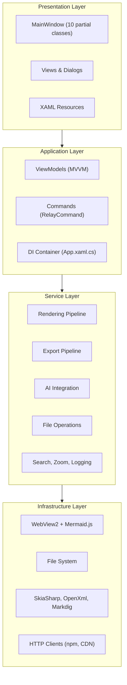
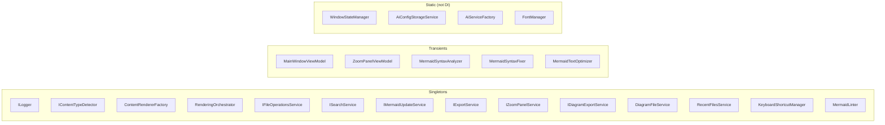
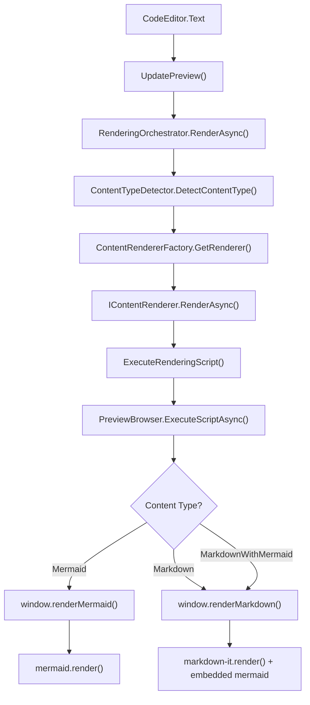
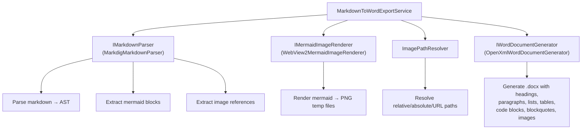
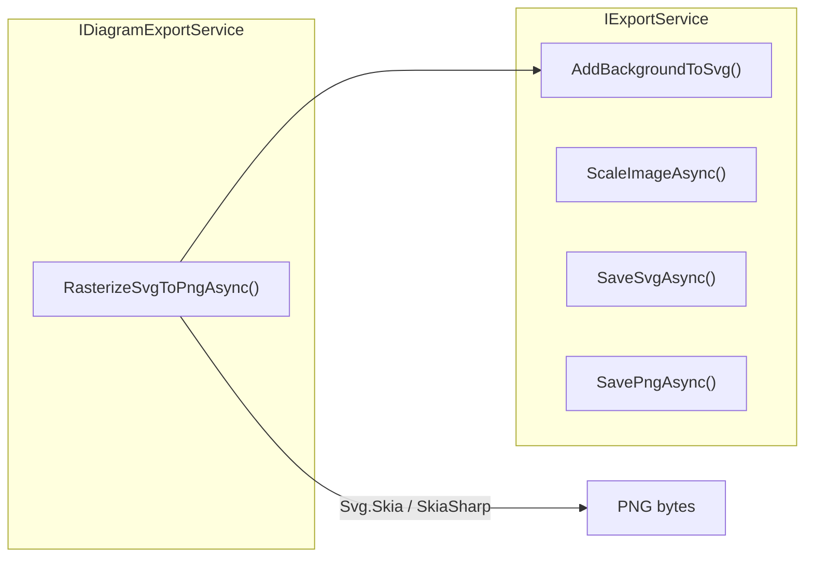
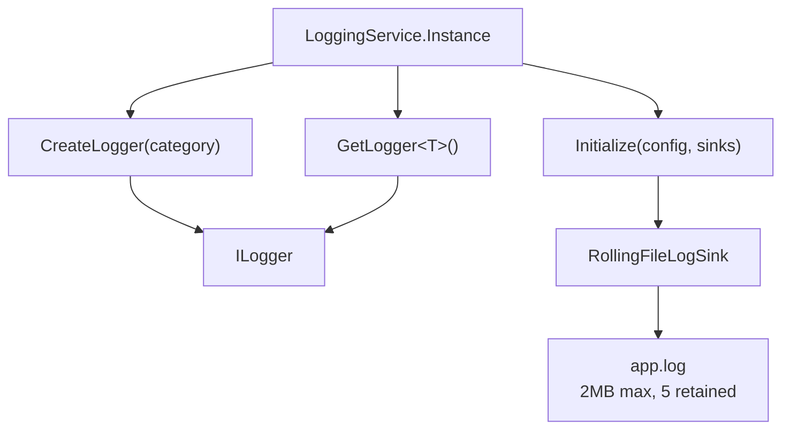

# System Design Document — Mermaid Diagram Editor

## 1. Overview

The Mermaid Diagram Editor is a Windows desktop application built with WinUI 3 (Windows App SDK 1.7) on .NET 8. It provides a split-pane interface for creating, editing, and previewing Mermaid diagrams and Markdown documents with real-time rendering. The application supports exporting to PNG, SVG, and Word (.docx) formats, and includes AI-powered diagram generation via OpenAI and Ollama.

## 2. Architecture

The application follows a four-layer architecture with dependency injection throughout.



### 2.1 Dependency Injection

Configured in `App.xaml.cs` using `Microsoft.Extensions.DependencyInjection`. All services are registered as singletons (stateful services) or transients (ViewModels, analyzers).



## 3. MainWindow Partial Class Organization

MainWindow is the primary UI component, split across 10 partial class files by concern. All services are constructor-injected.

| File | Lines | Responsibility |
|------|-------|----------------|
| `MainWindow.xaml.cs` | ~250 | Constructor, DI wiring, lifecycle, window state |
| `MainWindow.WebView.cs` | ~460 | WebView2 init, message handling, rendering dispatch |
| `MainWindow.UI.cs` | ~440 | Diagram templates, fullscreen, keyboard shortcuts |
| `MainWindow.FileOps.cs` | ~490 | File open/save/close, recent files, dialogs |
| `MainWindow.Export.cs` | ~430 | SVG/PNG export, Mermaid.js updates, about/log |
| `MainWindow.RenderMode.cs` | ~230 | Render mode overrides, zoom/pan controls |
| `MainWindow.Builder.cs` | ~120 | Visual builder panel visibility |
| `MainWindow.Search.cs` | ~140 | Search panel, find next/previous |
| `MainWindow.ScrollSync.cs` | ~200 | Synchronized scrolling, scroll-to-line |
| `MainWindow.MarkdownToWord.cs` | ~415 | Word export dialogs and progress |
| `MainWindow.ZoomPanel.cs` | ~120 | Zoom panel layout management |

## 4. Rendering Pipeline

### 4.1 Architecture



### 4.2 Content Type Detection Priority

1. Mermaid code blocks (` ```mermaid `) → `MarkdownWithMermaid`
2. Markdown indicators (headers, lists, tables, links) → `Markdown` or `MarkdownWithMermaid`
3. Mermaid keywords in first 10 lines → `Mermaid`
4. File extension fallback (.mmd → Mermaid, .md → Markdown)
5. Default → `Markdown`

### 4.3 Key Interfaces

```csharp
interface IContentRenderer {
    ContentType SupportedType { get; }
    bool CanRender(ContentType type);
    Task<RenderingResult> RenderAsync(string content, IRenderingContext context);
}

interface IContentTypeDetector {
    ContentType DetectContentType(string content, string fileExtension);
    void RegisterDetectionRule(string extension, Func<string, ContentType> rule);
    void ClearCache();
}
```

### 4.4 WebView2 Integration

- Virtual host mapping: `https://appassets/` → `Assets/` folder
- `UnifiedRenderer.html` bundles mermaid.min.js, markdown-it.min.js, highlight.min.js
- Communication: `WebMessageReceived` (JS→C#) / `ExecuteScriptAsync` (C#→JS)
- Ready detection: JSON `{ type: "ready" }` message or timer-based polling

## 5. Export Pipeline

### 5.1 Markdown to Word Export



### 5.2 SVG/PNG Export



## 6. Service Interfaces

### 6.1 File Operations

```csharp
interface IFileOperationsService {
    Task<string?> ReadFileAsync(string filePath);
    Task SaveFileAsync(string filePath, string content);
    Task<DiagramBuilderFile?> LoadDiagramAsync(string filePath);
    Task<bool> SaveDiagramAsync(string filePath, DiagramCanvasViewModel viewModel);
    string OptimizeMermaidContent(string content);
    bool NeedsMermaidOptimization(string content);
    void AddRecentFile(string filePath);
    IReadOnlyList<RecentFileEntry> GetRecentFiles();
    void RemoveRecentFile(string filePath);
    void ClearRecentFiles();
    string GetWindowTitle(string? filePath);
}
```

Delegates to: `DiagramFileService`, `RecentFilesService`, `MermaidTextOptimizer`

### 6.2 Search

```csharp
interface ISearchService {
    string CurrentSearchText { get; }
    void SetSearchText(string text);
    SearchResult FindNext(string text, string editorContent);
    SearchResult FindPrevious(string text, string editorContent);
    void Reset();
}
```

### 6.3 Mermaid Updates

```csharp
interface IMermaidUpdateService {
    Task<MermaidVersionInfo> CheckForUpdatesAsync();
    Task<bool> DownloadAndInstallUpdateAsync(string version);
    string GetCurrentVersion();
}
```

### 6.4 Zoom Panel

```csharp
interface IZoomPanelService {
    bool IsOpen { get; }
    double ZoomLevel { get; }
    string? CurrentSvgContent { get; }
    void Open(string svgContent);
    void Close();
    void ZoomIn();
    void ZoomOut();
    void SetZoomLevel(double level);
    void ApplyWheelDelta(double deltaY);
    event EventHandler<ZoomPanelStateChangedEventArgs>? StateChanged;
}
```

Zoom range: 25% – 1000%, increment: 25%

### 6.5 AI Integration

```csharp
interface IAiService {
    Task<string> GenerateMermaidDiagramAsync(string prompt);
    Task<string> DetermineDiagramTypeAsync(string prompt);
    Task<string> ValidateAndImproveMermaidAsync(string mermaidCode);
}

static class AiServiceFactory {
    static IAiService CreateAiService(AiConfiguration config);
    // Returns OpenAiService, OllamaAiService, or throws for unsupported providers
}
```

### 6.6 Logging



## 7. ViewModel Layer

### 7.1 MainWindowViewModel

- 9 bindable properties: CurrentFilePath, CurrentContentType, IsFullScreen, IsPresentationMode, IsPanModeEnabled, IsBuilderVisible, CurrentSearchText, LastPreviewedCode, IsWebViewReady
- 19 ICommand properties for menu/toolbar actions
- Callback delegates (Action/Action<string>) for operations requiring UI access (file pickers, WebView2)
- Constructor-injected services: IFileOperationsService, ISearchService, IMermaidUpdateService, IExportService, RenderingOrchestrator, IContentTypeDetector, MarkdownStyleSettingsService, ILogger

### 7.2 Other ViewModels

| ViewModel | Responsibility |
|-----------|---------------|
| DiagramBuilderViewModel | Visual diagram builder logic, node/connector management |
| DiagramCanvasViewModel | Canvas interaction, drag/drop, selection |
| AiDiagramGeneratorViewModel | AI prompt input, generation progress |
| MarkdownToWordViewModel | Export dialog state, progress tracking |
| PropertiesPanelViewModel | Selected element properties editing |
| ShapeToolboxViewModel | Shape palette for visual builder |
| SyntaxIssuesViewModel | Syntax error list display |
| ZoomPanelViewModel | Zoom panel controls, zoom level display |

## 8. Data Models

| Model | Purpose |
|-------|---------|
| `ContentType` (enum) | Unknown, Mermaid, Markdown, MarkdownWithMermaid |
| `RenderingResult` | Success, RenderedContent, ErrorMessage, DetectedContentType, RenderDuration |
| `RenderingContext` | FileExtension, ForcedContentType, EnableMermaidInMarkdown, Theme, FilePath, StyleSettings |
| `SearchResult` (record) | Found, MatchIndex, MatchLength, StatusMessage |
| `MermaidVersionInfo` | CurrentVersion, LatestVersion, UpdateAvailable |
| `MarkdownStyleSettings` | FontSize, FontFamily, LineHeight, MaxContentWidth, CodeFontFamily, CodeFontSize |
| `SyntaxIssue` | Line, Column, Message, Severity |
| `CanvasNode` | Visual builder node (position, shape, label, connections) |
| `CanvasConnector` | Connection between nodes (source, target, label, style) |
| `DiagramBuilderFile` | Serializable diagram file format (.mmdx) |
| `ShapeTemplate` | Shape definitions for the visual builder toolbox |

## 9. Design Patterns

| Pattern | Where Used | Purpose |
|---------|-----------|---------|
| Strategy | IContentRenderer → MermaidRenderer, MarkdownRenderer | Interchangeable rendering algorithms |
| Factory | ContentRendererFactory, AiServiceFactory | Centralized object creation |
| Observer | RenderingStateChanged, PropertyChanged, StateChanged events | Loose coupling between components |
| Facade | RenderingOrchestrator, FileOperationsService | Simplified interface to complex subsystems |
| Singleton | LoggingService.Instance | Single logging instance across app |
| MVVM | ViewModels + XAML data binding + RelayCommand | UI/logic separation |
| Dependency Injection | App.xaml.cs ServiceCollection | Inversion of control |

## 10. Extensibility Points

### 10.1 Adding a New Content Type

1. Create a new `IContentRenderer` implementation
2. Register it in `ContentRendererFactory`
3. Add detection rules in `ContentTypeDetector` (or use `RegisterDetectionRule`)
4. Add JavaScript rendering function in `UnifiedRenderer.html`
5. Add routing case in `ExecuteRenderingScript`

### 10.2 Adding a New Export Format

1. Create a new export service implementing a suitable interface
2. Register in DI container
3. Add menu item and handler in `MainWindow.Export.cs`

### 10.3 Adding a New AI Provider

1. Implement `IAiService`
2. Add case in `AiServiceFactory.CreateAiService`
3. Add provider option in `AiSettingsDialog`

## 11. Modularity Assessment

### 11.1 Strengths

- Interface-based service design enables easy mocking and testing
- DI container manages all service lifetimes centrally
- Rendering pipeline is fully pluggable via Strategy + Factory patterns
- Export pipeline uses clean interface boundaries (IMarkdownParser, IWordDocumentGenerator, IMermaidImageRenderer)
- MainWindow partial classes separate concerns effectively

### 11.2 Areas for Improvement

- **MainWindow size**: Even split across partials, MainWindow holds ~3,000+ lines of UI logic. Some partials (FileOps, Export) could be further extracted into dedicated services
- **Static classes**: WindowStateManager, AiConfigStorageService, AiServiceFactory, FontManager bypass DI, making them harder to test and replace
- **WebView2 coupling**: Rendering dispatch in `ExecuteRenderingScript` has a switch statement that grows with each content type. Could be moved into the renderer implementations
- **ViewModel callback delegates**: MainWindowViewModel uses Action delegates to call back into MainWindow for UI operations (file pickers, WebView2). A mediator or message bus pattern would decouple this further
- **Export pipeline**: MarkdownToWordExportService directly instantiates some dependencies. Full DI injection would improve testability
- **Content type detection**: The detector uses regex patterns inline. Extracting these into configurable rules would improve extensibility
