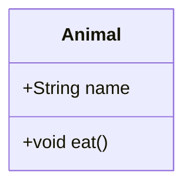

# User Guide

Welcome to the Mermaid Diagram App! This guide will walk you through its features and how to use them.

## 1. The Interface

The main window is split into two sections:

- **Code Editor (Left)**: This is where you write and edit your Mermaid diagram syntax or Markdown documentation.
- **Preview Panel (Right)**: This panel shows a live rendering of the diagram or Markdown content from the code editor.
- **Window Title**: When you open or save a file, the filename is displayed in the window title bar (e.g., "MyDiagram.mmd - Mermaid Diagram Editor").

You can resize these panels by dragging the vertical splitter between them.

### Content Type Support

The application automatically detects and renders two types of content:

- **Mermaid Diagrams** (`.mmd` files): UML diagrams, flowcharts, sequence diagrams, etc.
- **Markdown Documents** (`.md`, `.markdown` files): Technical documentation with optional embedded Mermaid diagrams

The status bar at the bottom shows the current rendering mode (e.g., "Mermaid Diagram" or "Markdown Document").

## 2. Creating a New Diagram

You can start a new diagram in two ways:

- **Blank Diagram**: Simply start typing in the code editor.
- **From a Template**: Go to the `New` menu and select one of the available diagram templates (e.g., `Class Diagram`, `Sequence Diagram`). This will load a basic example into the editor to get you started.

## 3. Live Preview

As you type in the code editor, the preview panel will automatically update every half-second to reflect your changes. 

If there is an error in your Mermaid syntax, the preview panel will display a red error message from the Mermaid.js library, helping you to debug your diagram.

## 4. Opening and Saving Files

### Opening a File

1.  Go to `File` > `Open`.
2.  A file dialog will appear.
3.  Select a Mermaid diagram file (`.mmd`) or Markdown file (`.md`, `.markdown`).
4.  The content of the file will be loaded into the code editor, and the preview will update.
5.  The filename will appear in the window title bar.

### Saving a File

1.  Go to `File` > `Save`.
2.  A file dialog will appear.
3.  Choose a location, enter a file name, and click `Save`.
4.  The current content of the code editor will be saved to the specified file.

## 5. Exporting Diagrams

You can export your diagram as an image in either SVG or PNG format.

### Exporting to SVG

1.  Go to `Export` > `Export as SVG`.
2.  A file dialog will appear.
3.  Choose a location, enter a file name, and click `Save`.
4.  The currently rendered diagram will be saved as a `.svg` file.

### Exporting to PNG

1.  Go to `Export` > `Export as PNG`.
2.  A file dialog will appear.
3.  Choose a location, enter a file name, and click `Save`.
4.  The currently rendered diagram will be saved as a `.png` file.

## 6. Working with Markdown Documents

The application provides full support for Markdown documents with embedded Mermaid diagrams.

### Creating Markdown Files

1. Create a new file or open an existing `.md` file
2. Write standard Markdown content (headings, lists, tables, code blocks, etc.)
3. The preview panel will render the formatted Markdown

### Embedding Mermaid Diagrams in Markdown

You can include Mermaid diagrams within Markdown documents using code blocks:

```markdown
# My Documentation

Here's a class diagram:



More text here...
```

The embedded diagrams will render inline within your Markdown preview.

### Image Support

Markdown images are fully supported, including local file paths:

```markdown


```

Both relative and absolute paths work. The application automatically resolves local paths.

## 7. Markdown Style Settings

You can customize how Markdown content is displayed in the preview.

### Accessing Style Settings

1. Go to `View` > `Markdown Style Settings...`
2. A dialog will open showing customization options

### Available Settings

**Font Settings:**
- **Font Size**: Adjust text size (10-32px, default: 16px)
- **Font Family**: Choose from system fonts (Segoe UI, Arial, Georgia, etc.)
- **Line Height**: Control spacing between lines (1.0-3.0, default: 1.6)

**Layout Settings:**
- **Maximum Content Width**: Set max width for readability (0-2000px, default: 900px, 0 = no limit)

**Code Block Settings:**
- **Code Font Size**: Adjust code block text size (8-24px, default: 14px)
- **Code Font Family**: Choose monospace font (Consolas, Monaco, Courier New, etc.)

### Using the Settings Dialog

1. Adjust sliders and dropdowns to customize appearance
2. View live preview at the bottom of the dialog
3. Click **Save** to apply changes (takes effect immediately)
4. Click **Reset to Defaults** to restore original settings
5. Click **Cancel** to discard changes

**Note:** Style settings only apply to Markdown documents, not Mermaid diagrams. If you open the settings while viewing a Mermaid diagram, you'll see an informational message.

## 8. Rendering Mode Control

The application automatically detects whether your content is a Mermaid diagram or Markdown document.

### Automatic Detection

- **`.mmd` files**: Always rendered as Mermaid diagrams
- **`.md` files**: Analyzed for content type
  - If the file starts with Mermaid diagram syntax, rendered as Mermaid
  - Otherwise, rendered as Markdown

### Status Indicator

The status bar shows the current rendering mode:
- **"Mermaid Diagram"**: Content is being rendered as a diagram
- **"Markdown Document"**: Content is being rendered as formatted text

### Manual Override

If automatic detection doesn't work as expected, you can manually override it:

1. Click the **"Rendering Mode"** button in the status bar
2. Select from the menu:
   - **Auto-detect**: Let the app determine the type (default)
   - **Force Mermaid**: Always render as Mermaid diagram
   - **Force Markdown**: Always render as Markdown document

The override applies only to the current session. Reopening the file resets to auto-detect.

## 9. Syntax Checker & Fixer

The application includes a powerful syntax checker that detects and fixes common Mermaid syntax issues.

### Running the Syntax Checker

**Method 1:** Press `F7` on your keyboard  
**Method 2:** Go to `Edit` > `Check & Fix Mermaid Syntax`

**Note:** The syntax checker only works with Mermaid diagram files (`.mmd`), not Markdown files.

### What It Detects

The syntax checker finds common issues:

1. **Unicode Dashes**: En-dashes (–) and em-dashes (—) that should be hyphens (-)
2. **Unicode Arrows**: Arrow characters (→, ←, ↔) that cause parsing errors
3. **Smart Quotes**: Curly quotes (" " ' ') that should be straight quotes (" ')
4. **Line Breaks**: `\n` escape sequences in labels that should be `<br/>` tags
5. **Parentheses Issues**: Problematic parentheses usage in labels

### Using the Syntax Issues Dialog

When you run the checker, a dialog appears showing all detected issues:

1. **Issue List**: Each issue shows:
   - Line and column number
   - Issue type and severity (Error/Warning/Info)
   - Description of the problem
   - Original text and suggested replacement

2. **Selection Controls**:
   - Check/uncheck individual issues to fix
   - **Select All**: Check all issues
   - **Deselect All**: Uncheck all issues
   - Filter by type (Unicode Dashes, Line Breaks, etc.)

3. **Preview Panel**:
   - Click an issue to see before/after comparison
   - Shows the surrounding code context
   - Highlights the specific change

4. **Applying Fixes**:
   - Review selected issues
   - Click **Apply Fixes** to update your code
   - The editor updates immediately
   - Use `Ctrl+Z` to undo if needed

### Tips

- The checker runs **manually only** - it never interrupts your work
- Review each issue before applying fixes
- You can selectively fix only certain types of issues
- All fixes are applied atomically (all at once)

## 10. Diagnostics and Logs

The app records diagnostic information to rotating log files so you can troubleshoot rendering or update issues.

* **Accessing logs in-app**  
  Open the `Help` menu and choose `Diagnostics`. From there you can open either the current log file or the entire log folder. The app will launch your default editor or file explorer.

* **Log file location**  
  Log files are stored under the app's local data directory inside a `Logs` folder. On Windows this is typically:  
  `%LocalAppData%\Packages\<AppPackageId>\LocalState\Logs`

* **Rolling behaviour**  
  Each log file is capped in size; older files are archived automatically, ensuring recent activity is always available without consuming excessive disk space.

* **When to review logs**  
  - Mermaid preview stays stuck on "Loading Mermaid.js…"  
  - Updates fail or Mermaid assets are not copied  
  - Export commands return an unexpected error dialog

## 11. Keyboard Shortcuts

| Shortcut | Action |
|----------|--------|
| `Ctrl+S` | Save current file |
| `Ctrl+O` | Open file |
| `F5` | Presentation mode |
| `F7` | Check & Fix Mermaid Syntax |
| `F11` | Full screen preview |
| `Ctrl+F5` | Refresh preview |

## 12. Visual Diagram Builder

**Full documentation available:** [`docs/user-guides/visual-diagram-builder-guide.md`](user-guides/visual-diagram-builder-guide.md)

The application will soon feature a professional drag-and-drop visual editor for creating diagrams without writing code.

## 13. Tips & Best Practices

### For Mermaid Diagrams
- Use straight quotes (`"`) not curly quotes (`"` )
- Use hyphens (`-`) not en-dashes (`–`) or em-dashes (`—`)
- Use `<br/>` for line breaks in labels, not `\n`
- Run the syntax checker (`F7`) if diagrams don't render

### For Markdown Documents
- Customize font settings for better readability
- Use embedded Mermaid diagrams for technical documentation
- Local images work with both relative and absolute paths
- Set max content width for comfortable reading

### General
- The window title shows your current filename
- Status bar indicates current rendering mode
- Settings are saved automatically and persist across sessions
