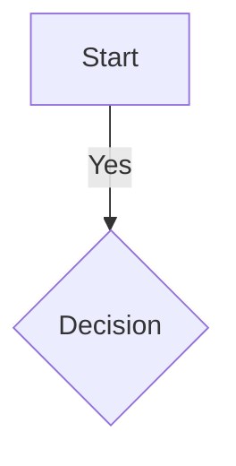

# Visual Diagram Builder - Technical Design Document

## Document Information
**Version:** 1.0  
**Date:** 2025-10-13  
**Status:** Design Phase  
**Author:** Development Team

---

## 1. Executive Summary

The Visual Diagram Builder transforms the Mermaid Diagram Editor from a code-first tool into a hybrid editor that supports both visual drag-and-drop diagram creation and traditional code-based editing. This feature targets users who prefer visual tools while maintaining the power and flexibility of Mermaid syntax for advanced users.

### Key Objectives
- **Lower barrier to entry**: Enable non-technical users to create diagrams without learning Mermaid syntax
- **Increase productivity**: Reduce diagram creation time by 50% for common use cases
- **Maintain flexibility**: Preserve code-based editing for advanced features
- **Ensure quality**: Generate clean, valid Mermaid code from visual operations

---

## 2. Architecture Overview

### 2.1 High-Level Architecture

```
┌─────────────────────────────────────────────────────────────┐
│                        MainWindow                            │
├─────────────┬───────────────────────────┬───────────────────┤
│  Toolbox    │    Canvas (Visual)        │   Properties      │
│  Panel      │    ┌─────────────────┐    │   Panel           │
│             │    │  CanvasNode     │    │                   │
│  [Shapes]   │    │  CanvasNode     │    │  [Node Props]     │
│  [Lines]    │    │  CanvasConnector│    │  [Line Props]     │
│  [UML]      │    └─────────────────┘    │  [Diagram Props]  │
│             │                            │                   │
└─────────────┴────────────────────────────┴───────────────────┘
       │                    │                        │
       ▼                    ▼                        ▼
┌─────────────┐    ┌──────────────┐      ┌─────────────────┐
│ShapeToolbox │    │DiagramCanvas │      │PropertiesPanel  │
│ ViewModel    │    │ViewModel     │      │ViewModel        │
└─────────────┘    └──────────────┘      └─────────────────┘
       │                    │                        │
       └────────────────────┼────────────────────────┘
                            ▼
                   ┌──────────────────┐
                   │  Code Sync       │
                   │  Manager         │
                   └──────────────────┘
                            │
              ┌─────────────┴─────────────┐
              ▼                           ▼
    ┌──────────────────┐        ┌──────────────────┐
    │MermaidCode       │        │MermaidCode       │
    │Generator         │        │Parser            │
    └──────────────────┘        └──────────────────┘
```

### 2.2 Component Responsibilities

| Component | Responsibility |
|-----------|---------------|
| **Shape Toolbox** | Display categorized shape libraries, handle drag initiation |
| **Diagram Canvas** | Visual editing surface, node/connector rendering, interaction handling |
| **Properties Panel** | Display and edit properties of selected elements |
| **Code Generator** | Convert canvas state to Mermaid syntax |
| **Code Parser** | Parse Mermaid syntax into canvas elements |
| **Sync Manager** | Coordinate canvas ↔ code synchronization |
| **Command System** | Undo/redo support for all canvas operations |

---

## 3. Key Design Decisions

### 3.1 Three-Panel Layout
- **Left**: Collapsible toolbox (300px default, resizable)
- **Center**: Canvas with grid and zoom controls
- **Right**: Properties panel (300px default, resizable)
- All panels can be toggled via View menu

### 3.2 Synchronization Strategy

**Canvas-First Mode (Default)**
- Canvas is source of truth
- Code auto-generated with 300ms debounce
- Code editor shows warning banner
- User can switch to Code-First mode

**Code-First Mode**
- Code editor is source of truth
- Canvas shows parsed view (read-only)
- "Import to Canvas" button for one-time sync

**Conflict Resolution**
- Track last modification source
- Show warning dialog if both modified
- User chooses which to keep

### 3.3 Technology Choices

| Aspect | Technology | Rationale |
|--------|-----------|-----------|
| Canvas Rendering | WinUI3 Canvas + XAML Shapes | Native performance, theme support |
| Drag-Drop | WinUI3 DragDrop APIs | Built-in support, good UX |
| Undo/Redo | Command Pattern | Flexible, testable |
| Code Generation | Template-based | Maintainable, extensible |
| Parsing | Regex + Custom Parser | Fast, handles metadata |

---

## 4. Data Models

### 4.1 Core Interfaces

```csharp
public interface ICanvasElement
{
    string Id { get; set; }
    Point Position { get; set; }
    Size Size { get; set; }
    bool IsSelected { get; set; }
    void Render(DrawingContext context);
    bool HitTest(Point point);
}

public interface ICanvasCommand
{
    void Execute();
    void Undo();
    string Description { get; }
}

public interface IMermaidCodeGenerator
{
    string Generate(DiagramCanvasViewModel canvas);
    DiagramType SupportedType { get; }
}
```

### 4.2 Key Classes

**CanvasNode**: Represents visual diagram nodes  
**CanvasConnector**: Represents connections between nodes  
**ShapeTemplate**: Defines available shapes in toolbox  
**CommandHistory**: Manages undo/redo stack  
**CanvasSerializer**: Saves/loads canvas state

---

## 5. Implementation Phases

### Phase 1: Core Infrastructure (Sprint 1-2)
- ✅ Three-panel layout with splitters
- ✅ Basic canvas with grid rendering
- ✅ Shape toolbox with categories
- ✅ Drag-drop from toolbox to canvas

### Phase 2: Canvas Interactions (Sprint 3-4)
- ✅ Node selection, dragging, resizing
- ✅ Multi-select with rubber-band
- ✅ Connection drawing between nodes
- ✅ Basic properties panel

### Phase 3: Code Synchronization (Sprint 5-6)
- ✅ Canvas → Mermaid code generation
- ✅ Mermaid code → Canvas parsing
- ✅ Mode switching (Canvas-First vs Code-First)
- ✅ Metadata format for positions

### Phase 4: Advanced Features (Sprint 7-8)
- ✅ Undo/redo system
- ✅ Zoom and pan controls
- ✅ Alignment and distribution tools
- ✅ Context menus and shortcuts

### Phase 5: Multi-Diagram Support (Sprint 9-10)
- ✅ Diagram type switcher
- ✅ Type-specific shape libraries
- ✅ Type-specific code generators
- ✅ Validation rules per type

---

## 6. Shape Library Structure

### 6.1 Categories

**General**
- Rectangle, Rounded Rectangle, Circle, Ellipse
- Triangle, Diamond, Hexagon, Pentagon
- Text box, Note, Comment

**Flowchart**
- Start/End (Stadium), Process (Rectangle)
- Decision (Diamond), Data (Parallelogram)
- Document, Manual Input, Predefined Process

**UML**
- Class (with compartments), Interface
- Actor (stick figure), Package, Note

**Entity-Relation**
- Entity, Weak Entity, Relationship, Attribute

**Arrows/Connectors**
- Solid, Dashed, Dotted, Thick
- Various arrow heads

### 6.2 Shape Template Format (JSON)

```json
{
  "category": "Flowchart",
  "shapes": [
    {
      "id": "flowchart-process",
      "name": "Process",
      "description": "A process or action step",
      "shapeType": "Rectangle",
      "defaultSize": { "width": 120, "height": 60 },
      "defaultText": "Process",
      "iconPath": "/Assets/Shapes/process.svg",
      "mermaidSyntax": "[{text}]",
      "connectionPoints": ["top", "bottom", "left", "right"]
    }
  ]
}
```

---

## 7. Code Generation Strategy

### 7.1 Flowchart Example

**Canvas State:**
- Node A (Rectangle) at (100, 100)
- Node B (Diamond) at (300, 100)
- Connection A → B with label "Yes"

**Generated Code:**


### 7.2 Metadata Format

Positions and sizes stored as Mermaid comments:
- Enables round-trip editing
- Doesn't affect rendering
- Easy to parse

---

## 8. Performance Targets

| Metric | Target | Measurement |
|--------|--------|-------------|
| Canvas FPS | 60 FPS | With 100+ nodes |
| Drag latency | <16ms | From mouse to visual update |
| Code generation | <100ms | For typical diagrams |
| Code parsing | <200ms | For typical diagrams |
| Undo/redo | <50ms | Any operation |
| Memory per node | <10KB | Including visual state |

---

## 9. Testing Strategy

### 9.1 Unit Tests
- Model validation (CanvasNode, CanvasConnector)
- Command pattern (undo/redo)
- Code generation accuracy
- Code parsing accuracy

### 9.2 Integration Tests
- End-to-end drag-drop workflow
- Canvas ↔ code synchronization
- Multi-diagram type support

### 9.3 Performance Tests
- Rendering with 100+ nodes
- Memory leak detection
- Stress testing undo/redo

---

## 10. Migration from Current Implementation

### Current State
- ❌ Basic flowchart builder (disabled)
- ❌ List-based UI
- ❌ Sync issues
- ❌ Flowchart-only

### Migration Path
1. Keep existing `DiagramBuilderViewModel` as data layer
2. Add new visual canvas layer on top
3. Implement proper sync with mode switching
4. Feature flag for gradual rollout
5. Deprecate old UI once stable

---

## 11. Risks and Mitigation

| Risk | Mitigation |
|------|------------|
| Performance with large diagrams | Virtualization, dirty region tracking |
| Sync conflicts | Mode switching, save both representations |
| Complex features unsupported | Document limitations, hybrid editing |
| Touch input issues | Test on devices, provide alternatives |
| Memory leaks | Limit history, efficient memento pattern |

---

## 12. Success Criteria

- ✅ 70%+ users prefer visual builder
- ✅ 50% faster diagram creation
- ✅ Zero data loss
- ✅ 60 FPS with 100+ nodes
- ✅ 90%+ Mermaid feature support
- ✅ >4.5/5 user satisfaction

---

## Related Documentation

- [Epic and User Stories](../features/visual-diagram-builder-epic.md)
- [User Guide](../user-guides/visual-diagram-builder-guide.md)
- [Main Software Design](../SOFTWARE_DESIGN.md)

---

**Document Status**: Ready for Review  
**Next Steps**: Team review → Update based on feedback → Begin Phase 1
