# DesignsAI - System Architecture Diagram

> **Generated:** January 15, 2026  
> **Version:** 0.2.0  
> **Description:** Comprehensive architecture diagram for the DesignsAI platform - an AI-powered design platform built with modern technologies

---

## Table of Contents

- [High-Level Architecture](#high-level-architecture)
- [Application Layer](#application-layer)
- [Service Layer](#service-layer)
- [Data Layer](#data-layer)
- [Infrastructure Layer](#infrastructure-layer)
- [External Integrations](#external-integrations)
- [Technology Stack](#technology-stack)
- [Data Flow](#data-flow)

---

## High-Level Architecture

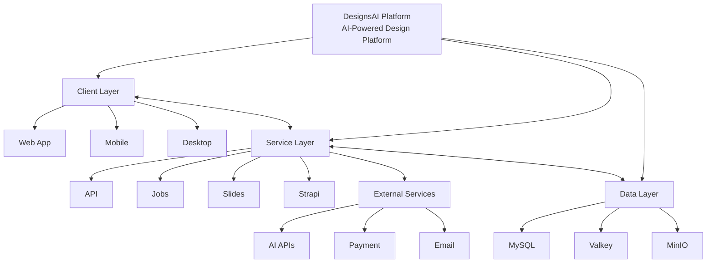
```mermaid
graph TB
    Platform[DesignsAI Platform<br/>AI-Powered Design Platform]
    
    Platform --> ClientLayer[Client Layer]
    Platform --> ServiceLayer[Service Layer]
    Platform --> DataLayer[Data Layer]
    
    ClientLayer --> WebApp[Web App]
    ClientLayer --> Mobile[Mobile]
    ClientLayer --> Desktop[Desktop]
    
    ServiceLayer --> API[API]
    ServiceLayer --> Jobs[Jobs]
    ServiceLayer --> Slides[Slides]
    ServiceLayer --> Strapi[Strapi]
    
    DataLayer --> MySQL[MySQL]
    DataLayer --> Valkey[Valkey]
    DataLayer --> MinIO[MinIO]
    
    ServiceLayer --> ExternalServices[External Services]
    ExternalServices --> AIAPIs[AI APIs]
    ExternalServices --> Payment[Payment]
    ExternalServices --> Email[Email]
    
    ClientLayer <--> ServiceLayer
    ServiceLayer <--> DataLayer
```

---

## Application Layer

### Frontend Applications

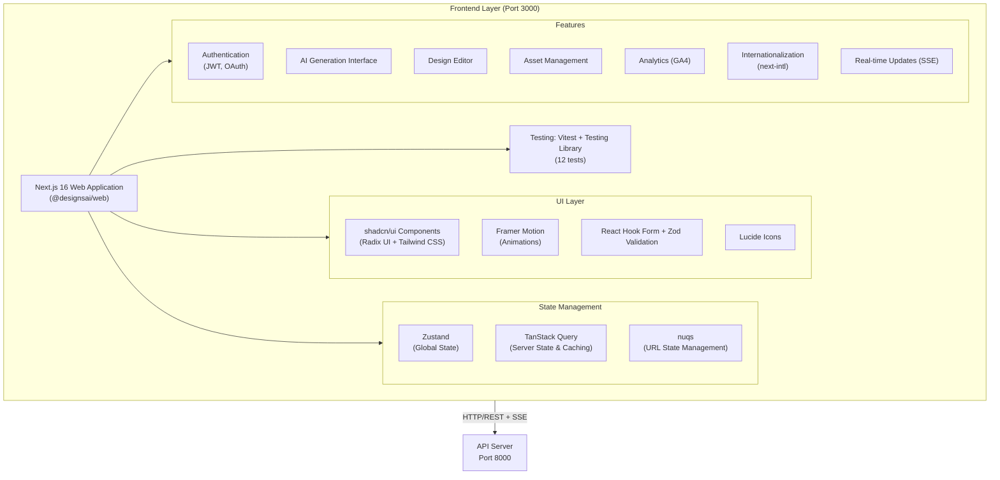
```mermaid
graph TB
    subgraph Frontend["Frontend Layer (Port 3000)"]
        NextJS["Next.js 16 Web Application<br/>(@designsai/web)"]
        
        subgraph UILayer["UI Layer"]
            shadcn["shadcn/ui Components<br/>(Radix UI + Tailwind CSS)"]
            framer["Framer Motion<br/>(Animations)"]
            rhf["React Hook Form + Zod Validation"]
            icons["Lucide Icons"]
        end
        
        subgraph StateManagement["State Management"]
            zustand["Zustand<br/>(Global State)"]
            tanstack["TanStack Query<br/>(Server State & Caching)"]
            nuqs["nuqs<br/>(URL State Management)"]
        end
        
        subgraph Features["Features"]
            auth["Authentication<br/>(JWT, OAuth)"]
            aigen["AI Generation Interface"]
            editor["Design Editor"]
            assets["Asset Management"]
            analytics["Analytics (GA4)"]
            i18n["Internationalization<br/>(next-intl)"]
            sse["Real-time Updates (SSE)"]
        end
        
        testing["Testing: Vitest + Testing Library<br/>(12 tests)"]
        
        NextJS --> UILayer
        NextJS --> StateManagement
        NextJS --> Features
        NextJS --> testing
    end
    
    Frontend -->|HTTP/REST + SSE| APIServer["API Server<br/>Port 8000"]
```

---

## Service Layer

### Backend Services

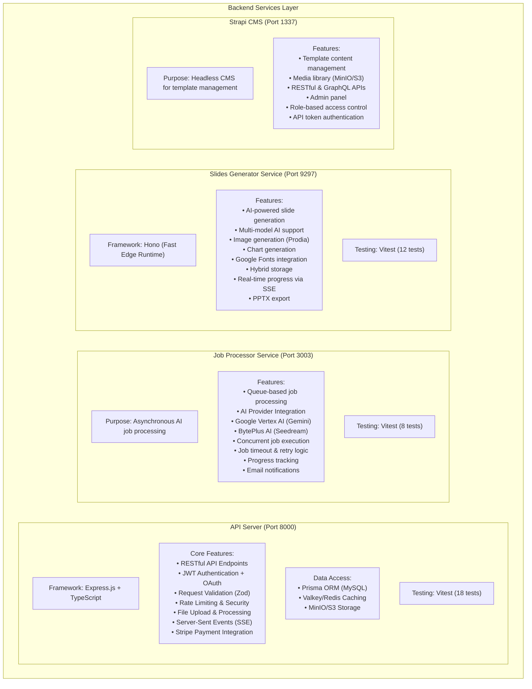
```mermaid
graph TB
    subgraph BackendServices["Backend Services Layer"]
        subgraph APIServer["API Server (Port 8000)"]
            api_framework["Framework: Express.js + TypeScript"]
            
            api_features["Core Features:<br/>• RESTful API Endpoints<br/>• JWT Authentication + OAuth<br/>• Request Validation (Zod)<br/>• Rate Limiting & Security<br/>• File Upload & Processing<br/>• Server-Sent Events (SSE)<br/>• Stripe Payment Integration"]
            
            api_data["Data Access:<br/>• Prisma ORM (MySQL)<br/>• Valkey/Redis Caching<br/>• MinIO/S3 Storage"]
            
            api_testing["Testing: Vitest (18 tests)"]
        end
        
        subgraph JobProcessor["Job Processor Service (Port 3003)"]
            job_purpose["Purpose: Asynchronous AI job processing"]
            
            job_features["Features:<br/>• Queue-based job processing<br/>• AI Provider Integration<br/>• Google Vertex AI (Gemini)<br/>• BytePlus AI (Seedream)<br/>• Concurrent job execution<br/>• Job timeout & retry logic<br/>• Progress tracking<br/>• Email notifications"]
            
            job_testing["Testing: Vitest (8 tests)"]
        end
        
        subgraph SlidesService["Slides Generator Service (Port 9297)"]
            slides_framework["Framework: Hono (Fast Edge Runtime)"]
            
            slides_features["Features:<br/>• AI-powered slide generation<br/>• Multi-model AI support<br/>• Image generation (Prodia)<br/>• Chart generation<br/>• Google Fonts integration<br/>• Hybrid storage<br/>• Real-time progress via SSE<br/>• PPTX export"]
            
            slides_testing["Testing: Vitest (12 tests)"]
        end
        
        subgraph StrapiCMS["Strapi CMS (Port 1337)"]
            strapi_purpose["Purpose: Headless CMS for template management"]
            
            strapi_features["Features:<br/>• Template content management<br/>• Media library (MinIO/S3)<br/>• RESTful & GraphQL APIs<br/>• Admin panel<br/>• Role-based access control<br/>• API token authentication"]
        end
    end
```

---

## Data Layer

### Databases & Storage

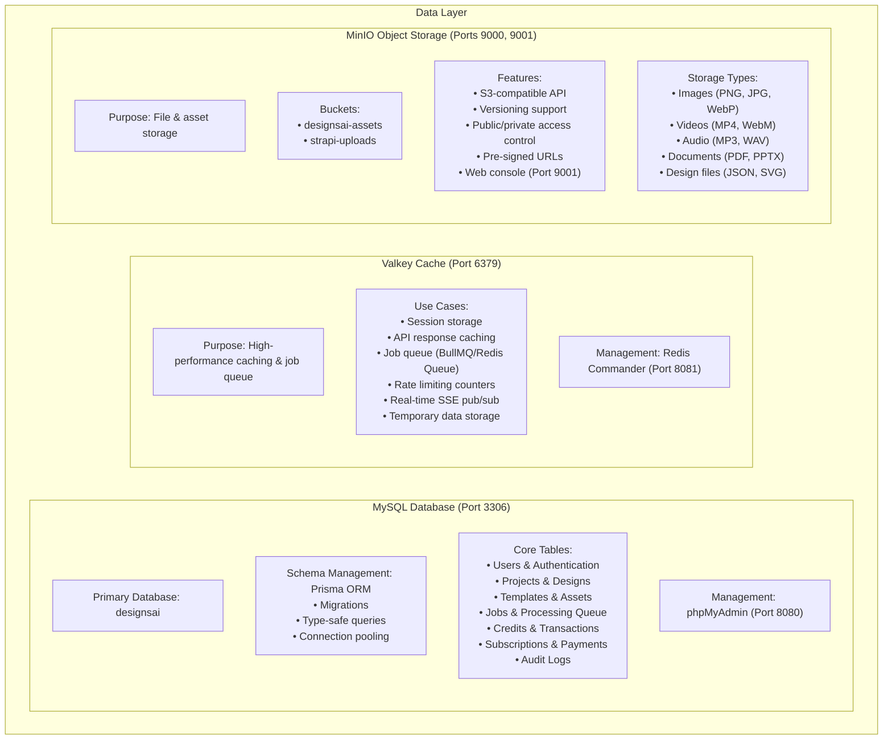
```mermaid
graph TB
    subgraph DataLayer["Data Layer"]
        subgraph MySQL["MySQL Database (Port 3306)"]
            mysql_db["Primary Database: designsai"]
            
            mysql_schema["Schema Management: Prisma ORM<br/>• Migrations<br/>• Type-safe queries<br/>• Connection pooling"]
            
            mysql_tables["Core Tables:<br/>• Users & Authentication<br/>• Projects & Designs<br/>• Templates & Assets<br/>• Jobs & Processing Queue<br/>• Credits & Transactions<br/>• Subscriptions & Payments<br/>• Audit Logs"]
            
            mysql_mgmt["Management: phpMyAdmin (Port 8080)"]
        end
        
        subgraph Valkey["Valkey Cache (Port 6379)"]
            valkey_purpose["Purpose: High-performance caching & job queue"]
            
            valkey_uses["Use Cases:<br/>• Session storage<br/>• API response caching<br/>• Job queue (BullMQ/Redis Queue)<br/>• Rate limiting counters<br/>• Real-time SSE pub/sub<br/>• Temporary data storage"]
            
            valkey_mgmt["Management: Redis Commander (Port 8081)"]
        end
        
        subgraph MinIO["MinIO Object Storage (Ports 9000, 9001)"]
            minio_purpose["Purpose: File & asset storage"]
            
            minio_buckets["Buckets:<br/>• designsai-assets<br/>• strapi-uploads"]
            
            minio_features["Features:<br/>• S3-compatible API<br/>• Versioning support<br/>• Public/private access control<br/>• Pre-signed URLs<br/>• Web console (Port 9001)"]
            
            minio_types["Storage Types:<br/>• Images (PNG, JPG, WebP)<br/>• Videos (MP4, WebM)<br/>• Audio (MP3, WAV)<br/>• Documents (PDF, PPTX)<br/>• Design files (JSON, SVG)"]
        end
    end
```

---

## Infrastructure Layer

### Shared Packages & Utilities

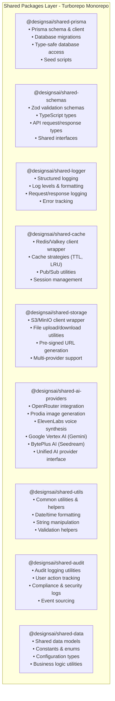
```mermaid
graph TB
    subgraph SharedPackages["Shared Packages Layer - Turborepo Monorepo"]
        prisma["@designsai/shared-prisma<br/>• Prisma schema & client<br/>• Database migrations<br/>• Type-safe database access<br/>• Seed scripts"]
        
        schemas["@designsai/shared-schemas<br/>• Zod validation schemas<br/>• TypeScript types<br/>• API request/response types<br/>• Shared interfaces"]
        
        logger["@designsai/shared-logger<br/>• Structured logging<br/>• Log levels & formatting<br/>• Request/response logging<br/>• Error tracking"]
        
        cache["@designsai/shared-cache<br/>• Redis/Valkey client wrapper<br/>• Cache strategies (TTL, LRU)<br/>• Pub/Sub utilities<br/>• Session management"]
        
        storage["@designsai/shared-storage<br/>• S3/MinIO client wrapper<br/>• File upload/download utilities<br/>• Pre-signed URL generation<br/>• Multi-provider support"]
        
        ai["@designsai/shared-ai-providers<br/>• OpenRouter integration<br/>• Prodia image generation<br/>• ElevenLabs voice synthesis<br/>• Google Vertex AI (Gemini)<br/>• BytePlus AI (Seedream)<br/>• Unified AI provider interface"]
        
        utils["@designsai/shared-utils<br/>• Common utilities & helpers<br/>• Date/time formatting<br/>• String manipulation<br/>• Validation helpers"]
        
        audit["@designsai/shared-audit<br/>• Audit logging utilities<br/>• User action tracking<br/>• Compliance & security logs<br/>• Event sourcing"]
        
        data["@designsai/shared-data<br/>• Shared data models<br/>• Constants & enums<br/>• Configuration types<br/>• Business logic utilities"]
    end
```

### Development & DevOps

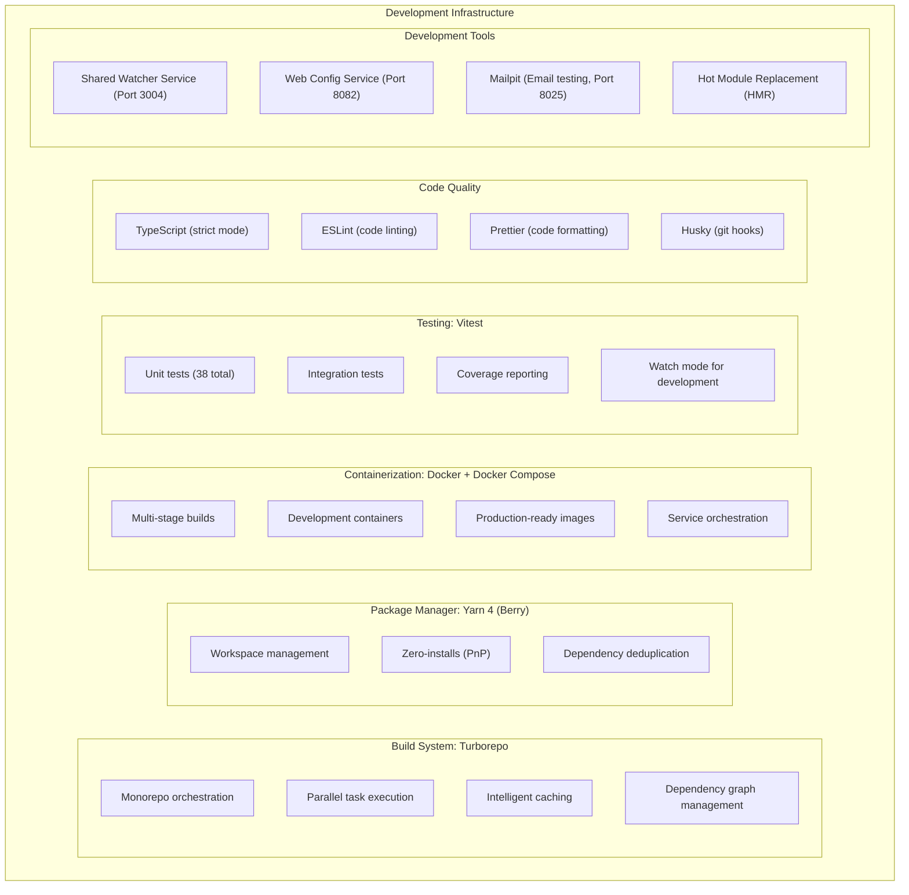
```mermaid
graph TB
    subgraph DevInfra["Development Infrastructure"]
        subgraph BuildSystem["Build System: Turborepo"]
            turbo1["Monorepo orchestration"]
            turbo2["Parallel task execution"]
            turbo3["Intelligent caching"]
            turbo4["Dependency graph management"]
        end
        
        subgraph PackageManager["Package Manager: Yarn 4 (Berry)"]
            yarn1["Workspace management"]
            yarn2["Zero-installs (PnP)"]
            yarn3["Dependency deduplication"]
        end
        
        subgraph Container["Containerization: Docker + Docker Compose"]
            docker1["Multi-stage builds"]
            docker2["Development containers"]
            docker3["Production-ready images"]
            docker4["Service orchestration"]
        end
        
        subgraph Testing["Testing: Vitest"]
            test1["Unit tests (38 total)"]
            test2["Integration tests"]
            test3["Coverage reporting"]
            test4["Watch mode for development"]
        end
        
        subgraph CodeQuality["Code Quality"]
            quality1["TypeScript (strict mode)"]
            quality2["ESLint (code linting)"]
            quality3["Prettier (code formatting)"]
            quality4["Husky (git hooks)"]
        end
        
        subgraph DevTools["Development Tools"]
            tools1["Shared Watcher Service (Port 3004)"]
            tools2["Web Config Service (Port 8082)"]
            tools3["Mailpit (Email testing, Port 8025)"]
            tools4["Hot Module Replacement (HMR)"]
        end
    end
```

---

## External Integrations

### Third-Party Services

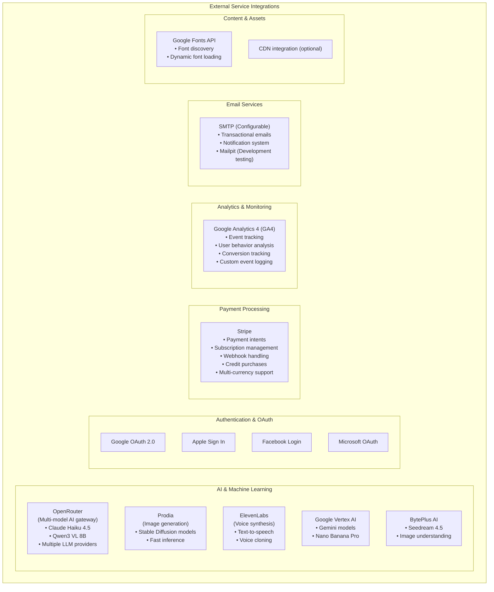
```mermaid
graph TB
    subgraph ExternalIntegrations["External Service Integrations"]
        subgraph AI["AI & Machine Learning"]
            openrouter["OpenRouter<br/>(Multi-model AI gateway)<br/>• Claude Haiku 4.5<br/>• Qwen3 VL 8B<br/>• Multiple LLM providers"]
            
            prodia["Prodia<br/>(Image generation)<br/>• Stable Diffusion models<br/>• Fast inference"]
            
            elevenlabs["ElevenLabs<br/>(Voice synthesis)<br/>• Text-to-speech<br/>• Voice cloning"]
            
            vertex["Google Vertex AI<br/>• Gemini models<br/>• Nano Banana Pro"]
            
            byteplus["BytePlus AI<br/>• Seedream 4.5<br/>• Image understanding"]
        end
        
        subgraph Auth["Authentication & OAuth"]
            google["Google OAuth 2.0"]
            apple["Apple Sign In"]
            facebook["Facebook Login"]
            microsoft["Microsoft OAuth"]
        end
        
        subgraph Payment["Payment Processing"]
            stripe["Stripe<br/>• Payment intents<br/>• Subscription management<br/>• Webhook handling<br/>• Credit purchases<br/>• Multi-currency support"]
        end
        
        subgraph Analytics["Analytics & Monitoring"]
            ga4["Google Analytics 4 (GA4)<br/>• Event tracking<br/>• User behavior analysis<br/>• Conversion tracking<br/>• Custom event logging"]
        end
        
        subgraph EmailServices["Email Services"]
            smtp["SMTP (Configurable)<br/>• Transactional emails<br/>• Notification system<br/>• Mailpit (Development testing)"]
        end
        
        subgraph Content["Content & Assets"]
            fonts["Google Fonts API<br/>• Font discovery<br/>• Dynamic font loading"]
            cdn["CDN integration (optional)"]
        end
    end
```

---

## Technology Stack

### Complete Technology Overview

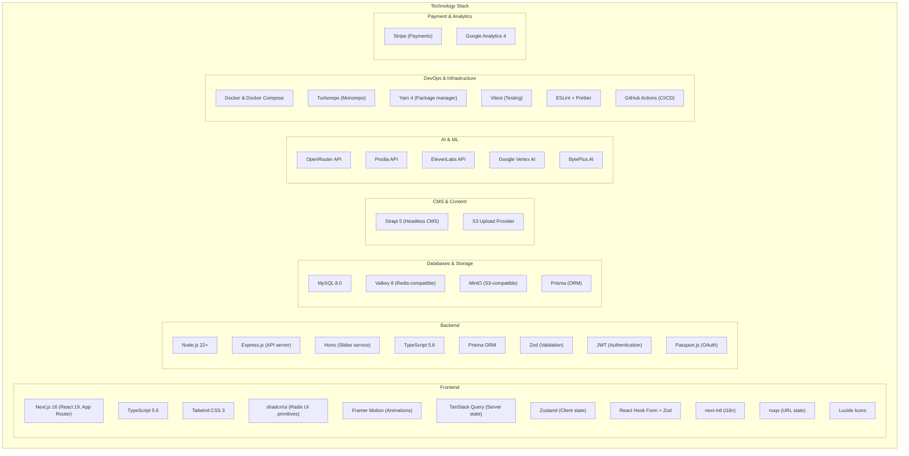
```mermaid
graph TB
    subgraph TechStack["Technology Stack"]
        subgraph Frontend["Frontend"]
            fe1["Next.js 16 (React 19, App Router)"]
            fe2["TypeScript 5.6"]
            fe3["Tailwind CSS 3"]
            fe4["shadcn/ui (Radix UI primitives)"]
            fe5["Framer Motion (Animations)"]
            fe6["TanStack Query (Server state)"]
            fe7["Zustand (Client state)"]
            fe8["React Hook Form + Zod"]
            fe9["next-intl (i18n)"]
            fe10["nuqs (URL state)"]
            fe11["Lucide Icons"]
        end
        
        subgraph Backend["Backend"]
            be1["Node.js 22+"]
            be2["Express.js (API server)"]
            be3["Hono (Slides service)"]
            be4["TypeScript 5.6"]
            be5["Prisma ORM"]
            be6["Zod (Validation)"]
            be7["JWT (Authentication)"]
            be8["Passport.js (OAuth)"]
        end
        
        subgraph Database["Databases & Storage"]
            db1["MySQL 8.0"]
            db2["Valkey 8 (Redis-compatible)"]
            db3["MinIO (S3-compatible)"]
            db4["Prisma (ORM)"]
        end
        
        subgraph CMS["CMS & Content"]
            cms1["Strapi 5 (Headless CMS)"]
            cms2["S3 Upload Provider"]
        end
        
        subgraph AIServices["AI & ML"]
            ai1["OpenRouter API"]
            ai2["Prodia API"]
            ai3["ElevenLabs API"]
            ai4["Google Vertex AI"]
            ai5["BytePlus AI"]
        end
        
        subgraph DevOps["DevOps & Infrastructure"]
            devops1["Docker & Docker Compose"]
            devops2["Turborepo (Monorepo)"]
            devops3["Yarn 4 (Package manager)"]
            devops4["Vitest (Testing)"]
            devops5["ESLint + Prettier"]
            devops6["GitHub Actions (CI/CD)"]
        end
        
        subgraph PaymentAnalytics["Payment & Analytics"]
            pa1["Stripe (Payments)"]
            pa2["Google Analytics 4"]
        end
    end
```

---

## Data Flow

### Request Flow Diagrams

#### 1. User Authentication Flow

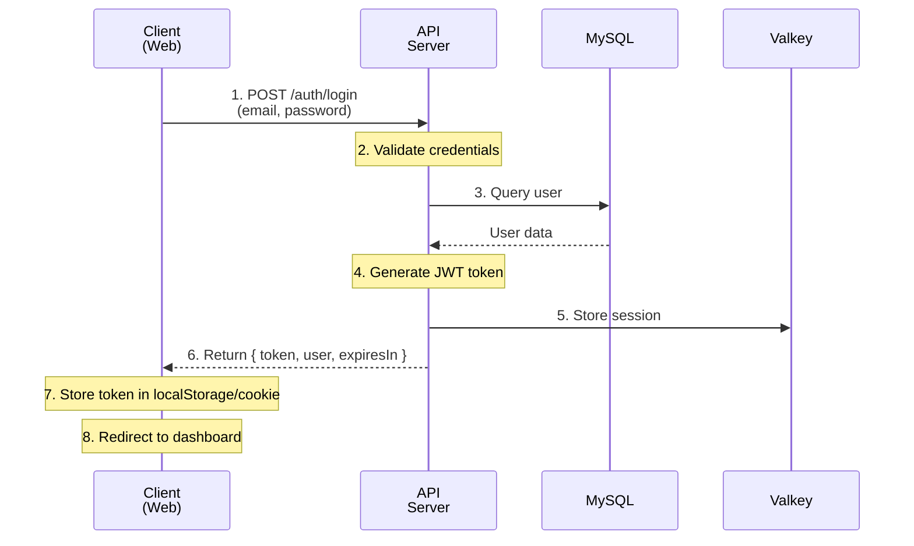
```mermaid
sequenceDiagram
    participant Client as Client<br/>(Web)
    participant API as API<br/>Server
    participant MySQL as MySQL
    participant Valkey as Valkey
    
    Client->>API: 1. POST /auth/login<br/>(email, password)
    
    Note over API: 2. Validate credentials
    API->>MySQL: 3. Query user
    MySQL-->>API: User data
    
    Note over API: 4. Generate JWT token
    API->>Valkey: 5. Store session
    
    API-->>Client: 6. Return { token, user, expiresIn }
    
    Note over Client: 7. Store token in localStorage/cookie
    Note over Client: 8. Redirect to dashboard
```

#### 2. OAuth Authentication Flow (Google/Apple/Facebook/Microsoft)

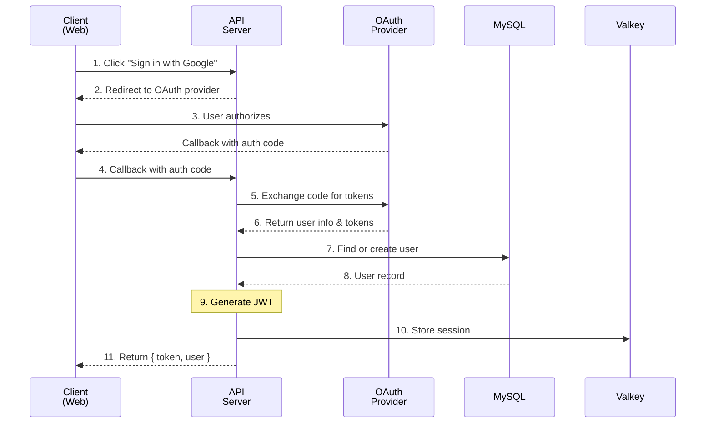
```mermaid
sequenceDiagram
    participant Client as Client<br/>(Web)
    participant API as API<br/>Server
    participant OAuth as OAuth<br/>Provider
    participant MySQL as MySQL
    participant Valkey as Valkey
    
    Client->>API: 1. Click "Sign in with Google"
    API-->>Client: 2. Redirect to OAuth provider
    
    Client->>OAuth: 3. User authorizes
    OAuth-->>Client: Callback with auth code
    
    Client->>API: 4. Callback with auth code
    API->>OAuth: 5. Exchange code for tokens
    OAuth-->>API: 6. Return user info & tokens
    
    API->>MySQL: 7. Find or create user
    MySQL-->>API: 8. User record
    
    Note over API: 9. Generate JWT
    API->>Valkey: 10. Store session
    
    API-->>Client: 11. Return { token, user }
```

#### 3. AI Design Generation Flow

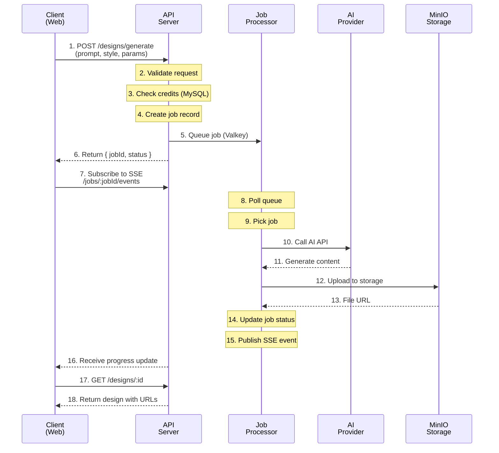
```mermaid
sequenceDiagram
    participant Client as Client<br/>(Web)
    participant API as API<br/>Server
    participant Job as Job<br/>Processor
    participant AI as AI<br/>Provider
    participant MinIO as MinIO<br/>Storage
    
    Client->>API: 1. POST /designs/generate<br/>(prompt, style, params)
    
    Note over API: 2. Validate request
    Note over API: 3. Check credits (MySQL)
    Note over API: 4. Create job record
    API->>Job: 5. Queue job (Valkey)
    
    API-->>Client: 6. Return { jobId, status }
    
    Client->>API: 7. Subscribe to SSE<br/>/jobs/:jobId/events
    
    Note over Job: 8. Poll queue
    Note over Job: 9. Pick job
    
    Job->>AI: 10. Call AI API
    AI-->>Job: 11. Generate content
    
    Job->>MinIO: 12. Upload to storage
    MinIO-->>Job: 13. File URL
    
    Note over Job: 14. Update job status
    Note over Job: 15. Publish SSE event
    
    API-->>Client: 16. Receive progress update
    
    Client->>API: 17. GET /designs/:id
    API-->>Client: 18. Return design with URLs
```

#### 4. Slides Generation Flow

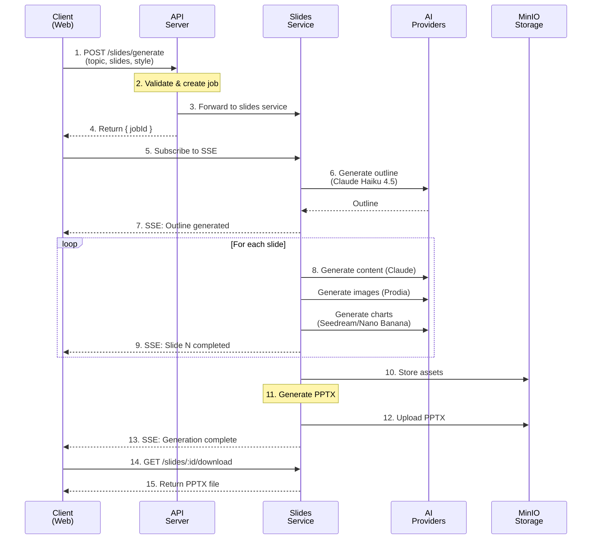
```mermaid
sequenceDiagram
    participant Client as Client<br/>(Web)
    participant API as API<br/>Server
    participant Slides as Slides<br/>Service
    participant AI as AI<br/>Providers
    participant MinIO as MinIO<br/>Storage
    
    Client->>API: 1. POST /slides/generate<br/>(topic, slides, style)
    
    Note over API: 2. Validate & create job
    API->>Slides: 3. Forward to slides service
    
    API-->>Client: 4. Return { jobId }
    
    Client->>Slides: 5. Subscribe to SSE
    
    Slides->>AI: 6. Generate outline<br/>(Claude Haiku 4.5)
    AI-->>Slides: Outline
    
    Slides-->>Client: 7. SSE: Outline generated
    
    loop For each slide
        Slides->>AI: 8. Generate content (Claude)
        Slides->>AI: Generate images (Prodia)
        Slides->>AI: Generate charts<br/>(Seedream/Nano Banana)
        
        Slides-->>Client: 9. SSE: Slide N completed
    end
    
    Slides->>MinIO: 10. Store assets
    
    Note over Slides: 11. Generate PPTX
    Slides->>MinIO: 12. Upload PPTX
    
    Slides-->>Client: 13. SSE: Generation complete
    
    Client->>Slides: 14. GET /slides/:id/download
    Slides-->>Client: 15. Return PPTX file
```

#### 5. Payment & Credit Purchase Flow

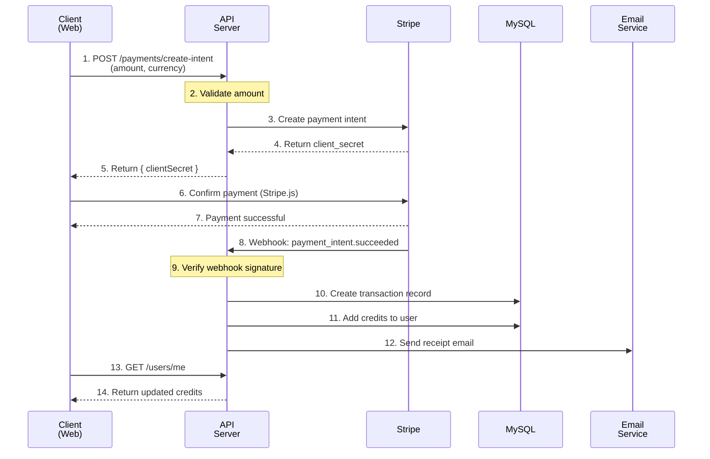
```mermaid
sequenceDiagram
    participant Client as Client<br/>(Web)
    participant API as API<br/>Server
    participant Stripe as Stripe
    participant MySQL as MySQL
    participant Email as Email<br/>Service
    
    Client->>API: 1. POST /payments/create-intent<br/>(amount, currency)
    
    Note over API: 2. Validate amount
    API->>Stripe: 3. Create payment intent
    Stripe-->>API: 4. Return client_secret
    
    API-->>Client: 5. Return { clientSecret }
    
    Client->>Stripe: 6. Confirm payment (Stripe.js)
    Stripe-->>Client: 7. Payment successful
    
    Stripe->>API: 8. Webhook: payment_intent.succeeded
    
    Note over API: 9. Verify webhook signature
    API->>MySQL: 10. Create transaction record
    API->>MySQL: 11. Add credits to user
    API->>Email: 12. Send receipt email
    
    Client->>API: 13. GET /users/me
    API-->>Client: 14. Return updated credits
```

#### 6. Template Management Flow (Strapi CMS)

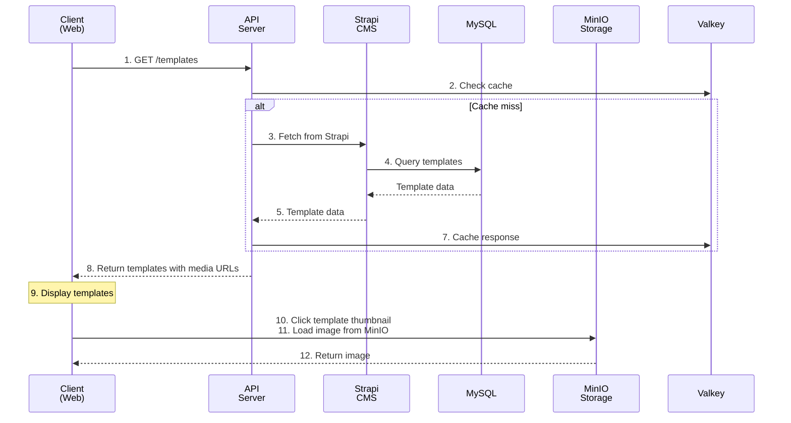
```mermaid
sequenceDiagram
    participant Client as Client<br/>(Web)
    participant API as API<br/>Server
    participant Strapi as Strapi<br/>CMS
    participant MySQL as MySQL
    participant MinIO as MinIO<br/>Storage
    participant Valkey as Valkey
    
    Client->>API: 1. GET /templates
    
    API->>Valkey: 2. Check cache
    
    alt Cache miss
        API->>Strapi: 3. Fetch from Strapi
        Strapi->>MySQL: 4. Query templates
        MySQL-->>Strapi: Template data
        Strapi-->>API: 5. Template data
        API->>Valkey: 7. Cache response
    end
    
    API-->>Client: 8. Return templates with media URLs
    
    Note over Client: 9. Display templates
    
    Client->>MinIO: 10. Click template thumbnail<br/>11. Load image from MinIO
    MinIO-->>Client: 12. Return image
```

---

## Port Reference

### Service Ports Overview

| Service          | Port(s)      | Purpose                          | Access       |
|------------------|--------------|----------------------------------|--------------|
| Web (Next.js)    | 3000         | Frontend application             | Public       |
| API Server       | 8000         | Backend REST API                 | Public       |
| Job Processor    | 3003         | Background job processing        | Internal     |
| Shared Watcher   | 3004         | Development file watcher         | Internal     |
| Slides Service   | 9297         | AI slides generation             | Internal     |
| Strapi CMS       | 1337         | Headless CMS                     | Internal     |
| MySQL            | 3306         | Primary database                 | Internal     |
| Valkey (Redis)   | 6379         | Cache & job queue                | Internal     |
| MinIO API        | 9000         | Object storage API               | Internal     |
| MinIO Console    | 9001         | Storage management UI            | Dev only     |
| phpMyAdmin       | 8080         | Database management UI           | Dev only     |
| Redis Commander  | 8081         | Cache management UI              | Dev only     |
| Web Config       | 8082         | Dynamic config service           | Internal     |
| Mailpit SMTP     | 1025         | Email testing (SMTP)             | Dev only     |
| Mailpit Web      | 8025         | Email testing UI                 | Dev only     |

---

## Security Architecture

### Security Layers & Best Practices

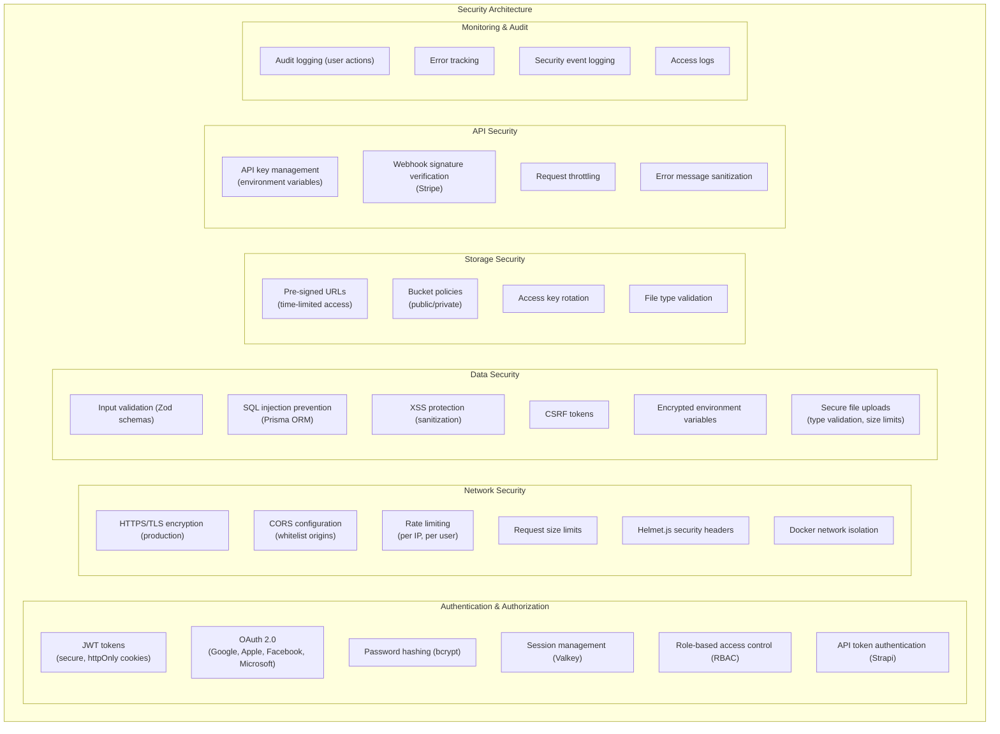
```mermaid
graph TB
    subgraph Security["Security Architecture"]
        subgraph AuthZ["Authentication & Authorization"]
            auth1["JWT tokens<br/>(secure, httpOnly cookies)"]
            auth2["OAuth 2.0<br/>(Google, Apple, Facebook, Microsoft)"]
            auth3["Password hashing (bcrypt)"]
            auth4["Session management (Valkey)"]
            auth5["Role-based access control (RBAC)"]
            auth6["API token authentication (Strapi)"]
        end
        
        subgraph Network["Network Security"]
            net1["HTTPS/TLS encryption (production)"]
            net2["CORS configuration<br/>(whitelist origins)"]
            net3["Rate limiting<br/>(per IP, per user)"]
            net4["Request size limits"]
            net5["Helmet.js security headers"]
            net6["Docker network isolation"]
        end
        
        subgraph DataSec["Data Security"]
            data1["Input validation (Zod schemas)"]
            data2["SQL injection prevention<br/>(Prisma ORM)"]
            data3["XSS protection (sanitization)"]
            data4["CSRF tokens"]
            data5["Encrypted environment variables"]
            data6["Secure file uploads<br/>(type validation, size limits)"]
        end
        
        subgraph StorageSec["Storage Security"]
            storage1["Pre-signed URLs<br/>(time-limited access)"]
            storage2["Bucket policies<br/>(public/private)"]
            storage3["Access key rotation"]
            storage4["File type validation"]
        end
        
        subgraph APISec["API Security"]
            api1["API key management<br/>(environment variables)"]
            api2["Webhook signature verification<br/>(Stripe)"]
            api3["Request throttling"]
            api4["Error message sanitization"]
        end
        
        subgraph Monitoring["Monitoring & Audit"]
            mon1["Audit logging (user actions)"]
            mon2["Error tracking"]
            mon3["Security event logging"]
            mon4["Access logs"]
        end
    end
```

---

## Deployment Architecture

### Production Deployment Overview

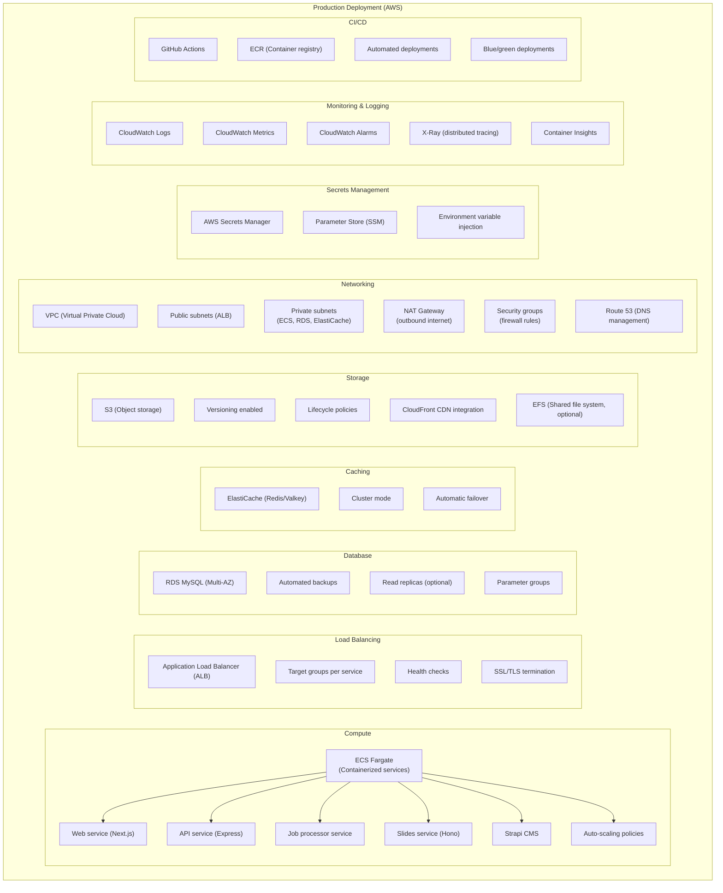
```mermaid
graph TB
    subgraph AWS["Production Deployment (AWS)"]
        subgraph Compute["Compute"]
            ecs["ECS Fargate<br/>(Containerized services)"]
            web_svc["Web service (Next.js)"]
            api_svc["API service (Express)"]
            job_svc["Job processor service"]
            slides_svc["Slides service (Hono)"]
            strapi_svc["Strapi CMS"]
            autoscale["Auto-scaling policies"]
            
            ecs --> web_svc
            ecs --> api_svc
            ecs --> job_svc
            ecs --> slides_svc
            ecs --> strapi_svc
            ecs --> autoscale
        end
        
        subgraph LoadBalancing["Load Balancing"]
            alb["Application Load Balancer (ALB)"]
            targets["Target groups per service"]
            health["Health checks"]
            ssl["SSL/TLS termination"]
        end
        
        subgraph Database["Database"]
            rds["RDS MySQL (Multi-AZ)"]
            backups["Automated backups"]
            replicas["Read replicas (optional)"]
            params["Parameter groups"]
        end
        
        subgraph Caching["Caching"]
            elasticache["ElastiCache (Redis/Valkey)"]
            cluster["Cluster mode"]
            failover["Automatic failover"]
        end
        
        subgraph Storage["Storage"]
            s3["S3 (Object storage)"]
            versioning["Versioning enabled"]
            lifecycle["Lifecycle policies"]
            cloudfront["CloudFront CDN integration"]
            efs["EFS (Shared file system, optional)"]
        end
        
        subgraph Networking["Networking"]
            vpc["VPC (Virtual Private Cloud)"]
            public["Public subnets (ALB)"]
            private["Private subnets<br/>(ECS, RDS, ElastiCache)"]
            nat["NAT Gateway<br/>(outbound internet)"]
            sg["Security groups<br/>(firewall rules)"]
            route53["Route 53 (DNS management)"]
        end
        
        subgraph Secrets["Secrets Management"]
            secrets_mgr["AWS Secrets Manager"]
            param_store["Parameter Store (SSM)"]
            env_inject["Environment variable injection"]
        end
        
        subgraph MonitoringLog["Monitoring & Logging"]
            cw_logs["CloudWatch Logs"]
            cw_metrics["CloudWatch Metrics"]
            cw_alarms["CloudWatch Alarms"]
            xray["X-Ray (distributed tracing)"]
            insights["Container Insights"]
        end
        
        subgraph CICD["CI/CD"]
            github["GitHub Actions"]
            ecr["ECR (Container registry)"]
            auto_deploy["Automated deployments"]
            blue_green["Blue/green deployments"]
        end
    end
```

---

## Performance Optimization

### Optimization Strategies

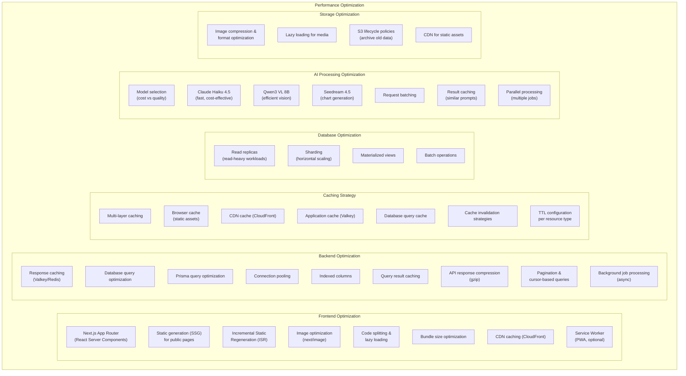
```mermaid
graph TB
    subgraph Performance["Performance Optimization"]
        subgraph FrontendOpt["Frontend Optimization"]
            fe_opt1["Next.js App Router<br/>(React Server Components)"]
            fe_opt2["Static generation (SSG)<br/>for public pages"]
            fe_opt3["Incremental Static<br/>Regeneration (ISR)"]
            fe_opt4["Image optimization<br/>(next/image)"]
            fe_opt5["Code splitting &<br/>lazy loading"]
            fe_opt6["Bundle size optimization"]
            fe_opt7["CDN caching (CloudFront)"]
            fe_opt8["Service Worker<br/>(PWA, optional)"]
        end
        
        subgraph BackendOpt["Backend Optimization"]
            be_opt1["Response caching<br/>(Valkey/Redis)"]
            be_opt2["Database query optimization"]
            be_opt3["Prisma query optimization"]
            be_opt4["Connection pooling"]
            be_opt5["Indexed columns"]
            be_opt6["Query result caching"]
            be_opt7["API response compression<br/>(gzip)"]
            be_opt8["Pagination &<br/>cursor-based queries"]
            be_opt9["Background job processing<br/>(async)"]
        end
        
        subgraph CachingStrategy["Caching Strategy"]
            cache1["Multi-layer caching"]
            cache2["Browser cache<br/>(static assets)"]
            cache3["CDN cache (CloudFront)"]
            cache4["Application cache (Valkey)"]
            cache5["Database query cache"]
            cache6["Cache invalidation strategies"]
            cache7["TTL configuration<br/>per resource type"]
        end
        
        subgraph DBOpt["Database Optimization"]
            db_opt1["Read replicas<br/>(read-heavy workloads)"]
            db_opt2["Sharding<br/>(horizontal scaling)"]
            db_opt3["Materialized views"]
            db_opt4["Batch operations"]
        end
        
        subgraph AIOpt["AI Processing Optimization"]
            ai_opt1["Model selection<br/>(cost vs quality)"]
            ai_opt2["Claude Haiku 4.5<br/>(fast, cost-effective)"]
            ai_opt3["Qwen3 VL 8B<br/>(efficient vision)"]
            ai_opt4["Seedream 4.5<br/>(chart generation)"]
            ai_opt5["Request batching"]
            ai_opt6["Result caching<br/>(similar prompts)"]
            ai_opt7["Parallel processing<br/>(multiple jobs)"]
        end
        
        subgraph StorageOpt["Storage Optimization"]
            storage_opt1["Image compression &<br/>format optimization"]
            storage_opt2["Lazy loading for media"]
            storage_opt3["S3 lifecycle policies<br/>(archive old data)"]
            storage_opt4["CDN for static assets"]
        end
    end
```

---

## Scalability Considerations

### Horizontal & Vertical Scaling

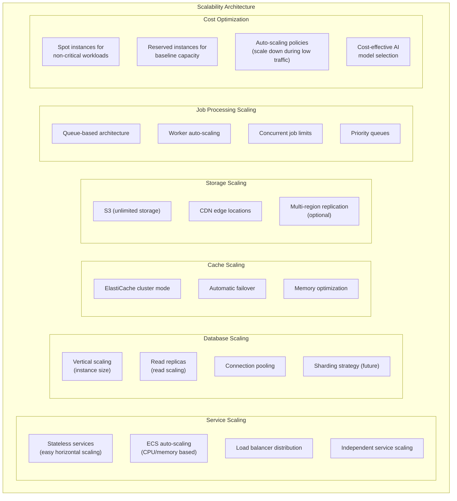
```mermaid
graph TB
    subgraph Scalability["Scalability Architecture"]
        subgraph ServiceScaling["Service Scaling"]
            svc1["Stateless services<br/>(easy horizontal scaling)"]
            svc2["ECS auto-scaling<br/>(CPU/memory based)"]
            svc3["Load balancer distribution"]
            svc4["Independent service scaling"]
        end
        
        subgraph DBScaling["Database Scaling"]
            db1["Vertical scaling<br/>(instance size)"]
            db2["Read replicas<br/>(read scaling)"]
            db3["Connection pooling"]
            db4["Sharding strategy (future)"]
        end
        
        subgraph CacheScaling["Cache Scaling"]
            cache1["ElastiCache cluster mode"]
            cache2["Automatic failover"]
            cache3["Memory optimization"]
        end
        
        subgraph StorageScaling["Storage Scaling"]
            storage1["S3 (unlimited storage)"]
            storage2["CDN edge locations"]
            storage3["Multi-region replication<br/>(optional)"]
        end
        
        subgraph JobScaling["Job Processing Scaling"]
            job1["Queue-based architecture"]
            job2["Worker auto-scaling"]
            job3["Concurrent job limits"]
            job4["Priority queues"]
        end
        
        subgraph CostOpt["Cost Optimization"]
            cost1["Spot instances for<br/>non-critical workloads"]
            cost2["Reserved instances for<br/>baseline capacity"]
            cost3["Auto-scaling policies<br/>(scale down during low traffic)"]
            cost4["Cost-effective AI<br/>model selection"]
        end
    end
```

---

## Monitoring & Observability

### System Health & Performance Tracking

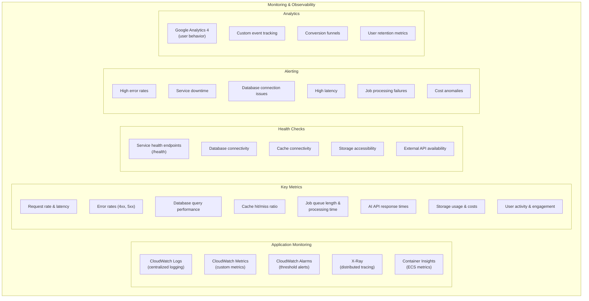
```mermaid
graph TB
    subgraph Monitoring["Monitoring & Observability"]
        subgraph AppMonitoring["Application Monitoring"]
            app1["CloudWatch Logs<br/>(centralized logging)"]
            app2["CloudWatch Metrics<br/>(custom metrics)"]
            app3["CloudWatch Alarms<br/>(threshold alerts)"]
            app4["X-Ray<br/>(distributed tracing)"]
            app5["Container Insights<br/>(ECS metrics)"]
        end
        
        subgraph KeyMetrics["Key Metrics"]
            metric1["Request rate & latency"]
            metric2["Error rates (4xx, 5xx)"]
            metric3["Database query performance"]
            metric4["Cache hit/miss ratio"]
            metric5["Job queue length &<br/>processing time"]
            metric6["AI API response times"]
            metric7["Storage usage & costs"]
            metric8["User activity & engagement"]
        end
        
        subgraph HealthChecks["Health Checks"]
            health1["Service health endpoints<br/>(/health)"]
            health2["Database connectivity"]
            health3["Cache connectivity"]
            health4["Storage accessibility"]
            health5["External API availability"]
        end
        
        subgraph Alerting["Alerting"]
            alert1["High error rates"]
            alert2["Service downtime"]
            alert3["Database connection issues"]
            alert4["High latency"]
            alert5["Job processing failures"]
            alert6["Cost anomalies"]
        end
        
        subgraph Analytics["Analytics"]
            analytics1["Google Analytics 4<br/>(user behavior)"]
            analytics2["Custom event tracking"]
            analytics3["Conversion funnels"]
            analytics4["User retention metrics"]
        end
    end
```

---

## Disaster Recovery & Backup

### Business Continuity Planning

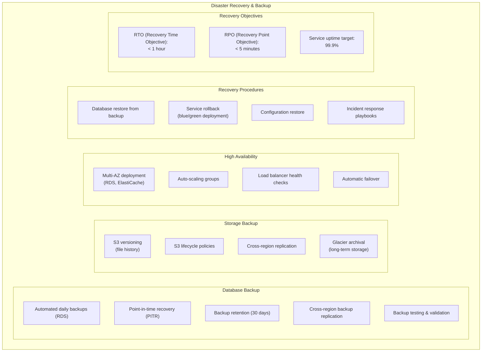
```mermaid
graph TB
    subgraph DR["Disaster Recovery & Backup"]
        subgraph DBBackup["Database Backup"]
            db_backup1["Automated daily backups (RDS)"]
            db_backup2["Point-in-time recovery (PITR)"]
            db_backup3["Backup retention (30 days)"]
            db_backup4["Cross-region backup replication"]
            db_backup5["Backup testing & validation"]
        end
        
        subgraph StorageBackup["Storage Backup"]
            storage_backup1["S3 versioning<br/>(file history)"]
            storage_backup2["S3 lifecycle policies"]
            storage_backup3["Cross-region replication"]
            storage_backup4["Glacier archival<br/>(long-term storage)"]
        end
        
        subgraph HighAvailability["High Availability"]
            ha1["Multi-AZ deployment<br/>(RDS, ElastiCache)"]
            ha2["Auto-scaling groups"]
            ha3["Load balancer health checks"]
            ha4["Automatic failover"]
        end
        
        subgraph RecoveryProc["Recovery Procedures"]
            recovery1["Database restore from backup"]
            recovery2["Service rollback<br/>(blue/green deployment)"]
            recovery3["Configuration restore"]
            recovery4["Incident response playbooks"]
        end
        
        subgraph RecoveryObj["Recovery Objectives"]
            obj1["RTO (Recovery Time Objective):<br/>< 1 hour"]
            obj2["RPO (Recovery Point Objective):<br/>< 5 minutes"]
            obj3["Service uptime target:<br/>99.9%"]
        end
    end
```

---

## Future Enhancements

### Planned Architecture Improvements

```mermaid
graph TB
    subgraph Future["Future Enhancements"]
        subgraph ScalabilityFuture["Scalability"]
            scale1["Microservices architecture<br/>(further decomposition)"]
            scale2["Event-driven architecture<br/>(Kafka/EventBridge)"]
            scale3["GraphQL API<br/>(in addition to REST)"]
            scale4["Database sharding"]
        end
        
        subgraph PerformanceFuture["Performance"]
            perf1["Edge computing<br/>(CloudFront Functions)"]
            perf2["WebSocket support<br/>(real-time collaboration)"]
            perf3["Progressive Web App (PWA)"]
            perf4["Advanced caching strategies"]
        end
        
        subgraph AIFuture["AI Capabilities"]
            ai1["Custom fine-tuned models"]
            ai2["Multi-modal AI<br/>(text, image, video, audio)"]
            ai3["Real-time AI streaming"]
            ai4["AI model versioning &<br/>A/B testing"]
        end
        
        subgraph FeaturesFuture["Features"]
            feat1["Real-time collaboration<br/>(multiplayer editing)"]
            feat2["Version control for designs"]
            feat3["Advanced analytics dashboard"]
            feat4["Mobile apps (React Native)"]
            feat5["Desktop apps (Electron)"]
        end
        
        subgraph InfraFuture["Infrastructure"]
            infra1["Multi-region deployment"]
            infra2["Kubernetes migration (EKS)"]
            infra3["Service mesh<br/>(Istio/App Mesh)"]
            infra4["Infrastructure as Code<br/>(Terraform/CDK)"]
        end
        
        subgraph SecurityFuture["Security"]
            sec1["Zero-trust architecture"]
            sec2["Advanced threat detection"]
            sec3["Compliance certifications<br/>(SOC 2, GDPR)"]
            sec4["End-to-end encryption"]
        end
    end
```

---

## Document Information

**Document Version:** 0.2.0  
**Last Updated:** January 15, 2026  
**Maintained By:** DesignsAI Engineering Team  
**Review Cycle:** Quarterly

### Related Documentation

- [API Documentation](./api/README.md)
- [Deployment Guide](./deployment/README.md)
- [Setup Instructions](./setup/README.md)
- [Testing Guide](./testing/README.md)
- [Analytics Documentation](./GA4_EVENTS_DOCUMENTATION.md)

### Changelog

- **v0.2.0** (2026-01-15): Converted all ASCII diagrams to Mermaid format
  - High-level architecture diagram (Mermaid graph)
  - Application layer diagram (Mermaid graph)
  - Service layer diagrams (Mermaid graphs)
  - Data layer diagrams (Mermaid graphs)
  - Infrastructure layer diagrams (Mermaid graphs)
  - External integrations diagram (Mermaid graph)
  - Technology stack diagram (Mermaid graph)
  - All 6 data flow diagrams (Mermaid sequence diagrams)
  - Security architecture diagram (Mermaid graph)
  - Deployment architecture diagram (Mermaid graph)
  - Performance optimization diagram (Mermaid graph)
  - Scalability considerations diagram (Mermaid graph)
  - Monitoring & observability diagram (Mermaid graph)
  - Disaster recovery diagram (Mermaid graph)
  - Future enhancements diagram (Mermaid graph)

- **v0.1.0** (2026-01-15): Initial comprehensive architecture diagram
  - Complete system architecture overview
  - Service layer documentation
  - Data flow diagrams
  - Security architecture
  - Deployment architecture
  - Performance optimization strategies
  - Monitoring & observability
  - Disaster recovery planning

---

**End of Architecture Diagram**
